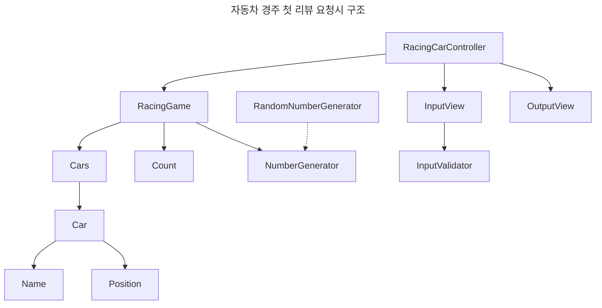

### 자동차 경주

자동차 경주 미션에서는 다즐과 페어가 매칭되었다.  
우테코 들어와서 첫 페어프로그래밍이라 많이 떨렸지만, 다즐이 대화를 잘 이끌어줘 너무 즐거웠다.  

첫날은 간단히 컨벤션과 환경을 설정하는 시간을 가졌고 다음 날부터 자동차 경주를 시작했다.  
시작은 간단하게 요구사항을 정리하고, 어떻게 코드를 작성할지 같이 고민했다.  

시작하기 전 아래와 같이 mermaid를 이용하여 의존성 방향에 대해서 간단한 다이어그램을 만들고 시작했다.  
mermaid는 코드로 다이어그램을 생성 해주는 도구로 다음과 같은 장점이 있다고 생각한다.

- 코드 기반이라 빠른 시간 안에 생각한 것을 시각화할 수 있다.  
- github에서 mermaid를 지원하기 때문에 리뷰어에게 코드를 이해할 수 있는 부가적인 정보를 제공할 수 있다.



미션을 진행하는 데 큰 어려움이 있지는 않았고, 페어를 마치기 전 서로 고민되는 부분을 정리했을 때 좋았다.

페어하면서 잘했다고 생각했던 점은 서로의 생각과 리뷰 받은 것을 공유한 것이다.  
리팩터링을 어떻게 했는지? 이런 리뷰에 대해 어떻게 생각하는지 깊게 고민하는 시간을 가질 수 있었다.

### 부족했던 부분

리팩터링이 끝난 후 메서드명, 테스트시 출력하는 메시지에 대한 코멘트가 많이 달렸다.  
객체가 어떤 책임과 역할을 가지는지 생각하는 시간을 가지고 명확한 메서드명을 작성해야겠다고 생각했다.  

평소에 프로그래밍 이야기가 아닌 다른 주제로 이야기하면 잘 들으려고 하는 편이지만  
내가 좋아하는 주제, 관심가는 주제인 프로그래밍에 대한 이야기를 할 땐 말이 많아진다.  
다음 미션부터는 더 많은 시간을 페어의 의견과 이야기를 듣는 곳에 사용해야겠다.

### 새로 학습한 부분

**Assertions extracting**

결과 내부에 있는 값을 확인하고 싶을 때 extracting 키워드를 이용해서 내부의 값을 검증할 수 있다.  
이전에는 필요에 따라 stream을 이용하여 검증할 값을 생성했지만, 해당 방법을 이용해서 절차를 줄일 수 있었다.

```java
@Test
void extracting() {
    final Cars cars = new Cars(List.of("car1", "car2"));

    assertThat(cars.getCars())
            .extracting(Car::getName)
            .containsExactly("car1", "car2");
}
```

---

아래는 리뷰어님과 대화를 나누면서 얻은 답변 + 나의 의견이다.

**제어할 수 없는 부분에 대한 테스트**

테스트 대상이 검증된 것이라면 작성하지 않거나, 제어할 수 있는 부분에 대한 테스트를 더욱 꼼꼼하게 작성한다.  
이건 개인적인 생각이지만 내가 안정감이 들 수 있을 정도로 출력 범위 내의 결과를 반환하는지 정도 테스트할 수 있지 않을까?

**단순 위임을 하는 메서드에 대한 테스트**

위임이라는 것은 역할과 책임을 넘겨준다는 것이다.  
호출 횟수를 검증하는 것보다 결과에 대한 테스트하는 것이 좋다.  
단순히 위임만 하는 테스트의 경우 결과를 검증한다면 테스트가 중복되지 않을까 생각했었다.  
따라서 중복된 테스트를 줄이기 위해 내부의 메서드를 호출하는지 검증하는 방법도 있다는 것을 알게 되었지만  
안정적으로 결과를 테스트 하는 것이 더 좋은 방법인 것 같다.

**테스트를 위한 getter 사용**

테스트 용도로 도메인에 새로운 메서드가 생성되는 것은 좋지 못하다.  
필요의 경우 생성해서 사용할 수 있지만, 기존에 있는 메서드들을 활용해보는 것이 더 좋은 방법이다.  
이 부분에 대해서 매우 동의하고, 앞으로도 최대한 테스트를 위한 코드를 도메인에 작성하지 않을 것 같다.

### 페어에게 배울 부분

질문이나 생각할 점이 있을 때 매우 깊게 고민하는 것 같았다.  
생각을 정리한 후 자신의 의견을 명료하게 전달해주었다.  
그렇기 때문에 지식을 효율적으로 습득한다.   
난 생각을 잘 정리하지 않은 채로 내버려 둔 얕은 지식이 많은 것 같다. (이런 것도 아는 것이라고 할 수 있을까?)  
앞으로 조금 더 머릿속에서 정리하고, 문제에 대해 깊게 고민하는 시간을 늘려야겠다.

개발에 열정을 가진 게 느껴진다.  
나도 개발을 좋아하지만, 최근에는 의지가 약해졌었다.  
열정이 가득한 사람을 만나니 나도 열정적인 사람이 되는 것 같다.

칭찬을 많이 해준다. 단순히 많이 해주는 것이 아니라, 진심을 담긴 칭찬을 해줬다.  
칭찬은 고래도 춤추게 하던가?  
그래서 즐거운 마음으로 페어 프로그래밍을 했었던 것 같다.

어떤 이유 때문인지 모르겠지만 같이 페어하는데 편한 마음이 들었다.  
이건 바로 배울 수 없지만.  
나도 같이 일할 때 편한 사람, 같이 일하고 싶은 사람이 되기 위해 깊이 고민해봐야겠다.