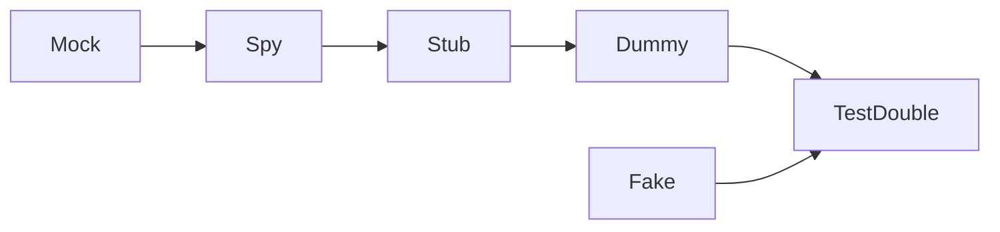

### 테스트 대역이란?

모든 유형의 비운영용 가짜 의존성을 의미하고, 테스트가 실행될 때 다른 객체를 대신한다.  
Gerard Meszaros의 xUnit Test Patterns라는 책에서는 테스트 대역을 다섯 가지(더미, 스텁, 스파이, 목, 페이크)로 구분한다.

테스트 대역의 기본 메커니즘은 다형성을 이용하는 방법이다.  
외부 서비스를 사용하는 코드를 테스트 하는 경우, 인터페이스를 정의하고 외부 서비스 대신 테스트 용도의 구현체를 생성하는 것이다.

**테스트 대역의 타입 계층 구조**

### 더미(Dummy)

가장 단순하고, 원시적인 유형의 테스트 대역이다.  
기본적으로 아무 일도 하지 않는 구현체로 인스턴스화가 필요한 경우 사용한다.  
만약 메서드가 무언가 반환을 해야하는 경우 0, null과 같은 값을 반환한다.  

### 스텁(Stub)

시나리오마다 다른 값(미리 준비 된 결과)을 반환한다.  

### 스파이(Spy)

스텁과 유사하지만 호출된 횟수를 기록한다.  
예) 메일 전송 기능을 가진 객체를 테스트 대역으로 구현했을 때 메일 전송 횟수를 기록한다.  

### 목, 모의 객체(Mock)

목은 더미, 스텁, 스파이를 포함한다.  
호출 시 사전에 정의된 결과를 반환하고, 예상치 못한 호출이 있을 경우 예외를 던질 수 있다.  
또한 호출이 예상된 것이었는지 확인할 수 있다.  

### 가짜(Fake)

DOC와 동일한 기능을 제공하지만, 더욱 간단한 방법으로 구현된 것이다.  

:::note DOC(depended-on component)

의존 구성 요소, DOC를 테스트 더블로 대체할 수 있다.  
테스트 더블은 DOC와 동일한 API를 제공해야 한다.  

:::

### 목과 스텁 구분

단위 테스트 p.149 에서는 테스트 대역을 크게 목과 스텁으로 구분한다.  

| TestDouble | Mock | Stub |
| --- | --- | --- |
| 포함 유형 | 목, 스파이 | 스텁, 더미, 페이크 |
| 용도 | 외부로 나가는 상호작용을 모방하고 검사하는 데 사용 | 내부로 들어오는 상호작용을 모방하는 데 사용 |
| 설명 | SUT가 상태를 변경하기 위한 의존성을 호출하는 것에 해당 | SUT가 입력 데이터를 얻기 위한 의존성을 호출하는 것에 해당
| 예시 | 이메일 발송 | 데이터 검색 |

:::note SUT(system under test)

테스트 대상 시스템   
테스트를 하려는 대상

:::

### 정리

책, 문서에 따라 구분이 모호하고, 각 테스트 대역에 대한 설명이 다르다.  
일단 어떤 종류의 테스트 대역이 있고, 어떻게 사용하는지 정도만 알고 넘어가야겠다.  

### 참고자료

소프트웨어 장인 정신 이야기 - 3장 고급 테스트 주도 개발, 로버트 C. 마틴  
단위 테스트 - 5장 목과 테스트 취약성, 블라디미르 코리코프  
[테스트 더블, Martin Fowler](https://www.martinfowler.com/bliki/TestDouble.html)  
[테스트 관련 용어 정리, Johngrib](https://johngrib.github.io/wiki/test-terms/)  
[Test Double, Gerard Meszaros](http://xunitpatterns.com/Test%20Double.html)