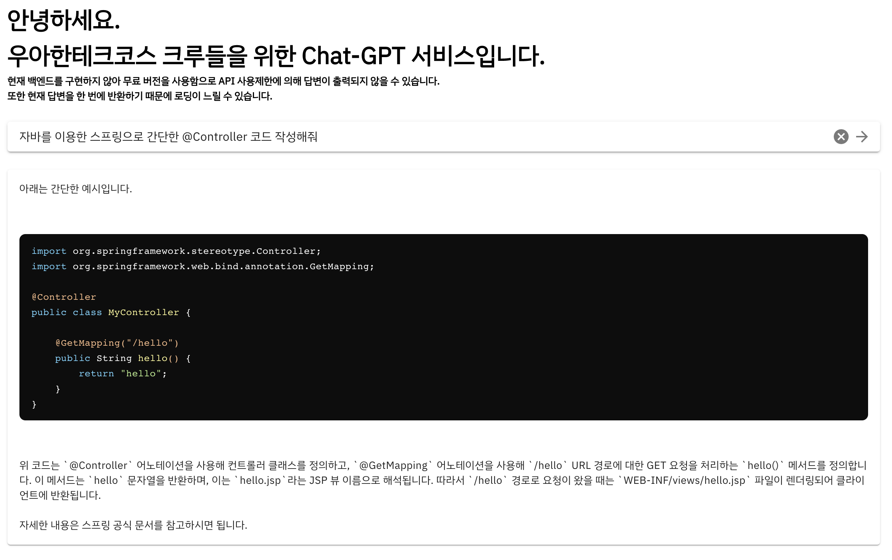

### 4월 21일 금요일

레벨 2를 시작한 뒤 내가 학습에 대한 방향을 잃어버렸다는 생각이 들었다.  
레벨 3, 4에서 나만의 강점을 가지고 싶어 고민을 많이 했다.  
단순히 스프링을 깊게 공부하는 건 효율이 많이 떨어진다고 생각했다.  
글쓰기 수상으로 받은 쿠폰을 사용해 브라운에게 커피챗을 신청했고, 사이드 프로젝트를 해보라는 답을 받았다.  

나는 아이디어를 못내는 편인데 브라운이 아이디어까지 던져주셨다.  
`Chat-GPT 서비스를 크루들에게 제공하고, 해당 크루들이 질문한 내용을 공유할 수 있는 건 어떤지?`  

기술이 목적인 사이드 프로젝트를 진행하면 좋을 것 같다는 답변을 들었고, 혼자 아니면 페어할 수 있을 정도의 인원으로 진행하면 좋겠다고 하셨다.  
프론트랑 간단하게 배포까지 해본 경험이 있어서 혼자해도 크게 어렵지 않을 것 같아서 혼자 하기로 마음을 먹었다.  

이건 못참지

### 도메인 구입 성공?

커피챗이 끝나고 집으로 돌아가는 길에 바로 도메인을 구매하려고 namecheap에서 적당한 도메인이 없을까 검색을 계속했다.  
마치 어릴 때 했던 게임 닉네임 정하는 것처럼 시간이 오래 걸렸다.  
dev, io, chat 도메인이 후보였고 집 가는 길에 결정만 하다가 구매하지 못했다.

### 말랑의 DM

집에 가서 밥을 먹고 말랑이랑 DM 하다 프로젝트를 같이 하자는 이야기가 나왔다.  
우테코 최고 고수 말랑의 요구라 수락하지 않으면 후폭풍을 감당할 수 없었다.  

이런저런 대화를 나누다가 난 빠르게 프로토타입을 만들어 보고 싶어서 프론트를 구현한다고 했고, 말랑은 GPT api를 조사하기로 했다.  
추가로 도메인에 관한 이야기를 하다가 woowachat이 언급되었고, namecheap에서 chat 도메인을 사용한 woowa.chat으로 구매했다.  
이후에 teco.chat으로 변경했다!

### 도메인 설정 및 배포

토요일에 구매한 도메인을 CDN, 보안 등 다양한 기능을 제공하는 Cloudflare에 도메인 등록을 했다.  
나에게 익숙한 Nuxt3를 사용하기로 했고, Cloudflare Pages를 이용하여 배포했다.  

### GPT

무료 크레딧을 사용하니 api limit이 있어 분당 3번밖에 사용할 수 없었다.  
일단 백엔드를 구축하기 전에는 무료 크레딧을 사용할 생각이다.  

### Sonarcloud

정적 코드 분석 도구로 Sonarcloud를 적용했다.  
Sonarcloud는 SonarQube의 SaaS 버전이고 사용이 매우 편하다.  
예전에 Sonarcloud를 사용할 땐 버튼 몇 번 누르면 적용할 수 있었는데, 이번에는 바로 github action을 사용하라는 안내 페이지로 이동했다.  
Sonarcloud가 자체적으로 github repository에 push 하면 정적 분석을 해주는 기능을 원했고, Administration -> Analysis Method에 Automatic Analysis를 설정하니 되었다.  
너무 꽁꽁 숨겨져있네

### Tiptap

코드 하이라이팅 기능을 넣고 싶어서 Tiptap을 사용했다.  
Tiptap은 Headless WYSIWYG 에디터로 사용자 정의 기능에 특화되어있는 에디터다.  
아직 Tiptap이 제공하는 모든 기능을 자연스럽게 사용하지는 못하지만 CodeBlockLowlight 플러그인을 사용하여 코드 블록을 예쁘게 출력할 수 있었다.  
api 반환값 그대로 tiptap의 content에 설정했더니 코드 블록이 설정되지 않아서 백 틱 3개를 `<pre><code>`로 변환했다.  
추가로 띄어쓰기도 적용되지 않아서 `\n`를 `<br>`태그로 변환했다.  
변환하는 로직은 GPT의 도움을 많이 받았다.  

```ts
const replaceCodeFences = (input: String) => {
    const codeFencesRegex = /```([\w-]*)\n([\s\S]*?)\n```/g;
    return input
        .replace(codeFencesRegex, (match, p1, p2) => {
        const languageClass = p1 ? ` class="language-${p1}"` : "";
        return `<pre><code${languageClass}>${p2}</code></pre>`;
        })
        .replace(/\n/g, "<br>");
};
```

Tiptap을 적용하니 다음과 같이 깔끔한 코드 블록을 볼 수 있었다.  



### 폰트 및 favicon 적용

타이틀은 배달의민족 도현체, 내용은 IBM Plex Sans를 사용했다.  
추가로 favicon도 간단하게 적용해서 만족스러웠다.  