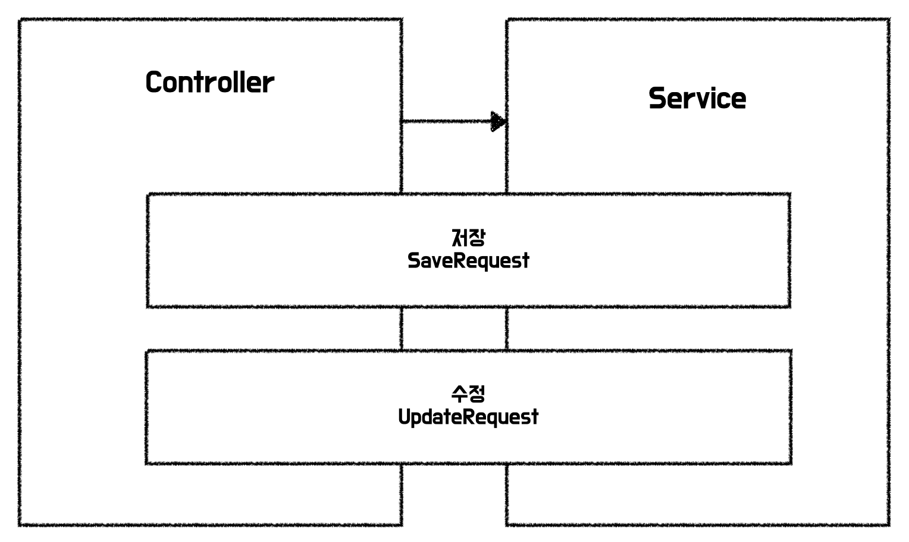
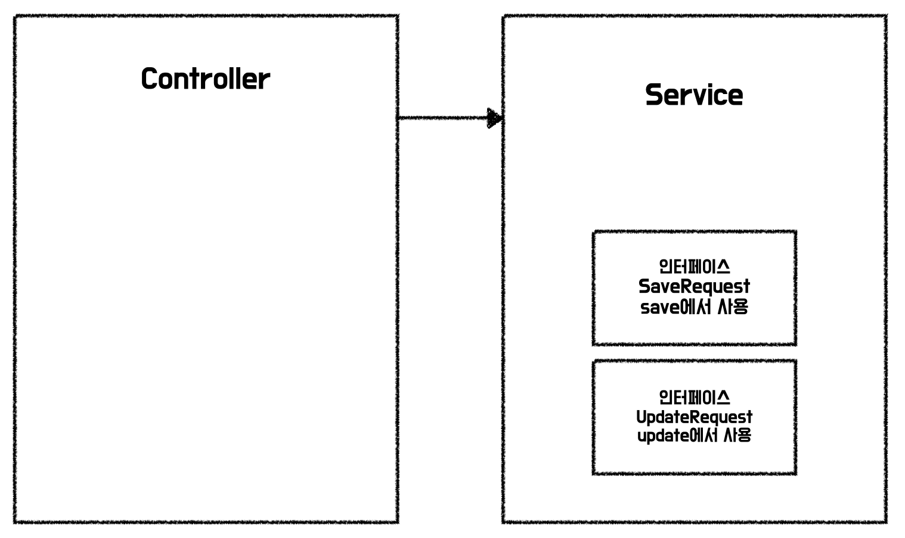

장바구니 미션에서는 상품 추가와 상품 수정에 대한 요구사항이 있었다.  
요청에 담긴 Body를 통해 전달받은 값을 DTO로 매핑하여 추가와 수정을 했다.

### 장바구니 미션에서의 상품 추가 및 수정


클래스명을 제외하고 필드와 검증로직 그 외 모든게 같은 DTO를 보며 중복이라고 생각했다.  
하지만 반대로 용도가 다르기 때문에 중복이 아니라고 생각하기도 했다.  
위 경우는 중복일까? 중복이 아닐까?

이 부분에 대해서 다음과 같은 리뷰를 받았다.

> `ProductSaveRequest`와 `ProductUpdateRequest`가 완전히 동일한데, 재사용할 수 없을까? 라는 리뷰를 남겼었어요. 사실 생성과 수정은 서로 달라질 개연성이 높아서 미리 분리해놓는 게 더 좋은 방법이긴 한데, 그래도 중복은 싫어서 저도 요즘 이런저런 방법들을 시도해보는 중 입니다. 허브는 이 부분에 대해 어떤 생각을 가지고 있을지 궁금하네요 ㅎㅎ
> 

질문에 대해 아래와 같이 답변을 했다.

> 저장과 수정할 때 필요한 필드값이 동일하여 현재 구조에서는 하나로 사용해도 된다고 생각을 하지만, 말씀해주신대로 요구사항이 변경된다면 달라질 가능성이 높다고 판단하였습니다!
> 

### 중복과 우발적 중복

로버트 마틴님이 집필하신 클린 아키텍처는 아래와 같이 중복을 여러가지 종류로 나누어 설명하고 있다.

- 진짜 중복: 한 인스턴스가 변경되면, 동일한 변경을 그 인스턴스의 모드 복사본에 반드시 적용해야 한다.
- 거짓된 중복, 우발적 중복: 중복으로 보이는 두 코드 영역이 각자의 경로로 발전한다면, 즉 서로 다른 속도와 다른 이유로 변경된다면 이 두 코드는 진짜 중복이 아니다.

추가와 수정은 초기에는 중복으로 보이지만 초기 생성시에만 기입하는 데이터들이 추가되거나, 시간이 지나면서 서로 달라질 가능성이 높아진다.
그렇기 때문에 위 상황은 우발적 중복으로 보인다. 그래도 중복을 제거해볼 수 있지 않을까?

### 하나로 사용하는 건 안좋아보이고, 중복은 제거하고 싶은 마음

지금은 추가, 수정 2가지 경우 밖에 없지만 조금 더 복잡한 요구사항이 주어져서 10가지 경우로 입력을 받으면 어떻게 해야할까?  
서비스 계층에서도 계층의 분리를 위해서 다른 DTO를 사용하고 있다면 20개의 DTO를 만들어야 할까?  
리뷰어가 알려준 의존 역전을 이용한 방법을 통해 이를 해결해보자!  

### 중복 제거 전 코드

현재 코드에서는 아래와 같은 구조로 되어있다.  
Controller와 Service에서 저장, 수정할 때 각각의 DTO를 사용하고 있다.
현재 DTO는 controller, service 패키지 내에 있는 것이 아니라 dto라는 패키지에 위치하고 있다.

```java
├── controller
│   └── ProductController
├── service
│   └── ProductService
├── dto
│   ├── ProductSaveRequest
│   └── ProductUpdateRequest
```



### 인터페이스 작성하기



서비스 레이어에서 필요로 하는 값들을 인터페이스로 정의한다.  
해당 인터페이스는 서비스에서 사용하기 때문에 service 패키지 내부로 옮겨준다.

```java
├── controller
│   └── ProductController
├── service
│   ├── ProductService
│   ├── ProductSaveRequest
│   └── ProductUpdateRequest
```

```java
public interface ProductSaveRequest {

    String getName();

    String getImage();

    Long getPrice();
}

// ProductService
public Long save(final ProductSaveRequest request) {
    final Product product = new Product(request.getName(), request.getImage(), request.getPrice());
    return productDao.saveAndGetId(product);
}
```

### 구현체 작성하기


위에서 작성한 인터페이스를 구현하는 클래스를 작성한다.  
요청은 ProductRequest 클래스로 받고, 서비스에 전달할 땐 해당 인터페이스의 명세만 맞추면 문제없이 사용할 수 있다.

```java
├── controller
│   ├── ProductController
│   └── ProductRequest
├── service
│   ├── ProductService
│   ├── ProductSaveRequest
│   └── ProductUpdateRequest
```

```java
public class ProductRequest implements ProductSaveRequest, ProductUpdateRequest {

    @NotBlank(message = "이름은 공백일 수 없습니다.")
    @Size(min = 1, max = 100, message = "이름은 최소 {min}자 이상, {max}자 이하여야 합니다.")
    private final String name;

    @NotBlank(message = "이미지는 공백일 수 없습니다.")
    private final String image;

    @Range(message = "가격은 최소 {min}원 이상, {max}원 이하여야 합니다.")
    private final long price;

    public ProductRequest(final String name, final String image, final long price) {
        this.name = name;
        this.image = image;
        this.price = price;
    }

    @Override
    public String getName() {
        return name;
    }

    @Override
    public String getImage() {
        return image;
    }

    @Override
    public long getPrice() {
        return price;
    }
}

// ProductController
@PostMapping("/products")
public ResponseEntity<Void> save(@Valid @RequestBody final ProductRequest request) {
    final Long id = productService.save(request);
    return ResponseEntity.created(URI.create("/products/" + id)).build();
}
```

### 정리

위와 같이 구현한다면 다음과 같은 장점을 얻을 수 있다.  

1. Service에서 모든 클라이언트 요청에 대한 DTO를 알지 않아도 된다.
2. 공통적으로 사용하는 DTO를 제외하고 DTO 패키지에 대한 결합도가 낮아지고, 각 레이어의 응집도가 증가한다.
3. 요청 객체만 다르고 서비스에서 동일한 행위를 수행하는 경우 중복을 제거할 수 있다.

위 방법을 지금 미션에서 바로 적용할까 하다가, 나중에 필요할 때 적용하면 더 좋을 것 같아서 미션에는 적용하지 않았다.  
상황에 맞춰 적재적소에 의존 역전을 이용해보는 것도 좋을 것 같다.

### 참고 자료

클린 아키텍처 16장 독립성, 로버트 C. 마틴  
[https://techblog.woowahan.com/2647/](https://techblog.woowahan.com/2647/)  
[https://tecoble.techcourse.co.kr/post/2021-04-25-dto-layer-scope/](https://tecoble.techcourse.co.kr/post/2021-04-25-dto-layer-scope/)  