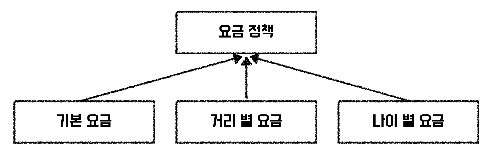
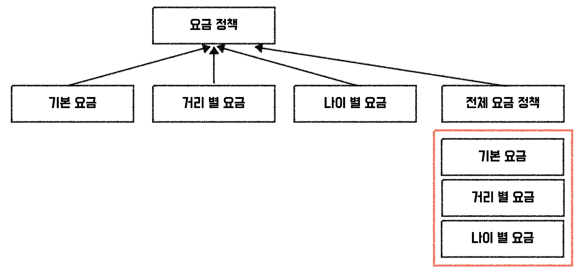
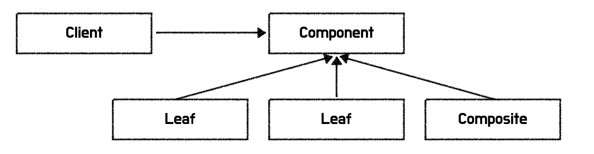

### 요구사항

지하철 미션에는 다음과 같은 요구사항이 있었다.

- 거리별 추가 요금 정책
- 노선별 추가 요금 정책
- 연령별 요금 할인 정책

### 인터페이스 사용

요금 정책은 다음과 같이 인터페이스로 표현할 수 있다.  
요금을 계산하는 메서드는 최단 경로 계산의 결과, 사용자의 정보, 요금을 받아 요금을 계산한다.

```java
public interface FarePolicy {
    int calculate(Path path, Passenger passenger, int fare);
}

public class BaseFarePolicy implements FarePolicy { ... }
public class DistanceFarePolicy implements FarePolicy { ... }
public class AgeDiscountFarePolicy implements FarePolicy { ... }
```



### 모든 요금 정책을 포함하는 새로운 요금 정책 만들기

나머지 구현체를 모두 가지고 있는 하나의 구현체를 만들었다.  
이 또한 FarePolicy를 구현한 형태가 되고, 필드로는 나머지 구현체들을 가지고 있다.

```java
public class SubwayFarePolicy implements FarePolicy {

    private final List<FarePolicy> farePolicies;

    public SubwayFarePolicy(final List<FarePolicy> farePolicies) {
        this.farePolicies = farePolicies;
    }

    @Override
    public int calculate(final Path path, final Passenger passenger, final int fare) {
        int calculatedFare = fare;
        for (FarePolicy farePolicy : farePolicies) {
            calculatedFare = farePolicy.calculate(path, passenger, calculatedFare);
        }
        return calculatedFare;
    }
}
```

따라서 그림으로 본다면 다음과 같은 구조가 된다.



### 정책의 순서

지하철 요구사항은 순서가 중요했다.  
금액의 총합을 구하고, 그 후에 할인 정책이 들어가야했다.   
따라서 자식들의 순서를 관리할 때 주의를 기울여야 했다.  
Configuration 클래스에 다음과 같이 순서를 직접 적용시켰다.  

```java
@Configuration
public class FareConfiguration {

    @Bean
    public FarePolicy farePolicy() {
        return new SubwayFarePolicy(List.of(
                new BaseFarePolicy(),
                new DistanceFarePolicy(),
                new AgeDiscountFarePolicy()
        ));
    }
}
```

### 컴포지트 패턴이란?



GOF의 디자인 패턴 책에서는 컴포지트 패턴을 다음과 같이 설명하고 있다.

> 부분과 전체의 계층을 표현하기 위해 객체들을 모아 트리 구조로 구성합니다.  
사용자로 하여금 개별 객체와 복합 객체를 모두 동일하게 다룰 수 있도록 하는 패턴입니다.
> 

컴포지트 패턴은 인터페이스를 구현한 개별 객체가 존재하고, 그 개별 객체들을 포함하는 하나의 구현체가 따로 존재하는 패턴이다.  
이 때 사용자는 개별 객체와 합성 객체(개별 객체들을 포함하고 있는)를 똑같이 사용할 수 있다.

### 컴포지트 패턴의 구성요소

Component

- 집합 관계에 정의될 모든 객체에 대한 인터페이스 
- ex) 요금 정책(FarePolicy)  

Leaf

- 개별 객체, 객체 합성에 기본이 되는 객체의 행동 
- ex) 거리 별 요금 정책(DistanceFarePolicy)  

Composite

- 여러 개의 개발 객체를 포함하는 합성 객체 
- ex) 지하철 요금 정책(SubwayFarePolicy)  

Client

- 인터페이스를 사용하는 클라이언트

### 컴포지트 패턴의 사용과 주요 목표

부분 - 전체의 관계를 표현하고 싶을 때  
Client 기준으로 Composite와 Leaf의 차이를 알지 못해도 잘 사용할 수 있도록 해야될 때

### 패턴 사용시 주의해야할 부분

패턴은 공통으로 사용 가능한 역할, 책임, 협력의 템플릿이다.  
반복되는 문제를 효율적으로 해결할 수 있지만 패턴에 매몰되서는 안된다.  
패턴을 맹목적으로 사용해서는 안되고, 현재의 요구사항에 따라 패턴을 유동적으로 수정해가면서 적용하는 것이 좋다.  
항상 트레이드오프를 생각하자!

### 참고 자료

컴포지트 패턴, GoF의 디자인 패턴  
디자인 패턴과 프레임워크, 오브젝트