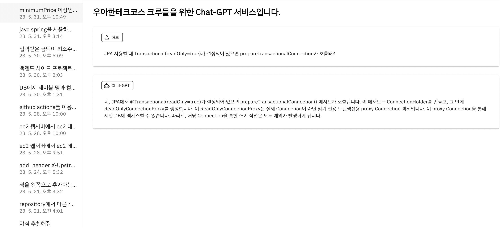
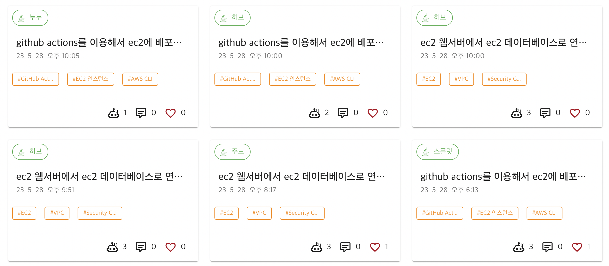
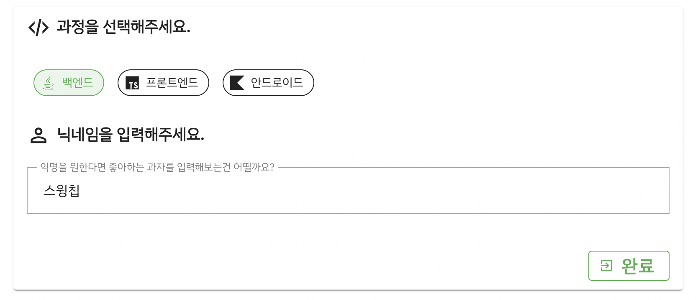

### 개요

원래 목적인 `크루들의 학습에 도움`을 주기 위해 어떤 기능을 추가해야 할지 고민을 많이 했다.  
레벨 2가 거의 끝나가는 시점, 그동안 했던 것을 정리해 보려고 한다.  

### 나의 채팅 확인하고 이어하는 기능

GPT에도 있는 기능인데, 내가 이전에 했던 채팅을 이어할 수 있는 기능을 추가했다.  
실제로 자주 사용하지는 않지만, 그래도 있으면 편리한 것 같다.  

### 좋아요와 댓글 기능

다른 사람들이 질문한 내용에 반응할 수 있는 무언가가 있었으면 좋겠다는 의견들이 많았다.  
누가 좋아요를 눌렀는지? 어떤 채팅이 좋아요를 가장 많이 받았는지? 확인할 수 있는 기능을 추가했다.  
댓글도 완벽하지는 않지만, 추가와 삭제 정도만 만들었다.  

### 키워드 추출

어떻게 키워드 추출을 할지 고민을 많이 했는데, 일단 GPT를 이용해서 키워드를 추출하기로 했다.  
해당 부분은 첫 질문에 대한 키워드만 추출하도록 했다.  
백엔드에선 말랑이 이벤트 이용해서 첫 채팅 요청이 이루어지면, 비동기로 키워드를 추출하는 질문을 추가로 날리도록 구현하였다.  
CSV 형식으로 GPT에게 답변을 입력해달라고 요청받는데, 이 부분이 문제(프롬프트 엔지니어링 한 부분도 가끔 반환된다.)가 좀 많은 것 같아서 개선이 필요한 것 같다.  

### 다른 크루의 채팅 복사해서 이어하는 기능

다른 크루들의 채팅을 읽다가 궁금한 점이 있다면 복사해서 바로 질문을 할 수 있는 기능을 추가했다.  
채팅은 좋아요와 댓글을 제외하고 그대로 복사되고, 바로 GPT와 채팅할 수 있는 창으로 갈 수 있도록 했다.  

### 사용성 고려하기

위 화면은 회원가입 창이다.  
사실 가장 마음에 드는 부분이고, 회원가입(닉네임만 입력하지만)할 때 익명을 원하는 사람들의 고민을 도와주게 끔 음식, 과일, 과자 등의 요소들을 입력하도록 유도했다!
추가로 GPT의 답변이 오면 자동으로 화면을 스크롤 해주는 것과 같이 사용성을 개선해 보려고 노력했지만 쉽지 않았다.  
제일 하고 싶은 것은 실제 GPT를 사용하는 것처럼 stream/text 값을 처리하고 싶은데 이 부분은 방학 때 기회가 되면 도전해 봐야겠다.  

### 향후 계획

실제 크루들이 사용해 주는 서비스를 직접 만들어보면서 사용자의 입장에서 고민도 하게 되는 것 같다.  
크루들이 직접 사용해 주니까 너무 고맙고, 한편으로는 신기하다.  
일단 방학 때 stream/text 관련된 부분 동작되도록 구현해보려고 하고, 그 외의 부분은 조금 더 고민해야될 것 같다.  