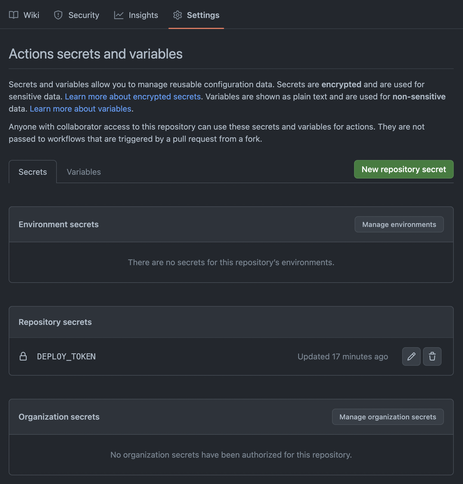
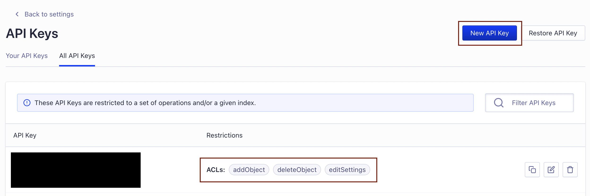

팀 블로그 또는 문서화를 위해 Docusaurus를 사용하는 방법을 정리하려고 한다.  

## 설치

[공식 홈페이지](https://docusaurus.io/docs/installation)에 들어가서 최신 버전을 설치한다.  

```bash
yarn create docusaurus
````

## 배포

[배포 안내 문서](https://docusaurus.io/docs/next/deployment#deploying-to-github-pages)  
netlify나 vercel 같은 서버리스 플랫폼을 추천하고 있고, 간단하고, 빠른 시간 안에 배포를 할 수 있다.  
이 글에서는 github pages를 이용해서 배포하는 방법을 설명한다.

### 레포지토리 생성

github pages를 이용하려면 [예시](https://github.com/greeng00se/greeng00se.github.io)와 같이 `username.github.io` 형태의 레포지토리를 생성해야 한다.  
이때 organization을 사용하는 경우 `organization.github.io` 형태의 레포지토리를 생성해서 사용한다. 

### 설정 파일 수정

```js title="docusaurus.config"
module.exports = {
  // ...
  url: 'https://greeng00se.github.io',
  baseUrl: '/',
  projectName: 'greeng00se.github.io',
  organizationName: 'greeng00se',
  trailingSlash: false,
  // ...
};
```

### 토큰 설정

github action을 위해 배포용 토큰을 하나 생성하여 생성한 레포지토리에 Repository secrets으로 설정한다.  
이 글에서는 토큰을 클래식 방식으로 생성했고 스코프는 [repo, user, workflow] 을 설정했다.  



### 브랜치 생성

github에서 gh-pages 브랜치를 하나 생성한다.  
repository -> settings -> pages -> branch에서 생성한 gh-pages로 브랜치를 변경한다.  
설정한 브랜치가 배포 브랜치가 되며, 해당 브랜치에 있는 파일들을 이용해서 정적 웹사이트를 제공한다.   

### 워크플로 작성

Docusaurus 2.0 기준 Node.js 16.14 이상의 버전을 사용해야 합니다.  
배포시에는 Repository secrets으로 설정한 DEPLOY_TOKEN 을 이용합니다.  

```yml title=".github/workflows/deploy.yml"
name: blog

on:
  push:
    branches: [main]

jobs:
  deploy:
    name: Deploy to GitHub Pages
    runs-on: ubuntu-latest
    steps:
      - uses: actions/checkout@v2
      - uses: actions/setup-node@v3
        with:
          node-version: 18
          cache: yarn

      - name: Install dependencies
        run: yarn install --frozen-lockfile
      - name: Build website
        run: yarn build

      - name: Deploy to GitHub Pages
        uses: peaceiris/actions-gh-pages@v3
        with:
          github_token: ${{ secrets.DEPLOY_TOKEN }}
          publish_dir: ./build
          user_name: github-actions[bot]
          user_email: 41898282+github-actions[bot]@users.noreply.github.com
```

## 댓글 기능

giscus를 이용하여 댓글 기능을 추가한다.  

### giscus 설정

1. 공개 저장소여야 한다.
2. giscus 앱이 설치되어 있어야 한다.
3. Discussions 기능이 해당 저장소에서 활성화되어 있어야 한다.

자세한 내용은 [giscus](https://giscus.app/ko)를 확인하자.

### docusaurus 설정

[swizzling](https://docusaurus.io/ko/docs/next/swizzling)을 이용하여 컴포넌트를 감싼다.  
기존에 게시물을 giscus가 포함된 리액트 컴포넌트로 감싸는 형태가 된다.  
아래 명령어를 이용하여 BlogPostItem을 추출할 수 있다.  

```bash
yarn run swizzle @docusaurus/theme-classic BlogPostItem -- --wrap
```

명령어를 입력하면 `/src/theme/BlogPostItem/index.js` 위치에 파일이 생성된다.  
파일의 내용을 아래와 같이 수정하고, 이때 setAttribute 부분은 적절하게 자신의 giscus 설정을 이용한다.  

```js title="/src/theme/BlogPostItem/index.js"
import OriginalBlogPostItem from "@theme-original/BlogPostItem";
import React, { useEffect, useRef } from "react";
// @ts-expect-error internal code
import { useColorMode } from "@docusaurus/theme-common";
import { useBlogPost } from "@docusaurus/theme-common/internal";

const giscusSelector = "iframe.giscus-frame";

function BlogPostItem(props) {
  const { colorMode } = useColorMode();
  const { isBlogPostPage } = useBlogPost();
  const giscusTheme = colorMode === "dark" ? "dark" : "light";
  const containerRef = useRef(null);

  useEffect(() => {
    if (!isBlogPostPage) return;

    const giscusEl = containerRef.current.querySelector(giscusSelector);

    const createGiscusEl = () => {
      const script = document.createElement("script");

      script.src = "https://giscus.app/client.js";
      script.setAttribute("data-repo", "teco-chat/teco-chat.github.io");
      script.setAttribute("data-repo-id", "R_kgDOJZ5j0Q");
      script.setAttribute("data-category", "Announcements");
      script.setAttribute("data-category-id", "DIC_kwDOJZ5j0c4CXS_Q");
      script.setAttribute("data-mapping", "pathname");
      script.setAttribute("data-strict", "0");
      script.setAttribute("data-reactions-enabled", "1");
      script.setAttribute("data-emit-metadata", "0");
      script.setAttribute("data-input-position", "bottom");
      script.setAttribute("data-theme", giscusTheme);
      script.setAttribute("data-lang", "ko");
      script.crossOrigin = "anonymous";
      script.async = true;
      
      containerRef.current.appendChild(script);
    };

    const postThemeMessage = () => {
      const message = {
        setConfig: {
          theme: giscusTheme,
        }
      };

      giscusEl.contentWindow.postMessage({ giscus: message }, "https://giscus.app");
    };

    giscusEl ? postThemeMessage() : createGiscusEl();
  }, [giscusTheme]);

  return (
    <>
      <OriginalBlogPostItem {...props} />
      {isBlogPostPage && <div ref={containerRef} />}
    </>
  );
}

export default BlogPostItem;
```

## 알고리아 설정 및 직접 관리하기

알고리아를 사용하면 검색 기능을 추가할 수 있다.  
유료 플랜이나 netlify를 사용하는 경우 크롤러를 따로 제공해 주는 것 같다.  

무료 플랜은 직접 인덱스를 수집하는 방법과, [docsearch](https://docsearch.algolia.com/)를 이용하는 방법이 있다.  
docsearch에 등록한다면 일주일에 한 번씩 크롤링이 진행된다.  
이 글에서는 직접 인덱스를 수집하는 방법을 사용한다.  

- [직접 인덱스 수집](https://docsearch.algolia.com/docs/legacy/run-your-own/)  
- [설정 파일](https://docsearch.algolia.com/docs/legacy/config-file)

### 알고리아 애플리케이션 생성 및 키 확인

회원가입을 하고 새로운 애플리케이션 생성을 누른다.  
생성을 다 마치면 다음과 같이 api 키를 확인할 수 있다.  


### 키 생성

직접 인덱스를 수집하기 위한 키를 생성한다.  
addObject, editSettings, deleteIndex acl(접근 제어 목록)이 있으면 된다.  



### .env 파일 생성

프로젝트 폴더 상단에 .env 파일을 생성한다.  

```bash title=".env"
APPLICATION_ID=MVIU5UEMOM
API_KEY=인덱스_생성용_키
```

### config 파일 생성

마찬가지로 최상단에 config.json 파일을 생성한다.
설정 파일은 해당 [링크](https://docsearch.algolia.com/docs/legacy/config-file)를 참고한다.  
또는 Docusaurus의 [설정 파일](https://github.com/algolia/docsearch-configs/blob/master/configs/docusaurus-2.json)을 참고한다.

```json title="config.json"
{
  "index_name": "teco",
  "start_urls": [
    "https://teco-chat.github.io/"
  ],
  "sitemap_urls": [
    "https://teco-chat.github.io/sitemap.xml"
  ],
  "sitemap_alternate_links": true,
  "stop_urls": [
    "/tests"
  ],
  "selectors": {
    "lvl0": {
      "selector": "(//ul[contains(@class,'menu__list')]//a[contains(@class, 'menu__link menu__link--sublist menu__link--active')]/text() | //nav[contains(@class, 'navbar')]//a[contains(@class, 'navbar__link--active')]/text())[last()]",
      "type": "xpath",
      "global": true,
      "default_value": "Documentation"
    },
    "lvl1": "header h1",
    "lvl2": "article h2",
    "lvl3": "article h3",
    "lvl4": "article h4",
    "lvl5": "article h5, article td:first-child",
    "lvl6": "article h6",
    "text": "article p, article li, article td:last-child"
  },
  "strip_chars": " .,;:#",
  "custom_settings": {
    "separatorsToIndex": "_",
    "attributesForFaceting": [
      "language",
      "version",
      "type",
      "docusaurus_tag"
    ],
    "attributesToRetrieve": [
      "hierarchy",
      "content",
      "anchor",
      "url",
      "url_without_anchor",
      "type"
    ]
  },
  "conversation_id": [
    "833762294"
  ],
  "nb_hits": 46250
}
```

### docker 이용하여 크롤링

docker와 jq가 필요하다.  
jq가 설치되어 있지 않으면 mac 기준 brew를 이용해서 설치할 수 있다.  

```bash
brew install jq
```

다음 명령어를 이용하여 .env와 config.json을 이용하여 크롤링을 한다.  

```bash
docker run -it --env-file=.env -e "CONFIG=$(cat ./config.json | jq -r tostring)" algolia/docsearch-scraper
```

### docusaurus 설정

전에 확인한 APP ID, Search-Only API KEY, IndexName을 이용하여 docusaurus.config 파일에 설정한다.  

```js title="docusaurus.config"
themeConfig:
  /** @type {import('@docusaurus/preset-classic').ThemeConfig} */
  ({
    ...
    algolia: {
      appId: 'MVIU5UEMOM', // Application ID
      apiKey: 'b68f378013817d9a190df88cdde226a0', // Search-Only API Key
      indexName: 'teco', // config.json에 설정한 인덱스명
      contextualSearch: true,
    },
  })
```

## 부가 설정

### 화면 상단 Github Icon

파일 최하단에 아래 css 구문을 추가한다.

```css title="/src/css/custom.css"
.header-github-link:hover {
  opacity: 0.6;
}

.header-github-link:before {
  content: '';
  width: 24px;
  height: 24px;
  display: flex;
  background: url("data:image/svg+xml,%3Csvg viewBox='0 0 24 24' xmlns='http://www.w3.org/2000/svg'%3E%3Cpath d='M12 .297c-6.63 0-12 5.373-12 12 0 5.303 3.438 9.8 8.205 11.385.6.113.82-.258.82-.577 0-.285-.01-1.04-.015-2.04-3.338.724-4.042-1.61-4.042-1.61C4.422 18.07 3.633 17.7 3.633 17.7c-1.087-.744.084-.729.084-.729 1.205.084 1.838 1.236 1.838 1.236 1.07 1.835 2.809 1.305 3.495.998.108-.776.417-1.305.76-1.605-2.665-.3-5.466-1.332-5.466-5.93 0-1.31.465-2.38 1.235-3.22-.135-.303-.54-1.523.105-3.176 0 0 1.005-.322 3.3 1.23.96-.267 1.98-.399 3-.405 1.02.006 2.04.138 3 .405 2.28-1.552 3.285-1.23 3.285-1.23.645 1.653.24 2.873.12 3.176.765.84 1.23 1.91 1.23 3.22 0 4.61-2.805 5.625-5.475 5.92.42.36.81 1.096.81 2.22 0 1.606-.015 2.896-.015 3.286 0 .315.21.69.825.57C20.565 22.092 24 17.592 24 12.297c0-6.627-5.373-12-12-12'/%3E%3C/svg%3E")
    no-repeat;
}

html[data-theme='dark'] .header-github-link:before {
  background: url("data:image/svg+xml,%3Csvg viewBox='0 0 24 24' xmlns='http://www.w3.org/2000/svg'%3E%3Cpath fill='white' d='M12 .297c-6.63 0-12 5.373-12 12 0 5.303 3.438 9.8 8.205 11.385.6.113.82-.258.82-.577 0-.285-.01-1.04-.015-2.04-3.338.724-4.042-1.61-4.042-1.61C4.422 18.07 3.633 17.7 3.633 17.7c-1.087-.744.084-.729.084-.729 1.205.084 1.838 1.236 1.838 1.236 1.07 1.835 2.809 1.305 3.495.998.108-.776.417-1.305.76-1.605-2.665-.3-5.466-1.332-5.466-5.93 0-1.31.465-2.38 1.235-3.22-.135-.303-.54-1.523.105-3.176 0 0 1.005-.322 3.3 1.23.96-.267 1.98-.399 3-.405 1.02.006 2.04.138 3 .405 2.28-1.552 3.285-1.23 3.285-1.23.645 1.653.24 2.873.12 3.176.765.84 1.23 1.91 1.23 3.22 0 4.61-2.805 5.625-5.475 5.92.42.36.81 1.096.81 2.22 0 1.606-.015 2.896-.015 3.286 0 .315.21.69.825.57C20.565 22.092 24 17.592 24 12.297c0-6.627-5.373-12-12-12'/%3E%3C/svg%3E")
    no-repeat;
}
```

themeconfig -> navbar에 github link를 설정한다.  

```js title="docusaurus.config"
navbar: {
  title: 'HELLO',
  items: [
    {
        href: 'https://github.com/greeng00se',
        position: 'right',
        className: 'header-github-link',
        'aria-label': 'GitHub repository',
    },
  ],
},
```

### 코드블럭

java나 kotlin의 경우 기본적으로 하이라이팅을 지원해 주지 않는다.  
prism 설정을 아래와 같이 변경해 준다.  

```js title="docusaurus.config"
prism: {
  theme: lightCodeTheme,
  darkTheme: darkCodeTheme,
  additionalLanguages: ['java', 'kotlin'],
}
```

### mermaid

mermaid를 사용하려면 `@docusaurus/theme-mermaid` 를 설치해야 한다.

```bash
yarn add @docusaurus/theme-mermaid
```

설치 후 아래와 같이 설정을 추가한다.

```js title="docusaurus.config"
const config = {
  ...
  markdown: {
    mermaid: true,
  },
  themes: [
    '@docusaurus/theme-mermaid'
  ],
};
```

themeConfig에서 mermaid의 테마를 지정할 수 있다.  

```js title="docusaurus.config"
themeConfig:
    /** @type {import('@docusaurus/preset-classic').ThemeConfig} */
    ({
      ...
      mermaid: {
        theme: {
          light: 'neutral', 
          dark: 'dark'
        },
      },
    }),
```

### 블로그 글 author

팀원 별로 문서를 관리한다면 다음과 같이 어떤 팀원이 글을 작성했는지 설정해야 한다.  


`authors.yml` 파일을 이용하여 사용자에 대한 기본 설정을 할 수 있다.  

```yml title="/blog/authors.yml"
herb:
  name: 허브
  title: Backend
  url: https://github.com/greeng00se
  image_url: https://github.com/greeng00se.png

mallang:
  name: 말랑
  title: Backend
  url: https://github.com/shin-mallang
  image_url: https://github.com/shin-mallang.png
```

블로그 글을 작성할 때 다음과 같이 authors에 넣어주기만 하면 된다.  

```mdx
---
slug: 1
title: Hello World
authors: [herb, mallang]
tags: [hello, docusaurus]
---

첫 번째 문서 내용
``` 