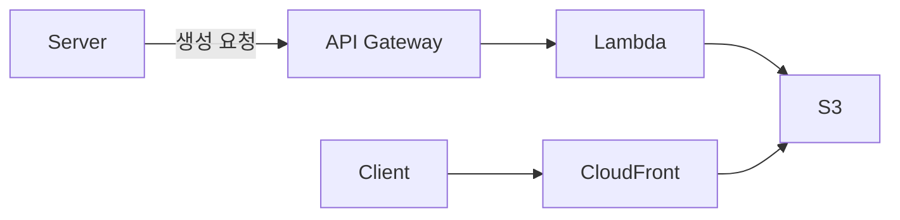

## 개요

여행 경로를 간략하게 보여주는 섬네일을 생성하기로 했다.  
단일 경로를 보여주는 것은 Map Api의 경로 그리기 기능을 사용하면 된다.  
하지만 다수의 여행 기록을 간략하게 보여준다면 해당 기능을 사용하기 어려울 것이라고 생각했다.    

### 사용 기술

언어: Python 3.10  
이미지 생성: matplotlib  
서비스: AWS Lambda, AWS API Gateway  
이미지 저장 및 URL: AWS S3, AWS CloudFront  

플로우는 다음과 같다.  



### 요구사항

위도, 경도로 이루어진 배열을 입력받는다.  
위경도 차이가 크든 작든 제공하는 이미지 내에 경로가 다 포함되어 있어야 한다.  

## 기능 구현

### 섬네일 생성 아이디어

주어진 데이터는 위도, 경도로 이루어진 배열이고 이를 통해 어떻게 섬네일을 만들지 고민을 많이 했다.  
GPT에게 물어봐도 이상한 답변만 받아서(질문하는 능력이 부족했나보다..) 당황스러웠다.  
아는 동생과 `경로를 간략하게 보여주는 것` 에 대해 이야기를 조금 나눈 다음 아이디어를 얻었다.  

하지만 처음 작성한 코드가 현실과 유사하지만 특정 상황에서 문제가 발생했다.  
이는 x, y 각각 정규화를 진행하고 플롯을 그려서 발생한 문제였다.  
예를 들어 y의 값이 다 동일하고 하나만 0.00000001의 차이를 가지는 값이 있다면 경로에 문제가 발생했다.  

후추와 리오에게 조언을 구해서 정규화 진행할 때 입력받은 위경도 배열의 max(x 최댓값 - x 최소값, y 최댓값 - y 최소값)으로 나누기로 했다.  

### 위경도 처리 방법

입력값 예시  
x = [126.9797895, 126.979215, 126.9766789]  
y = [37.5670131, 37.5670131, 37.5670131]  
PIXEL = 255

1. 경로를 일관성 있게 그리기 위한 값을 구한다. `입력받은 위경도 배열의 max(x 최댓값 - x 최소값, y 최댓값 - y 최소값)`
    - 0.0031105999999994083
2. 입력받은 위치 배열을 정규화한다. `(x - 최소값) / {1번에서 구한 값}`
    - [1.0, 0.8153089436124402, 0.0]
3. 정규화한 배열을 픽셀 값으로 곱해준다.
    - [255, 207, 0]

### 이미지 출력 방식

1. 위경도를 처리한 값으로 배열 형태로 점을 찍은 다음 이미지 형태로 저장
2. 플롯을 그려주는 라이브러리 사용하여 이미지 형태로 저장

이미지 출력 방식의 경우 1번과 2번을 고민했었다.  
점이 아닌 선 형태로 경로를 보여줄 수 있도록 플롯을 그려주는 라이브러리인 matplotlib을 사용하기로 했다.  

### 로컬에서 기능 구현

```python
import matplotlib.pyplot as plt

PIXEL = 255

def draw(point):
    x, y = zip(*point)
    pixel_x, pixel_y = convert_to_pixel_values(x, y)
    draw_lines(pixel_x, pixel_y)

def convert_to_pixel_values(x, y):
    max_diff = max(max(x) - min(x), max(y) - min(y))
    return scale_to_pixel_values(x, max_diff), scale_to_pixel_values(y, max_diff)

def scale_to_pixel_values(points, max_diff):
    min_value = min(points)
    scaled_coordinates = [(p - min_value) / max_diff for p in points]
    pixel_values = [int(p * PIXEL) for p in scaled_coordinates]
    return pixel_values

def draw_lines(x, y):
    plt.plot(x, y, 'k-', linewidth=10)
    plt.axis('off')
    plt.savefig('name.png', transparent=True, format='png')

point = [
    [126.9797895, 37.5670131],
    [126.979215, 37.5670131],
    [126.9766789, 37.5670131],
]

draw(point)
```

## 배포

### AWS Lambda

섬네일 생성 서버를 따로 두기는 기능 대비 비용이 너무 클 것이라고 생각했다.  
따라서 서버리스로 파일을 처리했다.  
추가로 s3 접근은 boto3를 사용했다.  

### 람다 S3 접근을 위한 IAM 생성

AmazonS3FullAccess, AmazonS3ObjectLambdaExecutionRolePolicy 두가지를 추가해서 Lambda 전용 역할을 만들어 사용했다.  

### 람다 배포용 코드

```python

import io
import uuid

import boto3
import matplotlib.pyplot as plt

PIXEL = 255
BUCKET_NAME = 'image-plot'
S3 = 's3'

def lambda_handler(event, context):
    x = event['x']
    y = event['y']
    image_name = str(uuid.uuid4())

    img_data = draw(x, y)
    s3 = boto3.client(S3)
    s3.put_object(Body=img_data.getvalue(), ContentType='image/png', Bucket=BUCKET_NAME, Key=image_name)
    url = f'https://{BUCKET_NAME}.s3.ap-northeast-2.amazonaws.com/{image_name}'

    return {
        'statusCode': 200,
        'body': url
    }

def draw(x, y):
    pixel_x, pixel_y = convert_to_pixel_values(x, y)
    img_data = draw_lines(pixel_x, pixel_y)
    plt.close()
    return img_data

def convert_to_pixel_values(x, y):
    max_diff = max(max(x) - min(x), max(y) - min(y))
    return scale_to_pixel_values(x, max_diff), scale_to_pixel_values(y, max_diff)

def scale_to_pixel_values(points, max_diff):
    min_value = min(points)
    scaled_coordinates = [(p - min_value) / max_diff for p in points]
    pixel_values = [int(p * PIXEL) for p in scaled_coordinates]
    return pixel_values

def draw_lines(x, y):
    plt.plot(x, y, 'k-', linewidth=10)
    plt.axis('off')
    img_data = io.BytesIO()
    plt.savefig(img_data, transparent=True, format='png')
    img_data.seek(0)
    return img_data

```

### Layer 추가를 위한 zip 파일 생성

matplotlib의 경우 외부 라이브러리기 때문에 따로 Layer를 추가해야 한다.  
zip 파일을 만들어서 업로드해야한다.  
이때 python의 Lambda 런타임에 대한 계층 경로는 python이다.  
따라서 압축한 zip 파일은 다음과 같은 구조를 띄어야 한다.  

```
pillow.zip
│ python/PIL
└ python/Pillow-5.3.0.dist-info
```

Ubuntu 기준 다음 명령어를 입력하여 생성을 진행했다.  

```
sudo apt update
sudo apt install zip
sudo apt install python3-pip

mkdir python
pip3 install matplotlib -t python # pip3 install 설치할_패키지 -t 설치_경로
zip -r my_layer.zip python # zip -r 압축_파일명 압축_파일이_존재하는_경로
```

### `No module named 'numpy.core._multiarray_umath'` 에러

Layer 추가 후 람다 실행 시 발생한 에러였다.  
처음에 mac에서 zip 파일을 생성해서 업로드했는데 해당 문제가 발생했다.  
이는 lambda가 돌아가는 동일한 환경에서 layer를 위한 zip 파일을 만들지 않아서 발생하는 문제다.  
간단하게 ec2 인스턴스를 하나 만들어서 따로 Layer를 생성하면 문제가 발생하지 않는다.  

## 적정기술에 대한 생각

프로젝트에 Lambda를 사용하려고 했지만 아쉽게도 반려당했다.  
AWS Lambda를 사용하는 것은 인스턴스에 해당 코드를 배포하는 것보다 더 효율적인 방법일 수 있다.  
하지만 현재 프로젝트에서 가용 가능한 자원, 기술의 난이도, 사용하는 팀원을 고려한다면 Lambda는 적정기술이 아닐 수 있다.  
따라서 해당 이미지 생성기를 어떻게 적용할지 조금 더 고려를 해야 될 것으로 보인다.  

## 참고 자료

[AWS Lambda](https://aws.amazon.com/ko/lambda/)  
[Lambda Layer](https://docs.aws.amazon.com/ko_kr/lambda/latest/dg/configuration-layers.html)  
[Python Lambda 함수에 대한 .zip 파일 아카이브 작업](https://docs.aws.amazon.com/ko_kr/lambda/latest/dg/python-package.html)  
[No module named 'numpy.core._multiarray_umath'](https://gist.github.com/ksmin23/0f3f243408a8497f766b43cf589fea7b)  
[사례별로 알아본 안전한 S3 사용 가이드](https://techblog.woowahan.com/6217/)