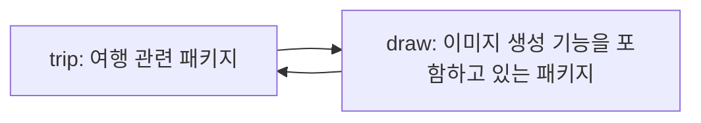
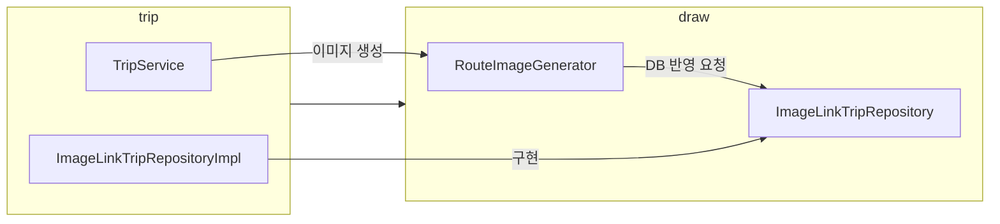
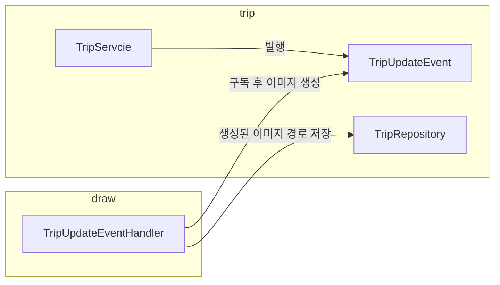
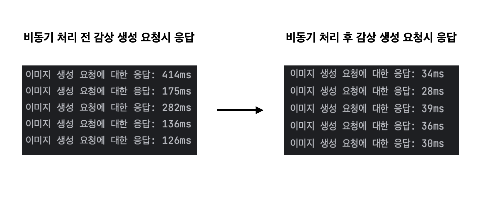

## 이전 글

[경로 이미지 생성하기 - 기술 선택](./36)  
[경로 이미지 생성하기 - 구현](./39)

## 개요

현재 여행을 마치는 경우, 감상을 생성하는 경우 이미지 생성 요청이 이루어진다.  
경로 이미지 생성의 경우 위치 정보의 개수에 정비례하여 생성 시간이 증가한다.  
따라서 비동기로 이미지 생성 요청을 처리하여 사용자의 경험을 증가시킬 수 있다고 생각했다.  

### 주기능의 응답속도 개선

여행 종료와 감상 생성이 주기능이고, 이미지 생성 기능은 부기능이다.  
하지만 현재 여행 종료와 감상 생성의 응답 속도가 경로 이미지 생성 시간에 영향을 받고 있다.  
경로 이미지 생성은 비동기 처리하여도 애플리케이션 사용에 문제가 되지 않는다.  
소요 시간이 1초 이상 튀는 경우가 존재하기에 이미지 생성을 비동기 처리하고 여행 종료와 감상 생성 기능의 응답 시간을 개선하는 것이 더 중요하다.  

### 확장성 대비

현재 10분 간격으로 위치 정보를 서버에 저장하고 있다.  
조금 더 짧은 간격으로 위치 정보를 그리는 경우 하나의 여행에 많은 위치 정보가 저장될 수밖에 없고 따라서 경로 이미지 생성에 걸리는 시간이 더 길어질 수 있다.  
따라서 추후에 더 짧은 간격으로 위치 정보를 저장하는 경우 대비 이미지 생성은 비동기로 처리하는 것이 합당하다.  

## 비동기 처리

@Async를 사용하면 간단하게 메서드를 비동기로 동작하도록 만들 수 있다.  

### 비동기 설정

사용하기 전에 설정 파일을 하나 만들어서 EnableAsync 설정을 해야한다.  
해당 설정을 적용하면 비동기적으로 실행하려는 메서드에 @Async 애너테이션을 붙여주기만 하면 비동기로 동작한다.  

```java title="AsyncConfig"
@EnableAsync
@Configuration
public class AsyncConfig {
}
```

스프링 부트를 사용하지 않는 경우 기본적으로 비동기 처리를 할 때 매번 새로운 스레드를 생성하기 때문에 스레드 풀 설정을 따로 해줘야 한다.  하지만 스프링 부트를 사용하는 경우 ThreadPoolTaskExecutor를 따로 설정하지 않아도 기본적으로 스프링 부트가 생성을 도와준다.  

> In the absence of an Executor bean in the context, Spring Boot auto-configures a ThreadPoolTaskExecutor with sensible defaults that can be automatically associated to asynchronous task execution (@EnableAsync) and Spring MVC asynchronous request processing.
> 7.7. Task Execution and Scheduling, Spring Boot Docs

### @Async 적용

이미지 생성기에 Async 애너테이션을 붙여 비동기로 동작하도록 한다.  

```java title="RouteImageGenerator"
@Async
public void generate(
        List<Double> latitudes,
        List<Double> longitudes,
        List<Double> pointedLatitudes,
        List<Double> pointedLongitudes,
        Long tripId
) {
    // 이미지 생성
    RouteImageDrawer routeImageDrawer = RouteImageDrawer.from(IMAGE_SIZE);
    Coordinates coordinates = Coordinates.of(latitudes, longitudes);
    Coordinates pointedCoordinates = Coordinates.of(pointedLatitudes, pointedLongitudes);
    drawImage(coordinates, routeImageDrawer, pointedCoordinates);

    // 이미지 저장
    String imageName = routeImageUploader.upload(routeImageDrawer.bufferedImage());

    // 자원 할당 해제
    routeImageDrawer.dispose();

    // 데이터베이스 값 변경
    Trip trip = tripRepository.findById(tripId)
        .orElseThrow();
    trip.changeRouteImageUrl(imageUrl);
    tripRepository.save(trip);
}
```

### 비동기 처리시 문제점

현재 이미지 생성을 하고 저장 후, 저장 경로를 DB에 반영해야 한다.  
따라서 패키지 간 순환 참조 형태가 되며 의존성 방향이 문제가 생긴다.  



이를 해결하기 위해서는 인터페이스를 사용하는 방법과 이벤트를 사용하는 방법이 있다.  
인터페이스를 사용한다면 다음과 같은 형태로 된다.  



이는 패키지 간 의존성은 해결되었지만, 이미지 경로 저장을 위해 받는 tripId와 같이 논리적인 의존성은 아직 해결되지 않았다.  
따라서 이벤트를 사용하기로 했다.  

## 이벤트 사용

스프링의 애플리케이션 이벤트를 사용하면 비즈니스 로직의 비관심사(ex 경로 이미지 생성)을 효율적인 방법으로 처리할 수 있다.

### 이벤트 발행

이벤트를 사용하려면 먼저 이벤트를 발행해야 한다.  
스프링에서는 ApplicationEventPublisher 인터페이스를 사용하여 이벤트를 발행할 수 있다.  
해당 인터페이스는 내부적으로 ApplicationContext가 구현하여 이벤트를 발행한다.  

```java title="TripService & TripUpdateEvent"
public void updateTripById(LoginUser loginUser, Long tripId, TripUpdateRequest tripUpdateRequest) {
    ...

    // 이벤트 발행
    applicationEventPublisher.publishEvent(new TripUpdateEvent(trip.id()));
}

public record TripUpdateEvent(Long tripId) {
}
```

이벤트를 발행할 때 발행하는 이벤트명이 중요하다.  
이벤트를 구독하는 도메인의 행위를 담고 있는 이벤트를 발행(ex RouteImageGenerateEvent)한다면 논리적인 의존 관계가 남아있기에 이벤트를 사용하는 의미가 없어진다.  
따라서 발행하는 이벤트명은 주기능이 어떤 행위(ex TripUpdateEvent)를 했는지에 대한 정보가 담겨있는 이벤트명으로 발행하는 것이 중요하다.  

### 이벤트 구독

이벤트를 구독하여 실행하는 메서드는 비동기로 처리하기 위하여 `@Async` 애너테이션을 적용했다.  
이벤트의 구독은 여행이 정상적으로 종료될 때 여행에 대한 정보를 가지고 경로 이미지를 생성하기 위해 `@TransactionalEventListener`를 사용했다.  

:::note TransactionPhase 설정
TransactionPhase을 사용하여 트랜잭션 이벤트를 어떤 단계에서 수신하고 처리할지를 지정할 수 있다.

AFTER_COMMIT(기본값): 트랜잭션이 정상적으로 커밋 되는 경우 이벤트 실행  
AFTER_ROLLBACK: 트랜잭션이 롤백되는 경우 이벤트 실행  
AFTER_COMPLETION: 트랜잭션이 커밋 또는 롤백 되었을 경우 이벤트 실행  
BEFORE_COMMIT: 트랜잭션이 커밋 되기 전 이벤트 실행  
:::

이미지 생성의 경우 트랜잭션에서 제외하기 위해 @Transactional 애너테이션을 사용하지 않았다.  

```java title="TripUpdateEventHandler"
@Component
public class TripUpdateEventHandler {

    private final RouteImageGenerator routeImageGenerator;
    private final TripRepository tripRepository;

    public TripUpdateEventHandler(RouteImageGenerator routeImageGenerator, TripRepository tripRepository) {
        this.routeImageGenerator = routeImageGenerator;
        this.tripRepository = tripRepository;
    }

    @Async
    @TransactionalEventListener(phase = AFTER_COMMIT)
    public void handle(TripUpdateEvent tripUpdateEvent) {
        Trip trip = tripRepository.getTripWithPoints(tripUpdateEvent.tripId());

        String imageUrl = routeImageGenerator.generate(
                trip.getLatitudes(),
                trip.getLongitudes(),
                trip.getPointedLatitudes(),
                trip.getPointedLongitudes()
        );

        trip.changeRouteImageUrl(imageUrl);
        tripRepository.save(trip);
    }
}
```

이벤트를 사용함으로써 패키지 간 순환 참조 문제가 다음과 같이 해결되었다.  
또한 주기능과 부기능을 분리함으로써 경로 이미지 생성 기능에 대한 전체적인 결합도를 낮추었다.



### 테스트

비동기로 동작하는 메서드를 테스트하기 위해서는 아래와 같은 방법이 있다.  

import Tabs from "@theme/Tabs";
import TabItem from "@theme/TabItem";

<Tabs>
<TabItem value="비동기 메서드가 종료될 때까지 대기 후 검증" label="비동기 메서드가 종료될 때까지 대기 후 검증">

```java
@SpringBootTest
public class TripUpdateEventHandlerIntegrationTest {

    ...

    @Test
    void 여행수정_이벤트를_발생시키면_이미지를_생성_요청을_한다() {
        // given
        TripUpdateEvent tripUpdateEvent = new TripUpdateEvent(1L);
        given(tripRepository.getTripWithPoints(tripUpdateEvent.tripId()))
                .willReturn(여행());

        // when
        transactionTemplate.executeWithoutResult(action -> applicationEventPublisher.publishEvent(tripUpdateEvent));

        // then
        then(routeImageGenerator)
                .should(Mockito.timeout(5000).times(1))
                .generate(any(), any(), any(), any());
    }
}
```

</TabItem>

<TabItem value="테스트 할 때만 비동기를 동기로 변경하여 검증" label="테스트 할 때만 비동기를 동기로 변경하여 검증" default>

```java
@ContextConfiguration(classes = TestSyncConfig.class)
@SpringBootTest
public class TripUpdateEventHandlerIntegrationTest {

    ...

    @Test
    void 여행수정_이벤트를_발생시키면_이미지를_생성_요청을_한다() {
        // given
        TripUpdateEvent tripUpdateEvent = new TripUpdateEvent(1L);
        given(tripRepository.getTripWithPoints(tripUpdateEvent.tripId()))
                .willReturn(여행());

        // when
        transactionTemplate.executeWithoutResult(action -> applicationEventPublisher.publishEvent(tripUpdateEvent));

        // then
        then(routeImageGenerator)
                .should(times(1))
                .generate(any(), any(), any(), any());
    }
}
```

</TabItem>
</Tabs>

처음에는 테스트에서만 동기로 설정 후 검증하려고 했다.  
통합 테스트에선 `트랜잭션이 정상 종료되었을 때 비동기로 이벤트를 구독하여 이미지 생성 메서드를 호출하는지` 검증이 필요했기 때문에 최종적으로  `Mockito.timeout` 메서드를 사용하여 비동기 메서드가 통과될 때까지 대기하는 방향으로 변경했다.  

## 결과



위 응답 시간은 위치 정보 1000개를 기준으로 테스트한 값이다.  
응답 시간에 이미지 생성 시간이 포함되지 않아서 성능이 개선된 것을 볼 수 있다.  

## 참고 자료

[7.7. Task Execution and Scheduling, Spring Boot Docs](https://docs.spring.io/spring-boot/docs/current/reference/htmlsingle/#features.task-execution-and-scheduling)  
[Spring Events, Baeldung](https://www.baeldung.com/spring-events)  
[회원시스템 이벤트기반 아키텍처 구축하기](https://techblog.woowahan.com/7835/)  