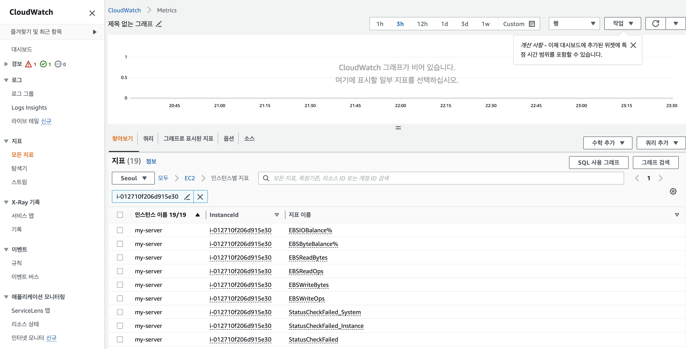
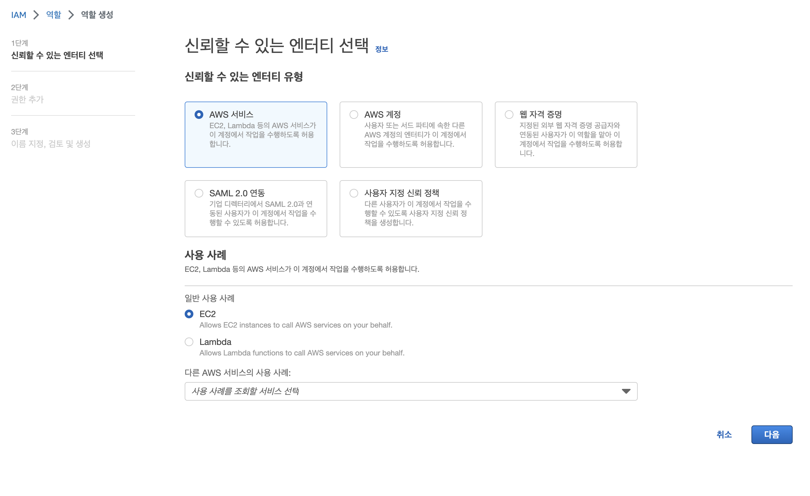
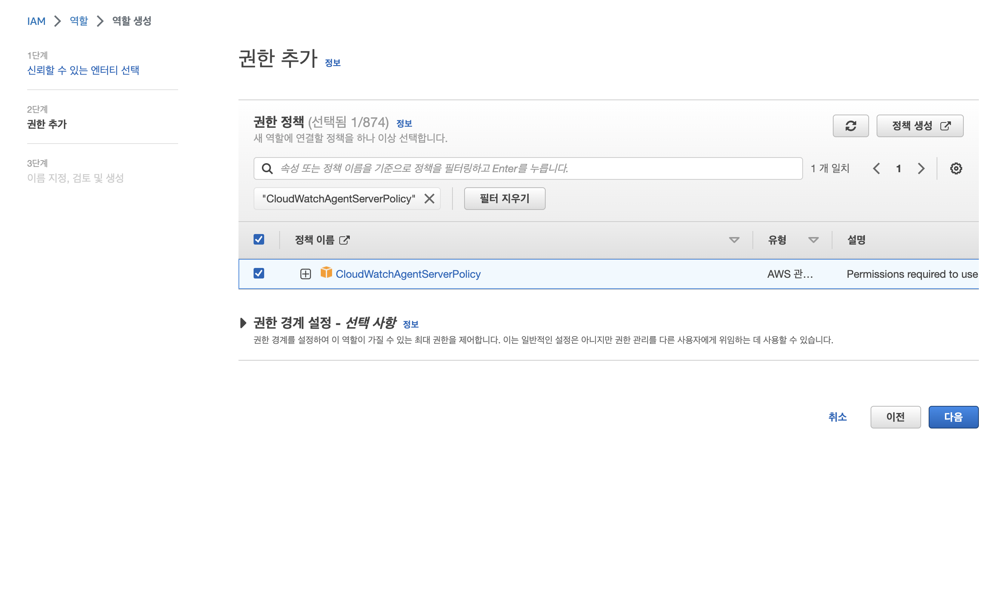
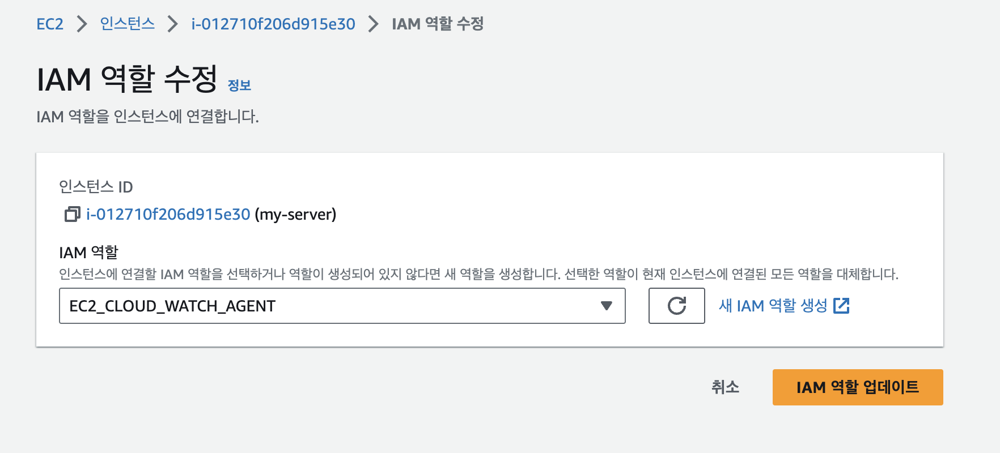
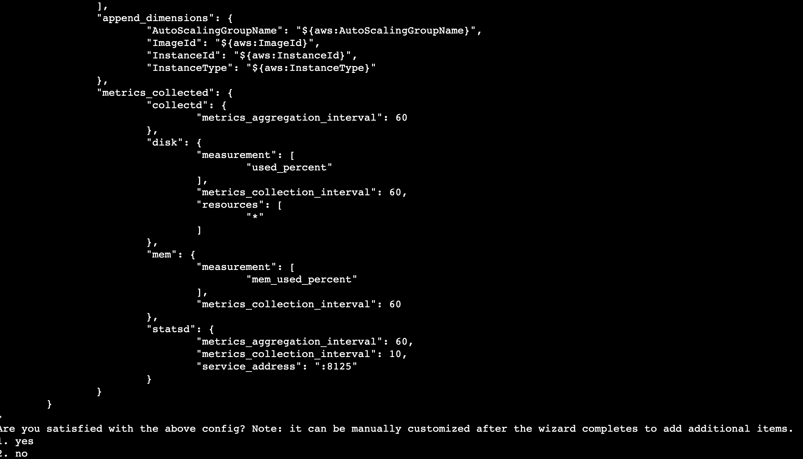
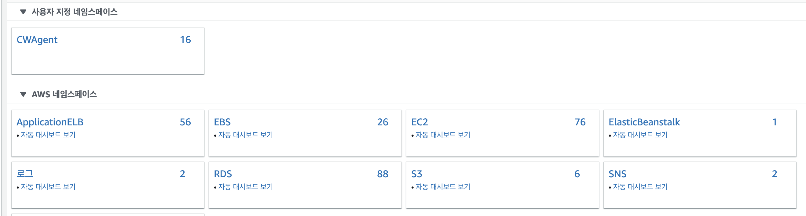
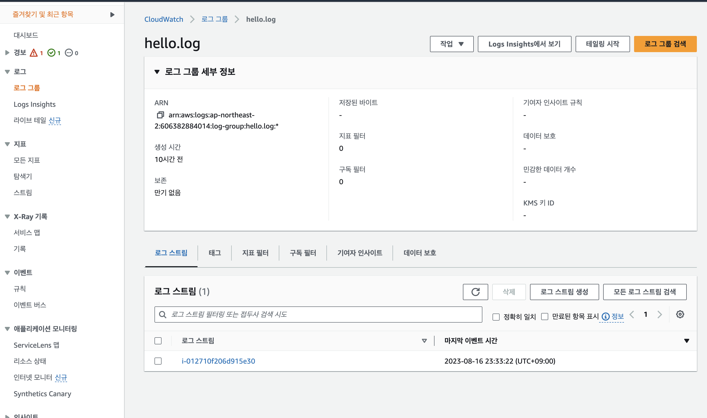

## CloudWatch

AWS 리소스와 애플리케이션의 지표와 로그에 대한 모니터링을 제공하는 서비스다.  
지표를 감시하여 알림을 보내는 기능도 제공한다.  
프리티어를 사용하지 않는 경우 대시보드당 3$/M 의 비용이 청구되고, 지표나 로그의 양에 따라 비용이 추가적으로 청구된다.  
요금 정보에 대한 자세한 정보는 [다음 링크](https://aws.amazon.com/ko/cloudwatch/pricing/)에서 확인할 수 있다.  

## CloudWatch Metrics

기본적으로 5분마다 지표에 대한 정보가 수집된다.  
세부 모니터링(Detailed Monitoring)을 활성화하면 1분마다 지표를 수집한다.  
대시보드에서 InstanceId로 검색하여 수집된 지표를 확인할 수 있다.



CPUUtilization, NetworkIn, NetworkOut과 같은 기본적인 지표를 제공하고, 메모리, 디스크 공간과 같은 지표를 확인하려면 사용자 지정 지표를 설정해야 한다.

## CloudWatch Agent 설치

CloudWatch Agent 사용자 지정 지표와 로그를 수집할 수 있다.  

### IAM 역할 설정

기본적으로 EC2 인스턴스가 CloudWatchAgentServerPolicy에 대한 권한이 있어야 한다.  
IAM → 역할에서 역할 생성을 클릭한다.



CloudWatchAgentServerPolicy 권한 정책을 선택하고, 적당한 역할 이름을 입력해서 역할을 생성한다.



EC2 인스턴스 목록으로 들어가서, CloudWatch Agent를 설치할 EC2 인스턴스를 클릭한다.  
작업 → 보안 → IAM 역할 수정에서 이전에 생성한 역할을 지정한다.



### 설치

환경은 다음과 같다.  

OS: ubuntu 22.04  
인스턴스 유형: t4g.small (ARM64)  

아래 명령어를 입력하여 설치한다.

```bash
wget https://s3.amazonaws.com/amazoncloudwatch-agent/ubuntu/arm64/latest/amazon-cloudwatch-agent.deb
sudo dpkg -i -E ./amazon-cloudwatch-agent.deb
```

[사용 설명서](https://docs.aws.amazon.com/ko_kr/AmazonCloudWatch/latest/monitoring/install-CloudWatch-Agent-commandline-fleet.html)에 각 인스턴스 유형마다 다운로드 링크가 자세하게 안내되어 있다.

### Wizard

CloudWatch Wizard를 사용하면 간단하게 설정 파일 생성할 수 있다.  
로그를 수집하도록 설정하는 경우 Wizard 실행 명령어 입력 전 log 파일의 절대 경로를 복사해두는 것이 좋다.  
아래의 명령어를 입력하여 Wizard를 실행할 수 있다.  

```bash
sudo /opt/aws/amazon-cloudwatch-agent/bin/amazon-cloudwatch-agent-config-wizard
```

설정을 진행하다 보면 설정 파일이 어떻게 구성될지 확인할 수 있다.  
로그를 추가할 것이냐고 물어보는 입력창이 나오면 준비해뒀던 로그 파일의 절대 경로를 입력한다.  



중간에 SSM parameter store에 설정 파일을 저장할 것이냐고 물어보는 창이 나온다. 

```bash
Do you want to store the config in the SSM parameter store?
1. yes
2. no
```

추가적으로 설정하지 않는 경우 2번을 선택한다.  
Parameter Store 관리에 대한 내용은 다음의 [문서](https://dev.classmethod.jp/articles/manage-the-cloudwatch-agent-from-the-parameter-store/)를 참고하면 좋을 거 같다.  
설정이 완료되면 `/opt/aws/amazon-cloudwatch-agent/bin/config.json` 에 설정에 대한 내용이 저장된다.  

### 설정 파일 적용

아래의 명령어를 입력하여 설정파일을 적용할 수 있다.  
file 뒤에는 설정 파일에 대한 절대경로(아래 명령어 기준 기본 생성 위치)를 입력하면 된다.  

```bash
sudo /opt/aws/amazon-cloudwatch-agent/bin/amazon-cloudwatch-agent-ctl -a fetch-config -m ec2 -s -c file:/opt/aws/amazon-cloudwatch-agent/bin/config.json
```

### types.db: no such file or directory 에러

다음과 같은 에러가 발생한다면 types.db 파일을 생성해서 문제를 해결할 수 있다.

```bash
Error running agent: Error loading config file /opt/aws/amazon-cloudwatch-agent/etc/amazon-cloudwatch-agent.toml: error parsing socket_listener, open /usr/share/collectd/types.db: no such file or directory
```

types.db 파일 생성

```bash
sudo mkdir /usr/share/collectd
sudo touch /usr/share/collectd/types.db
```

### 지표 확인

CloudWatch Metrics에 가보면 CWAgent라는 네임스페이스가 추가된 것을 볼 수 있다.  



다음과 같이 설정 파일에 네임스페이스를 추가하여 지표에 대한 네임스페이스를 변경할 수 있다.    

```json
{
  "metrics": {
    "namespace": "2023-hello-world",
    ......
   },
} 
```

### 로그

CloudWatch → 로그 그룹으로 가면 Wizard로 추가한 로그를 확인할 수 있다.



## 참고 자료

[CloudWatch란 무엇입니까?](https://docs.aws.amazon.com/ko_kr/AmazonCloudWatch/latest/monitoring/WhatIsCloudWatch.html)  
[Amazon CloudWatch 요금](https://aws.amazon.com/ko/cloudwatch/pricing/)  
[Linux 인스턴스 지표](https://docs.aws.amazon.com/ko_kr/AWSEC2/latest/UserGuide/viewing_metrics_with_cloudwatch.html)  
[서버에 CloudWatch 에이전트 설치 및 실행](https://docs.aws.amazon.com/ko_kr/AmazonCloudWatch/latest/monitoring/install-CloudWatch-Agent-commandline-fleet.html)  
[CloudWatch Agent를 Parameter Store에서 관리해 보기](https://dev.classmethod.jp/articles/manage-the-cloudwatch-agent-from-the-parameter-store/)  
[CloudWatch에이전트 구성 파일](https://docs.aws.amazon.com/ko_kr/AmazonCloudWatch/latest/monitoring/CloudWatch-Agent-Configuration-File-Details.html)