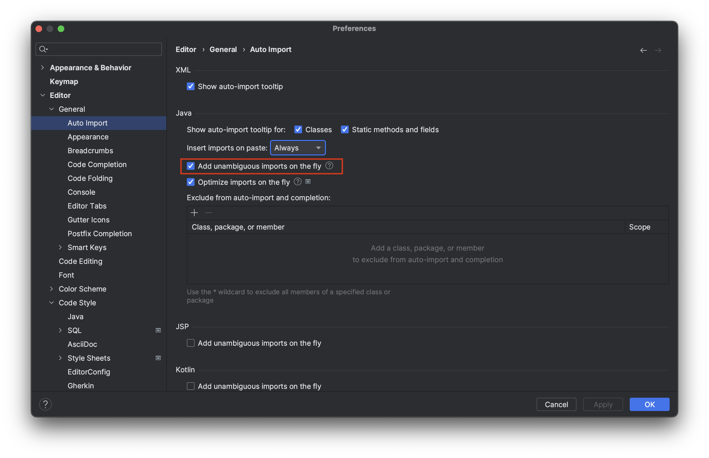
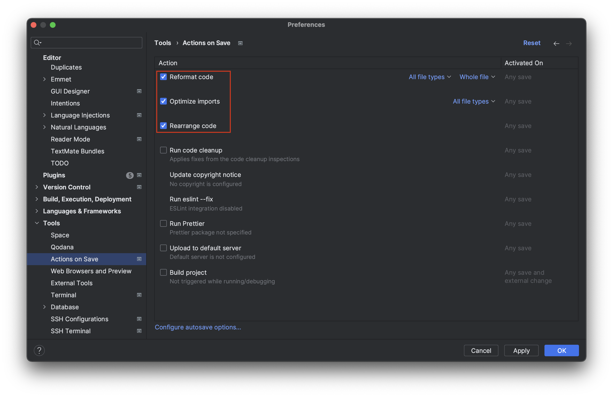
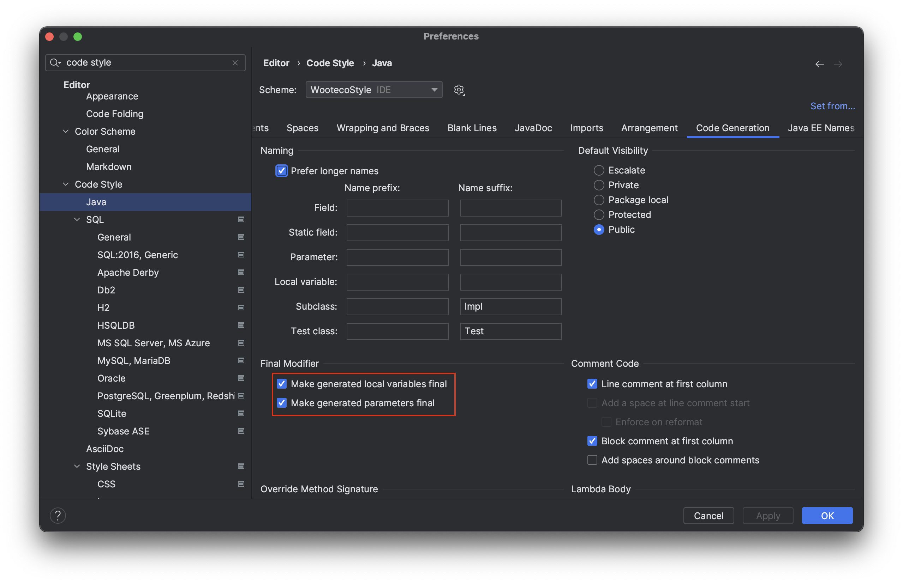

### Import 자동 적용

Prefrences > Editor > General > Auto Import > Add unambiguous imports on the fly

### 저장시 동작

Prefrences > Tools > Actions on Save

Reformat Code: Code Reformmating

Optimize imports: 사용하지 않는 Import 제거

Rearrange: Code Style > Arrangement 설정 기반 코드 재정렬

### 메소드 추출, 변수 추출시 final 적용

Prefrences > Editor > Code Style > Java > Code Generation > Final Modifier

