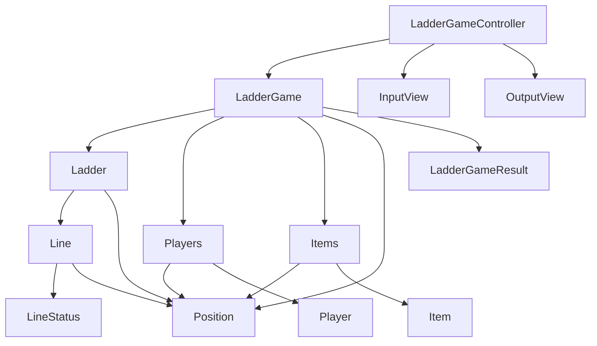
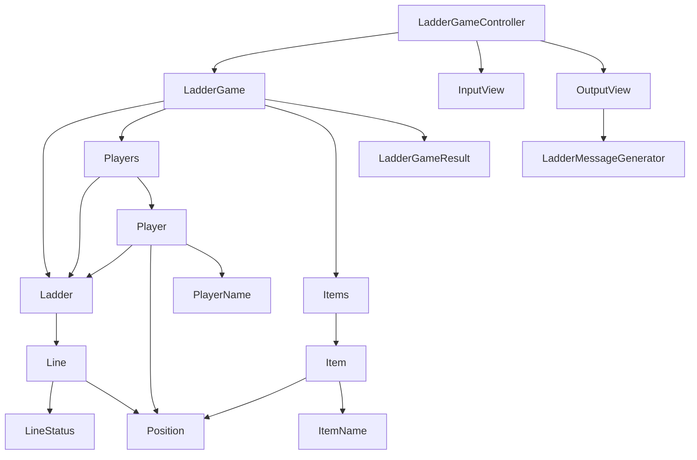

### 사다리 타기

사다리 타기 미션에서는 우가와 페어가 매칭되었다.  
이전 미션과 달리 TDD로 진행하는 것이 필수였기 때문에 익숙하지 않았지만, 우가와 미션에 관한 소통이 잘 되어서 큰 문제 없이 미션을 마무리할 수 있었다.  

우가와 이야기가 잘 통해서 그런지 1단계는 크게 어렵지 않게 진행할 수 있었는데, 2단계에서 많이 고전한 것 같다.

2단계에서는 2가지 방법으로 구현해봤다.

1. LadderGame에서 Position 기준으로 사다리 게임을 진행하는 방법
2. Player에게 Ladder를 넘겨서 Ladder에게 Position을 넘겨주며 메시지를 보내는 방법

### Position 기준으로 사다리 게임을 진행하는 방법

사실상 index를 Ladder에게 넘겨주고, 해당 index에 대한 결과를 받는 방법과 유사했다.  
구현하고 나니 다른 클래스들이 Position에 대한 의존도가 너무 높은 것 같았다.  
또한 Players가 별다른 책임을 가지고 있지 않다고 느꼈다.  



```java
public LadderGameResult play() {
    final Map<Player, Item> result = new LinkedHashMap<>();
    // 사용자 수만큼 Position을 가져와서 사다리 게임을 진행한다.
    for (Position position : Position.range(players.count())) {
        final Position resultPosition = ladder.play(position);
        result.put(players.get(position), items.get(resultPosition));
    }
    return new LadderGameResult(result);
}
```

### Player에게 Ladder를 전달하여 게임을 진행하는 방법

Position에 대한 값을 가지고 있는 Player에게 Ladder를 넘겨서, Player가 Ladder에게 메시지를 보내도록 구현하였다.  
이 방법이 사다리 게임을 위해서 객체들이 긴밀하게 협력하고, 조금 더 책임의 분배가 잘 되어있다고 생각이 되었다.  



```java
public LadderGameResult play() {
    // 참가자들에게 사다리를 전달해서 사다리에게 메시지를 보내도록 한다.
    final Map<Player, Position> playResult = players.play(ladder);

    final Map<Player, Item> result = new LinkedHashMap<>();
    for (Player player : playResult.keySet()) {
        result.put(player, toItem(playResult.get(player)));
    }
    return new LadderGameResult(result);
}
```

### 부족했던 부분

**유비쿼터스 언어에 시간을 들이기**  
유비쿼터스 언어를 정하는데 시간을 조금 더 들여야겠다고 생각했다.  
사다리 타기의 실행 결과를 Item으로 짓다니.. 뭔가 만족스럽지 않다.  
이전 미션과 마찬가지로, 명명하는 부분에서 부족함을 많이 느꼈다.  

**페어와 조금 더 친해지기**  
첫날은 페어와 친해지는 시간을 조금 더 가져야겠다고 생각했다.  
우가랑 회고할 때 내가 시작하자마자 컨벤션 정하자고 해서 많이 당황스러웠다고 한다. 우가 미안.. 🥲

**README를 조금 더 꼼꼼하게**  
이상하게 코딩에 집중하면 README를 업데이트하면서 같이 커밋 하는 걸 항상 까먹는다.  
다음 미션에는 조금 더 신경 써야겠다.

**좋은 질문을 생각하기**  
첫 PR때 리뷰어에게 질문을 남기지 못했다.  
리뷰어와의 시간이 소중한 시간이라는 것을 까먹지 말고, 나의 성장에 도움이 될 수 있는 질문을 생각해야겠다.   

**PR 후에도 꼼꼼하게 확인하기**  
분명 알고 있는 부분이지만, 놓친 부분이 많은 것 같았다.  
PR 하기 전에도 계속 확인을 했지만, 아무래도 IntelliJ에서 보니 코드에 익숙해져서 그런지 변경해야 할 부분이 잘 안보였다.  
github pr에서는 전체 변경사항을 확인할 수 있으니 PR 후에도 꼭 확인해야겠다.

**적극적으로 나의 의견을 말하기**  
의견을 적극적으로 내는 부분에 대해서 페어의 의견이 괜찮다고 생각하면 수용 후 개선을 하는 방향으로 진행을 했었는데, 조금 더 개선할 수 있는 방향이 있다면 나도 적극적으로 의견을 말해야겠다고 생각이 든다.  
나도 설득하는 힘을 기르고, 페어도 좋은 방향을 알 수 있고, 결과물도 좋은 방향으로 나오지 않을까? (고민 들어주신 리뷰어 터틀🐢 감사합니다.)

### 새로 학습한 부분

**객체의 생성 책임**  
Players가 Position을 생성하고 Player의 생성자에 넣어주었다. 하지만 이 부분에 대해서 생성 책임에 관련된 코멘트가 달렸다.
시간을 가지고 생각해 보니 Position을 가지고 있는 건 Player기 때문에 생성 책임을 Player가 담당하는 것이 좋다고 생각되었다.  

생성 책임에 관한 패턴으로 GRASP의 Creator 패턴이 있는데 다음의 요소를 최대한 만족하는 클래스에 생성 책임을 할당하는 것이 좋다.  
- B가 A 객체를 포함 또는 참조한다.
- B가 A 객체를 기록한다.
- B가 A를 긴밀하게 사용한다.
- B가 A의 초깃값을 가지고 있다.  

실제로 객체의 생성 책임에 관해서 깊이 생각하면서 코딩을 하지 않았는데, 이번 미션을 통해 시야가 넓어진 것 같다.

**패키지 분리 기준**  
패키지 분리에 대한 나만의 기준이 아직 명확하지 않아 질문이 들어와도 명확하게 답변을 하지 못했다.  
마지막 제출 전에 도메인 패키지 내부를 분리해 봤는데, 기준이 명확하지 않았기 때문에 좋지 않은 선택이었던 것 같다.
현재 진행하는 미션의 애플리케이션 크기가 그렇게 크지 않으니, domain 패키지에서 세부 패키지로 분리하지 않아도 될 것 같다.  

**사용하는 쪽에서 생각하기 & 예측가능한 코드 작성하기**  
Position에서 다음 위치나 이전 위치를 반환하는 메서드를 허용 범위(0~19)가 벗어난다면, 의미 없는 값이 들어간 Position을 반환하도록 했다.  
이건 Position을 사용하는 입장을 고려하지 못한 코딩이었는데, 사용하는 입장에서는 0~19의 값이 보장되어 있다고 생각할 것이기 때문이다.  
따라서 hasNext, hasPrevious라는 이전 값, 이후 값이 범위 내에 있는지 확인하는 메서드를 추가하고, 기존의 값을 가져오는 메서드는 범위가 벗어나면 예외를 던지는 방향으로 해결하였다.  

### 페어에게 배울 부분

밝은 기운을 가지고 있고 다른 사람들과 친화력이 좋은 것 같았다.  
이번에 페어 할 때 컨디션 관리를 제대로 못해서 많이 미안했다. 다음에는 최상의 컨디션으로 페어를 준비해 봐야겠다.  
그리고 우가랑 페어를 하고 나서, 나도 다른 사람들과 더 잘 지내봐야겠다는 생각이 들어 조금 더 용기를 내 잡담 중이다!  

의견을 적극적으로 내줘서 페어프로그래밍 진행이 잘 되었다.  
또한 페어 진행이 느린 것 같다고 말해줘서 안정적으로 시간 안에 미션을 완료할 수 있었다.  
페어프로그래밍 진행 속도에 대해 조금 더 생각을 해봐야겠다!

항상 지나갈 때마다 웃어주는데, 나도 자주 웃어야겠다고 생각했다.  
웃는 것만으로도 사람이 밝아 보여서 너무 좋은 것 같다!