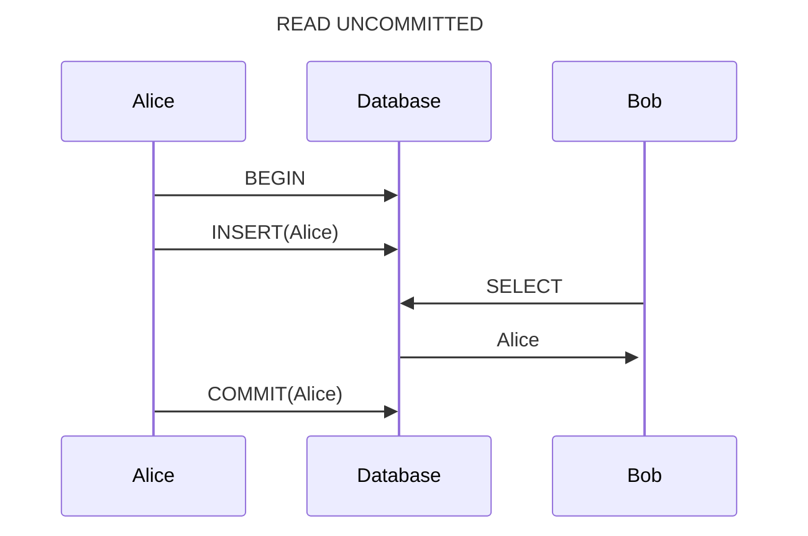
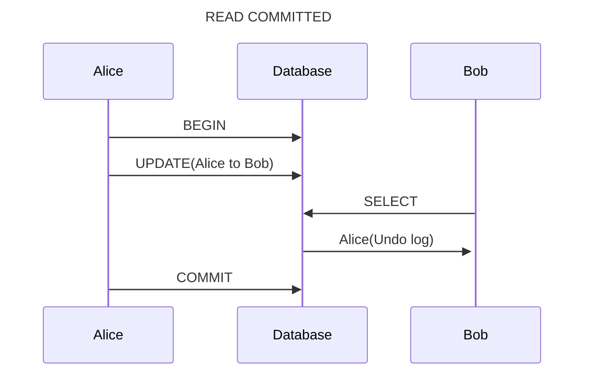
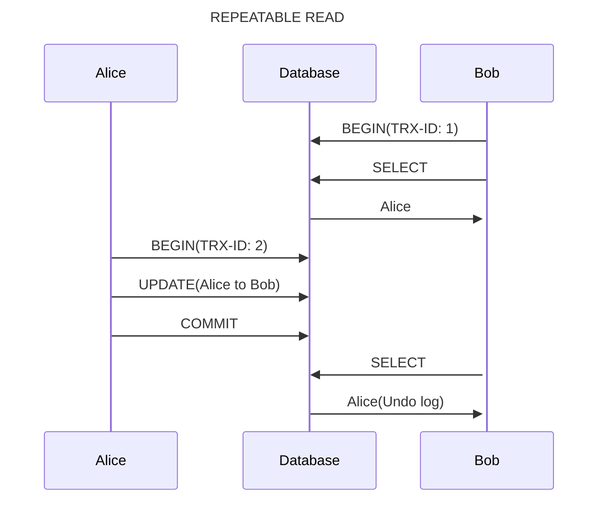
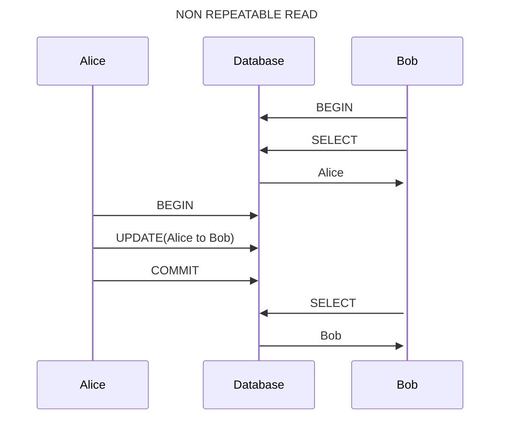
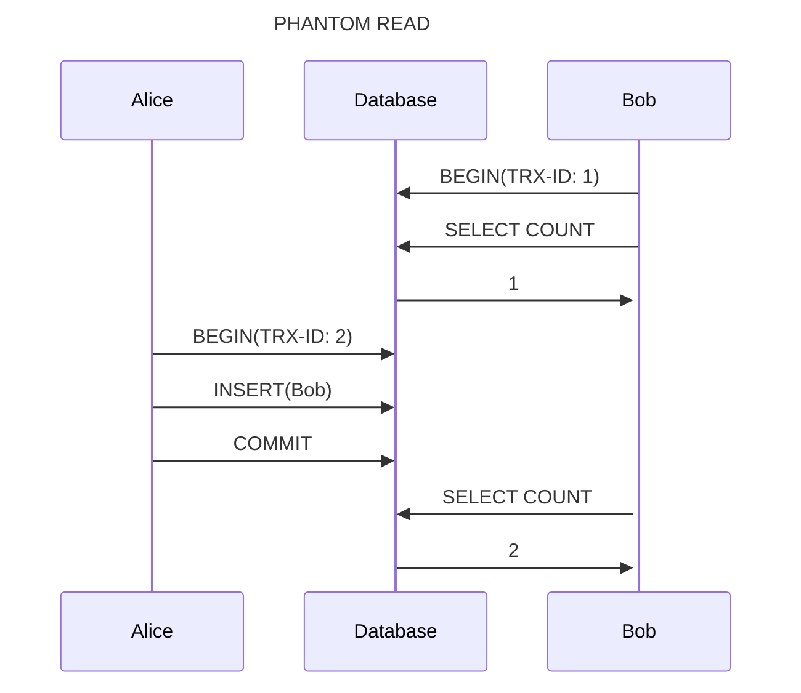

## 트랜잭션(Transaction)

데이터베이스에서 논리적 기능을 수행하기 위한 작업의 단위를 말한다.  
트랜잭션은 작업의 완전성과 데이터의 정합성을 보장해 준다.  
논리적인 작업 셋을 완벽하게 처리하거나, 오류 시 작업의 일부만 적용되는 현상을 막아준다.  

### 트랜잭션의 속성(ACID)

원자성(Atomicity): 트랜잭션 내에서 실행된 작업들은 모두 성공하거나, 실패해야 한다.  
일관성(Consistency): 트랜잭션이 수행되기 전과 후에 데이터베이스가 일관된 상태를 유지해야 한다.  
격리성(Isolation): 각각의 트랜잭션은 독립적이라 서로에게 영향을 주지 않아야 한다.  
지속성(Durability): 트랜잭션이 성공적으로 완료된다면 영구적으로 결과에 반영되어야 한다.  

### 트랜잭션 주의사항

트랜잭션은 꼭 필요한 최소의 코드에만 적용하는 것이 좋다.(트랜잭션의 범위를 최소화하라)  
구현해야 하는 업무에 따라 트랜잭션을 묶거나 트랜잭션에서 제외하고, 네트워크 작업이 있는 경우 반드시 트랜잭션에서 배제해야 한다.  

:::info 왜 네트워크 작업이 있을 때 트랜잭션에서 배제해야 할까? 🤔

데이터의 일관성과 안전성을 보장하기 위해 배제해야 한다.  
네트워크 작업을 트랜잭션 내부에 포함한다면 다음과 같은 문제가 발생할 수 있다.  
- 네트워크 작업이 중간에 실패할 가능성(안전성 X)
- 통신으로 인해 데이터가 변경될 수 있는 부분(일관성 X)

:::

## 격리 수준(Isolation level)

여러 트랜잭션이 동시에 처리될 때 특정 트랜잭션이 다른 트랜잭션에서 데이터의 조회 및 변경을 허용할지 결정하는 것을 말한다.  
격리 수준이 높아질 수록 동시 처리 성능이 떨어지는 것이 일반적이지만, `SERIALIZABLE`이 아니라면 크게 성능의 저하가 발생하지 않는다.  

### READ UNCOMMITTED

각 트랜잭션에서의 변경 내용이 `COMMIT`이나 `ROLLBACK` 여부에 상관없이 다른 트랜잭션에서 보인다.  
더티 리드 현상이 발생하기 때문에 정합성의 문제가 많은 격리 수준이다.  
MySQL 사용시 최소 `READ COMMITTED` 이상의 격리 수준 사용을 권장한다.  

### READ COMMITTED

트랜잭션에서 데이터를 변경하더라도 `COMMIT`이 완료된 데이터만 다른 트랜잭션에서 조회할 수 있다.  
오라클 DBMS에서 기본으로 사용되는 격리 수준이며, 온라인 서비스에서 가장 많이 선택되는 격리 수준이다.  
`REPEATABLE READ`가 보장되지 않기 때문에 `NON-REPEATABLE READ` 문제가 발생한다.  

### REPEATABLE READ

트랜잭션이 시작되기 전에 `COMMIT`이 완료된 내용에 대해서만 조회할 수 있다.  
MySQL의 InnoDB 스토리지 엔진에서 기본으로 사용되는 격리 수준이다.  
MVCC를 이용해 언두(Undo) 영역에 백업된 이전 데이터를 이용해 동일 트랜잭션 내에서는 동일한 결과를 보여줄 수 있게 보장한다.  
동일한 결과를 보장하는 방법은 다음과 같다.  
  - 모든 InnoDB 트랜잭션은 순차적으로 증가하는 고유한 트랜잭션 번호를 가진다.
  - Undo 영역에 백업된 레코드에는 변경을 발생시킨 트랜잭션의 번호가 포함되어있다.
  - Undo 영역의 백업된 데이터는 스토리지 엔진이 불필요하다고 판단하는 경우 삭제된다.
  - `REPEATABLE READ` 격리 수준에서는 MVCC를 보장하기 위해 가장 오래된 트랜잭션 번호보다 앞선 Undo 영역의 데이터는 삭제하지 않는다. 

InnoDB에서는 갭 락과 넥스트 키 락을 이용하여 팬텀 리드 현상을 방지한다.  

:::note 갭 랍(Gap lock)과 넥스트 키 락(Next-key lock)

갭 락: 레코드와 바로 인접한 레코드 사이의 간격만을 잠그는 락이다.  
넥스트 키 락: 레코드 락과 갭 락을 합쳐놓은 형태의 잠금으로 레코드와 그 레코드 앞의 갭 락을 포함한다.

:::

:::note MVCC(Multi Version Concurrency Control)

동시성을 제어하는 방법 중 하나로 하나의 레코드에 대해 여러 개의 버전이 동시에 관리되는 것이다.
  - PostgreSQL은 다중 버전의 데이터를 저장하는 것으로 MVCC를 구현한다.
  - Oracle, InnoDB는 `Undo log`를 이용해 이 기능을 구현한다.(최신 버전의 데이터만 DB에 저장)

잠금을 사용하지 않는 읽관된 읽기를 제공하는 것이 목적이다.

:::

### SERIALIZABLE

트랜잭션을 순차적으로 진행시키는 격리 수준이고 따라서 동시 처리 성능도 다른 격리 수준보다 떨어진다.  
트랜잭션에서 읽고 쓰는 레코드를 다른 트랜잭션에서는 접근할 수 없고 단순한 읽기 작업도 공유 잠금(읽기 잠금)을 획득해야만 한다.  
InnoDB에서는 팬텀 리드 현상이 `REPEATABLE READ` 격리 수준에서 발생하지 않기 때문에 굳이 사용할 필요는 없다.  

## 격리 수준에 따른 부정합 문제

격리 수준에 따라 더티 리드, 반복 가능하지 않은 조회, 팬텀 리드 문제가 발생한다.  

| 격리 수준 / 부정합 문제 | 더티 리드 | 반복 가능하지 않은 조회 | 팬텀 리드 |
| --- | --- | --- | --- |
| READ UNCOMMITTED | O | O | O |
| READ COMMITTED | X | O | O |
| REPEATABLE READ | X | X | O(InnoDB는 X) |
| SERIALIZABLE | X | X | X |

### 더티 리드(Dirty read)

어떤 트랜잭션에서 처리한 작업이 완료되지 않았어도 다른 트랜잭션에서 볼 수 있는 현상  
트랜잭션 격리 수준이 READ UNCOMMITTED일 때 발생한다.  
예) B가 레코드를 추가하고 커밋을 하지 않았지만, A가 해당 레코드를 조회할 수 있는 경우

### 반복 가능하지 않은 조회(Non-repeatable read)

한 트랜잭션 내의 같은 행에 두 번 이상 조회가 발생했는데, 그 값이 다른 현상  
예) A가 레코드를 여러 번 조회하던 중 B가 레코드를 변경하여 A가 조회한 값이 달라지는 경우  

### 팬텀 리드(Phantom read, Phantom row)

한 트랜잭션 내에서 동일한 쿼리 수행시, 수행 결과가 다른 현상  
예) A가 레코드를 조회하고 B가 레코드를 추가하여 A가 다시 조회할 때 존재하지 않은 레코드가 조회되는 경우  

## 참고 자료

Real My SQL 8.0 - 5장 트랜잭션과 잠금, 백은빈, 이성욱  
[Isolation Level, MySQL](https://dev.mysql.com/doc/refman/8.0/en/innodb-transaction-isolation-levels.html)