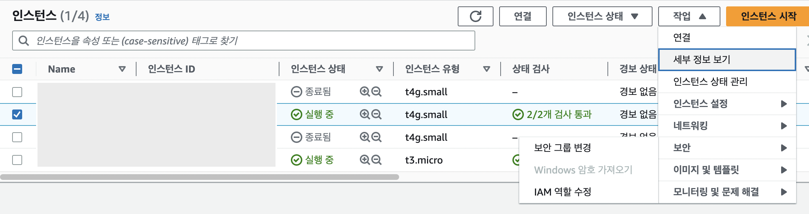

### 설정 환경

소프트웨어 이미지: Amazon Linux 2023 AMI  
아키텍쳐: ARM  
인스턴스 유형: t4g.small  
환경 구성이 완료된 Elastic Beanstalk   
단일 Spring Boot 프로젝트가 존재하는 Github Repository

### \[EC2 CLI\] Swap 메모리 설정

t4g.small이 램이 2G인데 램이 부족하다고 느껴져서 swap 메모리를 설정했다.  
아래 명령어를 따라 swap 메모리를 설정하고 free -h 명령어를 통해 잘 설정되었는지 확인할 수 있다.  

``` bash
# fallocate 이용하여 스왑 파일 생성
sudo fallocate -l 2G /swapfile

# 권한 설정
sudo chmod 600 /swapfile

# 파일을 Swap 포맷으로 변경 후 시스템에 등록
sudo mkswap /swapfile
sudo swapon /swapfile

# Swap 메모리 부팅시 자동으로 마운트하도록 적용
# 최하단에 다음 구문 설정 -> /swapfile swap swap defaults 0 0
sudo vim /etc/fstab
```


### \[EC2 CLI\] jenkins 설치

```bash
sudo wget -O /etc/yum.repos.d/jenkins.repo \
    https://pkg.jenkins.io/redhat-stable/jenkins.repo
sudo rpm --import https://pkg.jenkins.io/redhat-stable/jenkins.io-2023.key
sudo yum upgrade
sudo yum install java-17-amazon-corretto-devel
sudo yum install jenkins
sudo systemctl daemon-reload
```

[Jenkins 공식 홈페이지](https://www.jenkins.io/doc/book/installing/linux/#red-hat-centos) 를 참고하여 설치하는 게 좋다.

### \[EC2 CLI\] Jenkins 시작

```bash
sudo systemctl enable jenkins
sudo systemctl start jenkins
```

enable로 설정하여 부팅시 자동시작 되도록 설정한다.

### \[EC2 CLI\] nginx & git 설치

```bash
sudo yum install nginx
sudo systemctl enable nginx
sudo systemctl start nginx

sudo yum install git
```

nginx와 코드를 불러올 때 사용할 git을 설치한다.

### \[EC2 CLI\] nginx 리버스 프록시 설정

아래 설정 파일은 공식 홈페이지에서 안내한 기본적인 설정 파일이다.

```bash
upstream jenkins {
  keepalive 32; # keepalive connections
  server 127.0.0.1:8080; # jenkins ip and port
}

# Required for Jenkins websocket agents
map $http_upgrade $connection_upgrade {
  default upgrade;
  '' close;
}

server {
  listen          80;       # Listen on port 80 for IPv4 requests

  server_name     jenkins.example.com;  # replace 'jenkins.example.com' with your server domain name

  # this is the jenkins web root directory
  # (mentioned in the output of "systemctl cat jenkins")
  root            /var/run/jenkins/war/;

  access_log      /var/log/nginx/jenkins.access.log;
  error_log       /var/log/nginx/jenkins.error.log;

  # pass through headers from Jenkins that Nginx considers invalid
  ignore_invalid_headers off;

  location ~ "^/static/[0-9a-fA-F]{8}\/(.*)$" {
    # rewrite all static files into requests to the root
    # E.g /static/12345678/css/something.css will become /css/something.css
    rewrite "^/static/[0-9a-fA-F]{8}\/(.*)" /$1 last;
  }

  location /userContent {
    # have nginx handle all the static requests to userContent folder
    # note : This is the $JENKINS_HOME dir
    root /var/lib/jenkins/;
    if (!-f $request_filename){
      # this file does not exist, might be a directory or a /**view** url
      rewrite (.*) /$1 last;
      break;
    }
    sendfile on;
  }

  location / {
      sendfile off;
      proxy_pass         http://jenkins;
      proxy_redirect     default;
      proxy_http_version 1.1;

      # Required for Jenkins websocket agents
      proxy_set_header   Connection        $connection_upgrade;
      proxy_set_header   Upgrade           $http_upgrade;

      proxy_set_header   Host              $host;
      proxy_set_header   X-Real-IP         $remote_addr;
      proxy_set_header   X-Forwarded-For   $proxy_add_x_forwarded_for;
      proxy_set_header   X-Forwarded-Proto $scheme;
      proxy_max_temp_file_size 0;

      #this is the maximum upload size
      client_max_body_size       10m;
      client_body_buffer_size    128k;

      proxy_connect_timeout      90;
      proxy_send_timeout         90;
      proxy_read_timeout         90;
      proxy_buffering            off;
      proxy_request_buffering    off; # Required for HTTP CLI commands
      proxy_set_header Connection ""; # Clear for keepalive
  }

}
```

Jenkins는 8080 포트로 동작하기 때문에 리버스 프록시를 설정해준다.  
`/etc/nginx/conf.d` 아래 `default.conf` 파일을 하나 생성하고 위와 같이 입력하고 저장한다.  
nginx의 기본 설정 파일에 존재하는 `include /etc/nginx/conf.d/*.conf;` 설정 때문에 `.conf` 로 끝난다면 설정이 적용된다.  
설정 후 `sudo nginx -t`로 설정파일이 정상인지 확인하고, `sudo systemctl restart nginx` 명령어로 nginx를 재시작한다.  

### \[Jenkins\] Jenkins 접속

Jenkins를 설치한 EC2 인스턴스 인바운드 설정에 80번 포트가 열려있는지 확인한다.  
EC2의 아이피 주소를 입력하고 들어가면 비밀번호를 입력하라는 창이 나온다.


초기 비밀번호를 입력해야 하는데 `sudo cat /var/lib/jenkins/secrets/initialAdminPasswor` 를 입력해 초기 비밀번호를 얻을 수 있다.  
비밀번호를 입력하면 플러그인 설정 창이 나올텐데 `install suggested plugins`을 클릭하여 Jenkins가 추천하는 기본 플러그인들을 설치하면 된다.  
플러그인을 설치하면 계정 및 주소 설정을 해야하는데 이건 편하게 설정하면 된다.  

### \[Jenkins\] Jenkins Blue Ocean 설치

Jenkins 관리 → Plugin Manager에서 Blue Ocean을 검색해 설치한다.

### \[AWS IAM & EC2\] IAM으로 EC2 인스턴스 권한 설정하기

S3와 Elastic Beanstalk에 접근할 수 있는 권한을 부여하려면 AmazonS3FullAccess, AdministratorAccess-AWSElasticBeanstalk 두 개의 정책을 가지고 있는 역할을 생성해야 한다.  
IAM에서 다음과 같이 역할을 하나 새로 생성한다.

1. 엔터티 선택


2. 권한 추가


3. 이름 지정, 검토 및 생성


4. 생성한 IAM EC2 Jenkins 인스턴스를 선택하고, 작업 → 보안 → IAM 역할 수정을 눌러 Role 설정



### \[AWS S3\] Jar 파일을 업로드 할 S3 버킷 생성

버킷을 생성할 때 다음 설정을 제외하고 모두 차단 활성화를 해준다.

- `새 ACL(액세스 제어 목록)을 통해 부여된 버킷 및 객체에 대한 퍼블릭 액세스 차단`


### \[Github\] Blue Ocean에서 파이프라인 생성에 필요한 Github Token 생성

repo, user:email 권한이 있는 토큰이 필요하다.  

### \[Jenkins\] 블루 오션 시작


블루 오션 열기로 파이프라인을 생성한다.  
토큰 입력 → 조직 선택 → CI/CD 설정할 Repository 선택을 하면 파이프라인 창으로 넘어간다.  
Jenkinsfile을 직접 작성하여 설정하기 위해 간단하게 print 하나 출력하는 것으로 설정했다.  


파이프라인이 실행될 텐데 pipeline status에서 아래와 같이 초록불이 뜨면 된다.


### \[Github Repsoitory\] Jenkinsfile 설정

블루 오션 시작을 통해 설정하면 Jenkinsfile이 하나 만들어지고, 아래와 같이 원하는 파이프라인을 설정한다.

```bash
pipeline {
  agent any
  stages {
    stage('build and test') {
      steps {
        sh '/gradlew clean build'
      }
    }
    stage('zip') {
      steps {
        sh 'mv ./build/libs/woowachat.jar .'
        sh 'zip -r woowachat.zip .platform delivery.jar Procfile'
      }
    }
    stage('upload') {
      steps {
        sh 'aws s3 cp woowachat.zip s3://woowa-chat/woowachat.zip --region ap-northeast-2'
      }
    }
    stage('deploy') {
      steps {
        sh 'aws elasticbeanstalk create-application-version --region ap-northeast-2 --application-name woowachat --version-label ${BUILD_TAG} --source-bundle S3Bucket="woowa-chat",S3Key="woowachat.zip"'
        sh 'aws elasticbeanstalk update-environment --region ap-northeast-2 --environment-name Woowachat-env --version-label ${BUILD_TAG}'
      }
    }
  }
}
```

### \[Github\] Webhooks 설정


push 이벤트가 발생할 때 `http://Jenkins주소/github-webhook/` 로 post request를 하도록 웹훅을 설정한다.

### 참고 자료

[Install Jenkins - CentOS, Jenkins](https://www.jenkins.io/doc/book/installing/linux/#red-hat-centos)  
[Nginx Reverse Proxy Configuration, Jenkins](https://www.jenkins.io/doc/book/system-administration/reverse-proxy-configuration-nginx/)  
[Amazon Corretto 17 JDK Install, AWS](https://docs.aws.amazon.com/corretto/latest/corretto-17-ug/amazon-linux-install.html)  
[Amazon Linux 2023 packages, AWS](https://docs.aws.amazon.com/linux/al2023/release-notes/all-packages-al2023-20230419.html)