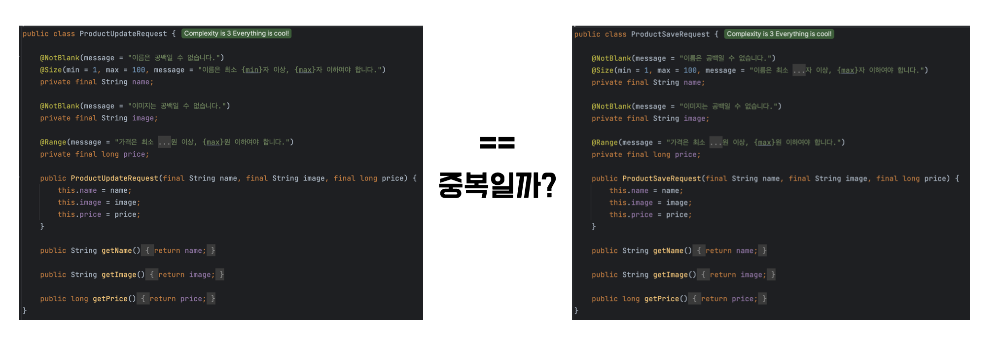
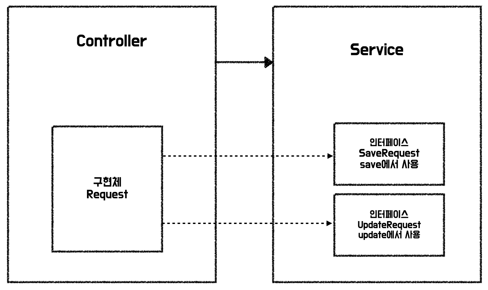

:::note PR 링크 
1단계: https://github.com/woowacourse/jwp-shopping-cart/pull/244  
2단계: https://github.com/woowacourse/jwp-shopping-cart/pull/300  
:::

### 웹 장바구니 미션

장바구니 미션은 블랙캣이랑 진행했다.  
요구사항이 엄청 복잡한 미션은 아니었고, 스프링을 사용하여 기본적인 CRUD를 구현하는 미션이었다.  
2단계에서는 Basic 인증을 통해 자신의 장바구니에만 상품을 담고, 제거할 수 있도록 구현하는 요구사항이 추가되었다.  
Interceptor나 Argument Resolver에 대한 이해도가 높지 않았는데, 이번 미션을 통해 조금 더 알아간 느낌이다.  
이전에 스프링 사용할 때는 아무 생각 없이 코드를 작성하는 경우가 많았는데, 코드를 작성할 때 근거가 생기고 있는 것 같다.  

### 새로 학습한 부분

**DTO 우발적 중복**

장바구니 미션에서는 상품 추가와 상품 수정에 대한 요구사항이 있었다.  

클래스명을 제외하고 필드와 검증 로직 그 외 모든 게 같은 DTO를 보며 중복이라고 생각을 했고, 반대로 용도가 다르기 때문에 중복이 아니라고 생각하기도 했다.  
로버트 마틴님이 집필하신 클린 아키텍처는 아래와 같이 중복을 여러 가지 종류로 나누어 설명하고 있다.  

- 진짜 중복: 한 인스턴스가 변경되면, 동일한 변경을 그 인스턴스의 모드 복사본에 반드시 적용해야 한다.
- 우발적 중복: 중복으로 보이는 두 코드 영역이 각자의 경로로 발전한다면, 즉 서로 다른 속도와 다른 이유로 변경된다면 이 두 코드는 진짜 중복이 아니다.

추가와 수정은 초기에는 중복으로 보이지만 초기 생성 시에만 기입하는 데이터들이 추가되거나, 시간이 지나면서 서로 달라질 가능성이 높아진다.  
따라서 리뷰어 웨지가 아래와 같이 의존 역전을 이용하는 방법도 있다고 알려주셨다.  

**Interceptor에서 인증한 값 재사용**

사실 조회를 두 번 하기 싫어서 다양한 방법을 생각했었는데 이번 미션에서는 ThreadLocal을 사용했다.  
일단 Tomcat은 요청마다 다른 스레드를 사용하고, Interceptor에서 조회해서 만든 Credential을 ThreadLocal에 넣어두었다가 ArgumentResolver에서 꺼낸 다음 ThreadLocal을 clear 하면 문제가 없을 거라 판단했다.  

리뷰어인 웨지에게도 어떤 방법을 사용할지 궁금증을 작성했었다.  
웨지는 email에 index를 걸어두고 dao 재조회를 사용할 것이라고 했다.  
재사용하지 않고 db에 인덱스를 걸 생각은 하지 못했는데, 제일 직관적이고 좋은 방법이라고 생각했다.  

### 페어에게 배울 부분

**기록**

블랙캣은 기록을 굉장히 잘 하는 크루였다.  
노션에 페어를 진행하면서 했던 내용 + 고민했던 부분 + 회고를 꼼꼼하게 기록해서 공유해 주었다.  
추가적으로 이모지를 적극적으로 사용하여 더욱 좋았다!

**의견 일치시키기**

페어 시간은 한정되어 있고, 기간 내 요구사항을 만족해야 한다.  
따라서 적당히 타협을 봐서 의견을 빠르게 수용해 데드라인을 맞추는 것도 중요하다고 생각한다.  
블랙캣은 내 의견을 잘 들어줬고, 덕분에 막히는 부분 없이 빠르게 미션을 진행할 수 있었다.  

빨리 친해졌고, 의사소통이 잘 돼서 재밌게 코딩할 수 있었다!