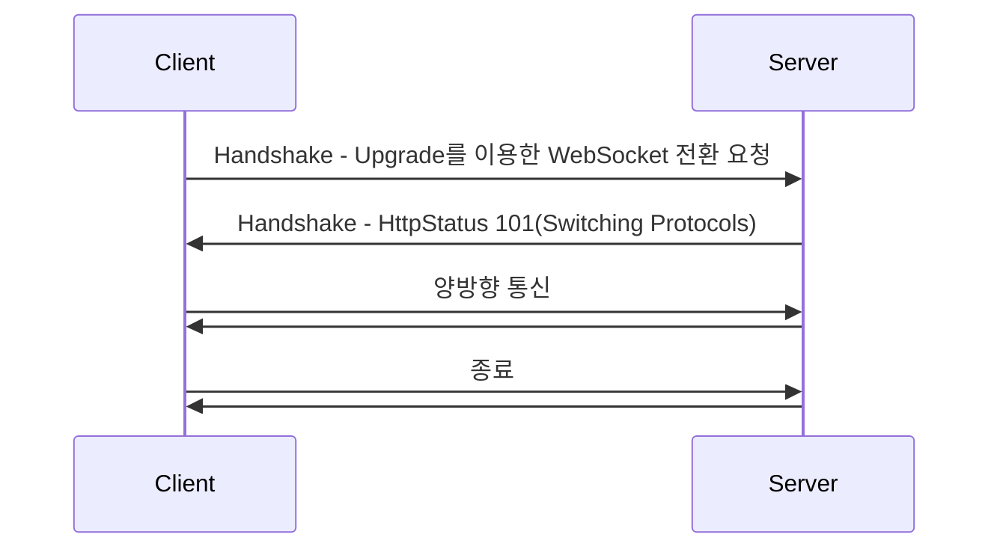

### 웹소켓

단일 TCP 연결을 통해 클라이언트와 서버 간 전이중 양방향 통신을 지원하는 프로토콜  
웹 환경에서 연속된 데이터를 실시간으로 처리할 수 있다.  

웹소켓은 HTTP의 포트를 그대로 사용하고 각각 포트 80과 포트 443을 사용하여 HTTP(ws://) 및 HTTPS(wss://)로 서버에 연결한다.  

### 웹소켓 등장 배경

웹소켓이 등장하기 이전, 실시간성을 보장하기 위해 Polling, Streaming 같은 기술을 사용했어야 했다.  
이는 실시간성이나 양방향성을 만족시키지 못했고, HTTP를 이용하기 때문에 과도한 오버헤드가 발생했다.  

### 웹소켓의 동작



### 1. Upgrade 요청

WebSocket 프로토콜로 전환하는 HTTP 요청을 보낸다.  
이는 HTTP와 같이 80, 443 포트를 사용한다.  
웹소켓으로 전환하기 위해서는 Upgrade: websocket, Connection: Upgrade 헤더가 필요하다.  
Sec-WebSocket-Key는 서버에서 Sec-WebSocket-Accept를 계산하여 응답하고 이 값이 예상한 값과 다르면 연결이 수립되지 않는다.  
Sec-WebSocket-Protocol의 경우 서브프로토콜의 목록으로 서버 측에서는 해당 목록 중 하나를 선택하여 반환해야 한다.  
만약 서버측에서 여러 개 지원이 가능한 경우 지원 가능한 프로토콜 중 첫번째 프로토콜을 클라이언트측으로 보낸다.  

```
GET /chats HTTP/1.1
Host: localhost:8080
Upgrade: websocket
Connection: Upgrade
Sec-WebSocket-Key: Uc9l9TMkWGbHFD2qnFHltg==
Sec-WebSocket-Protocol: v10.stomp, v11.stomp
Sec-WebSocket-Version: 13
Origin: http://localhost:8080
```

### 2. Switching Protocols

서버는 101 Switching Protocols 응답을 반환한다.  
Sec-WebSocket-Accept은 Sec-WebSocket-Key 뒤에 `258EAFA5-E914-47DA-95CA-C5AB0DC85B11`를 붙이고 SHA1로 해싱 후 Base64로 인코딩하여 반환한다.  
이는 서버 웹소켓 프로토콜의 지원 여부를 클라이언트에게 명확히 알리기 위해 존재한다.  

```
HTTP/1.1 101 Switching Protocols 
Upgrade: websocket
Connection: Upgrade
Sec-WebSocket-Accept: 1qVdfYHU9hPOl4JYYNXF623Gzn0=
Sec-WebSocket-Protocol: v10.stomp
```

### 3. 통신 후 종료

연결이 수립되면 웹소켓 프레임 단위로 양방향 통신을 한다.  
연결 종료를 원하는 경우 클라이언트, 서버 모두 연결 종료를 요청할 수 있다.  

### 참고 자료

https://datatracker.ietf.org/doc/html/rfc6455
https://developer.mozilla.org/ko/docs/Web/API/WebSockets_API/Writing_WebSocket_client_applications  
https://developer.mozilla.org/ko/docs/Web/API/WebSockets_API/Writing_WebSocket_servers  
https://docs.spring.io/spring-framework/reference/web/websocket.html  
