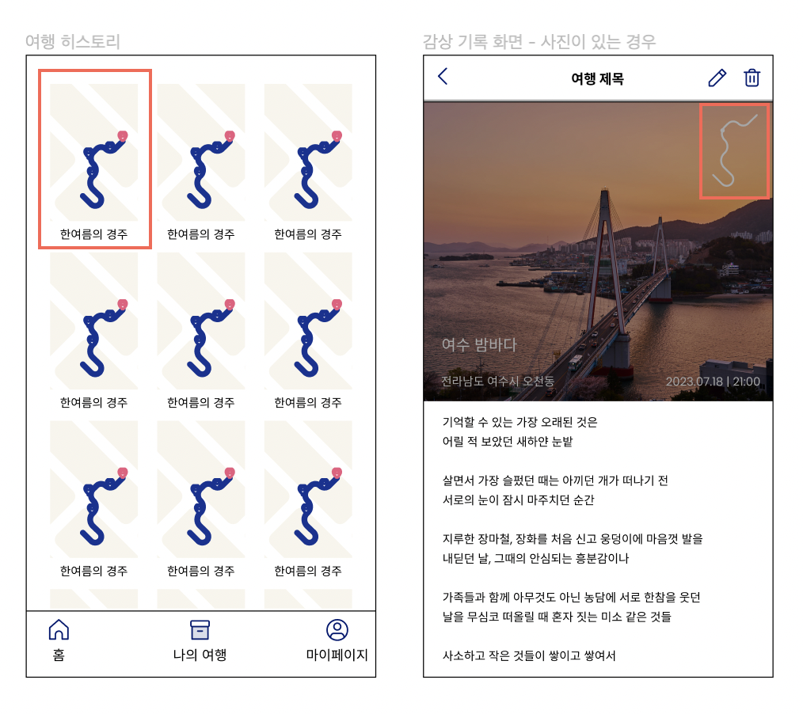

## 이미지 생성의 책임

위 와이어 프레임에서 `여행 히스토리`와 `여행에 대한 감상을 위한 경로 이미지`의 경우, 맵 API에서 제공하는 도형 그리기 API(네이버 맵 API 기준 Polyline)를 사용할 수 없다.  
따라서 이미지를 직접 생성하거나, 클라이언트에서 직접 위경도를 이용하여 그려야 한다.

해당 요구사항을 해결하기 위해서는 다음과 같은 기능을 가진 라이브러리가 필요하다.

- 이미지 생성
- 선과 점 표현
- 투명한 배경색

현재 클라이언트의 바쁜 일정과 기능 구현에 있어 약간의 연산이 들어간다는 부분에서 백엔드에서 이미지를 생성하기로 결정을 내렸다.

## 고려한 기술

이미지 생성을 위해 다음과 같은 라이브러리 또는 기술들을 확인해 보았다.  

- Python의 Matplotlib
- **AWT(Abstract Window Toolkit) [최종 선택]**
- 이미지 처리 라이브러리 및 Java에서 내부적으로 Matplotlib 사용할 수 있는 라이브러리 (원하는 기능 없음)
- Java Swing, Java FX (단순한 선 그리기 + 점 찍기라 불필요)

## Python & Matplotlib

데이터 시각화 라이브러리  
이미지 생성 및 로컬에 저장까지 걸리는 시간: 0.2초   

- 코드가 간단해서 유지 보수성이 좋다.  
- AWS Lambda 같은 서버리스 컴퓨팅 서비스나 FastAPI와 같은 웹 프레임워크로 추가적인 API를 구현해야 한다.
- Spring Boot에서 추가적인 API 호출을 해야하고, 확장성과 비동기 처리 등 고려 해야 할 부분이 많다.

## Java AWT 이외의 라이브러리

Python이 아닌 Java에서의 라이브러리도 고려를 해봤지만 요구사항에 적합하지 않거나, 적은 요구사항에 비해 무거운 라이브러리들이 많아서 제외했다.

라이브러리 | 설명 | 제외 이유
-- | -- | --
Swing | AWT 이후에 나온 GUI 라이브러리, 네이티브 UI를 사용하지 않고 모든 운영체제 상에서 동일한 UI를 가지도록 함 | 요구사항에 비해 무겁고 복잡도가 높음
JavaFX | Swing 이후에 나온 GUI 라이브러리, 3차원 그래픽을 지원함 | 요구사항에 비해 무겁고 복잡도가 높음
[simple-java-plot](https://github.com/yuriy-g/simple-java-plot) | AWT로 구현된 플로팅 라이브러리 | AWT 기반이긴 하지만 직접 AWT를 사용하는 것에 비해 메리트가 없음, 커스텀 설정 기능이 없음
[matplotlib4j](https://github.com/sh0nk/matplotlib4j) | Matplotlib를 Java에서 사용할 수 있게 하는 라이브러리 | 내부적으로 파이썬 사용하기에 무거움, 배경 투명화 기능 없음

## Java & AWT(Abstract Window Toolkit)

그래픽과 이미지를 그리기 위한 도구  
이미지 생성 및 로컬에 저장까지 걸리는 시간: 1.75초  

- 플로팅 라이브러리를 사용하는 것보다 구현의 난이도가 다소 존재한다.
- 이미지 생성 시간이 다소 소요되기 때문에 빠른 응답 반환을 위해 비동기 처리를 고려할 수 있을 것 같다.
- 추가적인 api 호출을 하지 않아도 된다.

## 기술 선택

AWT의 경우 Matplotlib에 비해 구현의 난이도가 다소 있고, 이미지 생성 시간이 더 많이 걸리는 단점이 있다.  
하지만 추가적인 api 호출을 하지 않아도 되는 부분, Python을 사용하는 경우 추가적인 웹 프레임워크의 학습 비용을 고려하여 AWT를 사용하기로 결정했다.

## 유지 보수

AWT라는 생소한 기술을 사용하기 때문에 유지 보수성을 위해 팀원들과 공유하는 것이 중요하다고 생각했다.  
따라서 다음과 같은 방법으로 공유하기로 했다.  

1. 코드 리뷰와 PR을 통해 작성한 AWT 코드에 대한 설명 및 리뷰 받는다. 
2. AWT를 사용한 부분을 문서화하여 공유한다.