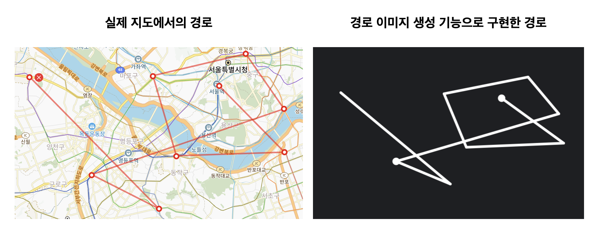
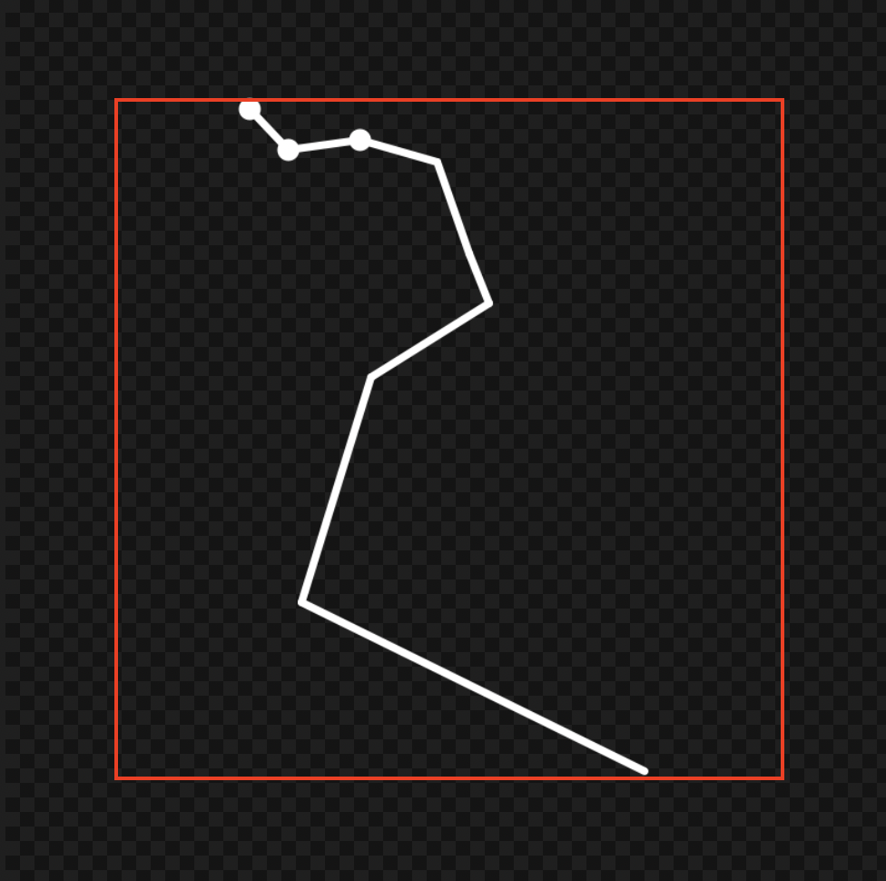
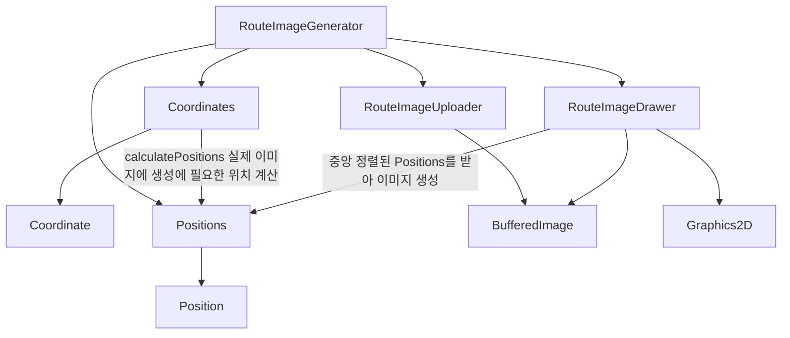
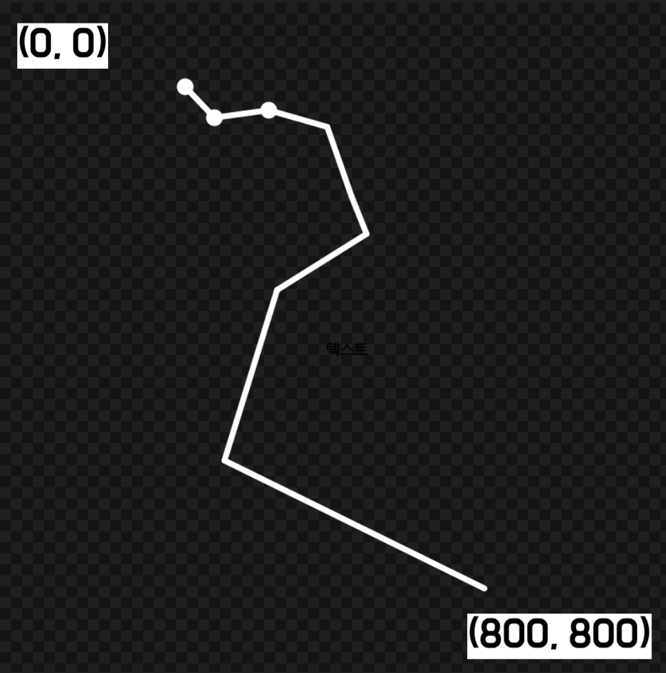
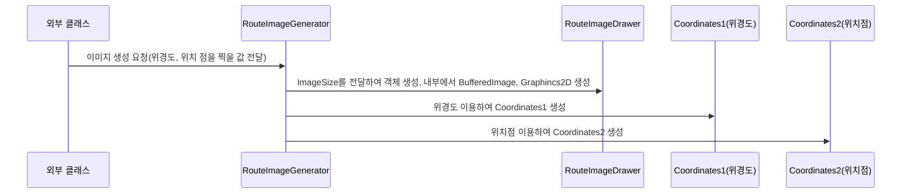
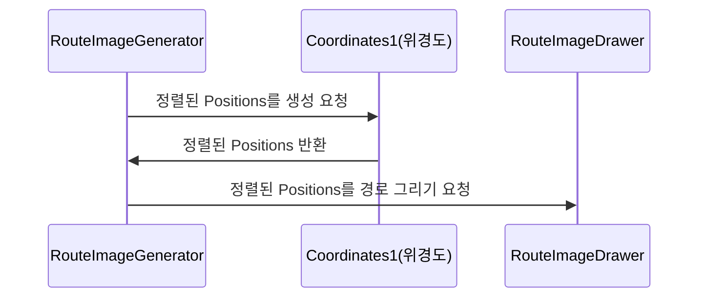
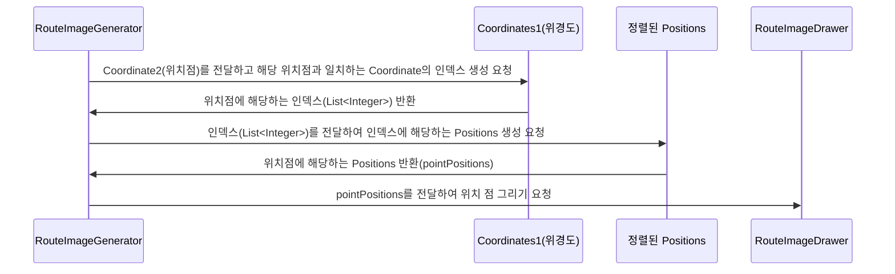
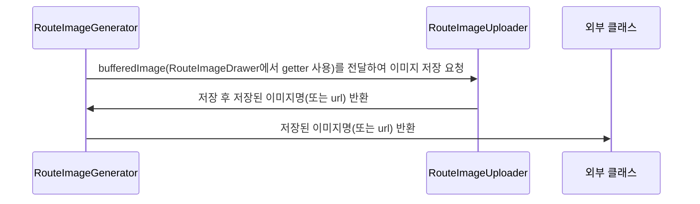
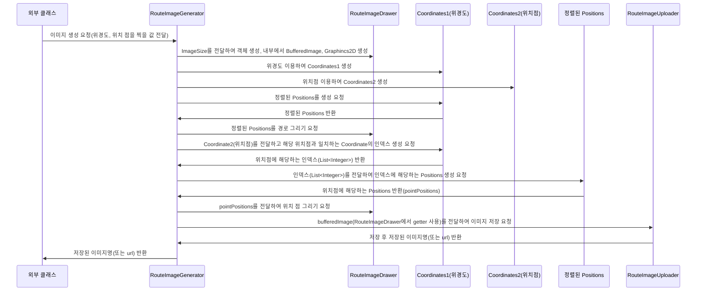

## 개요

여행에 대한 경로를 보여주기 위해 경로 이미지를 생성하는 기능을 추가했다.  
경로 이미지에 대한 요구사항 및 기술 선택에 대한 내용은 [링크](./route-image-intro)에 있다.

### 구현 결과



예시 데이터는 다음과 같다.  
**서울역(점)** → 신사역 → 노량진역 → 홍대입구역 → 종로3가역 → 옥수역 → **구로역(점)** → 신림역 → 발산역

```java title="예시 데이터"
List<Double> x = List.of(
        126.97094933811682, 127.02154822802501, 126.94218991864345, 126.92402556641424,
        126.99265358592287, 127.01779856076462, 126.88474839801178, 126.92900751277035, 126.83930056313639
);
List<Double> y = List.of(
        37.55302829553499, 37.51619698970427, 37.51294119442773, 37.5565933969331,
        37.57034879708931, 37.54027238225762, 37.50129417536773, 37.48258811529137, 37.557607696911184
);
List<Double> xPoints = List.of(126.97094933811682, 126.88474839801178);
List<Double> yPoints = List.of(37.55302829553499, 37.50129417536773);
```

### IMAGE_SIZE & ROUTE_SIZE

```java title="RouteImageGenerator.java"
private static final int IMAGE_SIZE = 800;
private static final int ROUTE_SIZE = 600;
```

코드를 보면 IMAGE_SIZE와 ROUTE_SIZE가 있다.  
IMAGE_SIZE는 말 그대로 이미지의 width와 height를 의미한다.  
ROUTE_SIZE의 경우 상하좌우 100px 만큼의 간격을 위해 존재한다.  
따라서 실제 경로 이미지의 크기는 600 * 600 사이즈로 생성된다.  



**사이즈 변경의 이유**

255 * 255 정도의 작은 사이즈로 이미지를 생성해보려고 했는데, 이미지의 선명도가 좋지 않아 800 * 800 사이즈로 변경했다.

## 주요 클래스

### 요약

| 클래스명 | 설명 | 특이사항 |
| --- | --- | --- |
| Coordinate | 위도, 경도로 이루어진 위치 값 | 좌표를 뜻하지만 여행 도메인에 포함된 Point 클래스와 구분하기 위해 longitude, latitude를 사용하지 않고 x, y 사용 |
| Coordinates | Coordinate의 일급 컬렉션 | - |
| Position | 실제 이미지 생성에 사용할 위치 값 | Integer 타입의 x, y 사용 |
| Positions | Positions의 일급 컬렉션 | - |
| RouteImageDrawer | 실제 이미지에 경로를 그려주는 클래스 BufferedImage, Graphics2D를 가지고 있음 | 이미지 생성에 필요한 상수가 정의되어 있음 |
| RouteImageUploader | BufferedImage를 받아 서버에 업로드 하는 클래스 | 현재 업로드 위치가 정해지지 않아 일단 기본(프로젝트 루트) 위치에 생성 |
| RouteImageGenerator | 이미지를 생성하고 업로드하는 서비스 | 여행 종료, 감상 저장시 해당 클래스를 통해 이미지 생성 요청  |
| BufferedImage(AWT) | 이미지 데이터를 처리하고 조작하는 데 사용 | 왼쪽 상단의 좌표가 (0, 0) |
| Graphics2D(AWT) | 선 그리기, 색상 관리 등을 지원하는 클래스 실제 해당 클래스의 draw 메서드를 경로를 그림 | JDK 1.2 이후에 추가됨, 2D(평면) 그래픽 환경을 지원, bufferedImage.createGraphics 메서드를 통해 생성 |

### 의존관계



### Coordinates(위도, 경도의 일급 컬렉션)

`List<Double>` 2개(위도, 경도)인 형태로 관리하는 방법이 있었지만, 위치 점을 여러개 찍는 부분에서 로직이 복잡해 질 것 같아서 Coordinate(x, y)와 일급 컬렉션인 Coordinates로 관리하기로 했다.  
Coordinates 클래스에는 다음 두 개의 인터페이스가 존재한다.

- calculatePositions: 경로 이미지의 크기를 받아 실제 이미지 생성시 사용될 Positions를 반환
- indexOf: 다른 Coordinates를 받아 동일한 위치점에 해당하는 인덱스를 반환하는 

Positions 계산 로직은 다음과 같다.  
위도, 경도 각각에 대한 부분을 이미지 생성시 필요한 값으로 변환한다.

```java title="Coordinates.java"
// 호출
// List<Integer> xPositions = toPositions(xValues, maxDifference, routeImageSize);
// List<Integer> yPositions = toPositions(yValues, maxDifference, routeImageSize);

private List<Integer> toPositions(List<Double> values, Double maxDifference, Integer routeImageSize) {
    Double minValue = Collections.min(values);
    return values.stream()
            .map(value -> normalizeCoordinate(value, maxDifference, minValue))
            .map(value -> mapToPosition(value, routeImageSize))
            .toList();
}

private double normalizeCoordinate(Double coordinate, Double maxDifference, Double minValue) {
    return (coordinate - minValue) / maxDifference;
}

private int mapToPosition(Double coordinate, Integer routeImageSize) {
    return (int) (coordinate * routeImageSize);
}
```

위도로 예시든 내용이다.

1. Collections.min(values) → 위도 리스트의 최소값을 구한다.
2. normalizeCoordinate → 각각의 위도 값에서 최소값을 빼고 0 ~ 1 사이 값으로 변환 후 **위경도의 최대 차이**로 나눈다.
3. mapToPosition → 그래프 크기를 받아 0 ~ 1 사이 값을 실제 이미지를 위한 위치값으로 변환한다.

### Positions(실제 이미지 생성에 사용할 위치)

Positions 클래스에는 다음 다섯 개의 인터페이스가 존재한다.

- align: 이미지 사이즈와 경로 이미지 사이즈를 받아 Position 값들을 중앙 정렬한다.
- getPositionsByIndexes: 인덱스 리스트를 받아 입력받은 인덱스에 해당하는 값들을 반환한다.
- size: 크기를 반환한다.
- xPositions: x 값들을 반환한다.
- yPositions: y 값들을 반환한다.

중앙 정렬 로직은 다음과 같다.  

```java title="Positions.java"
public Positions align(int imageSize, int routeSize) {
    int xOffset = calculateOffset(Position::x, imageSize);
    int yOffset = calculateOffset(Position::y, imageSize);

    return items.stream()
            .map(item -> new Position(item.x() + xOffset, imageSize - (item.y() + yOffset)))
            .collect(collectingAndThen(toList(), Positions::new));
}

private int calculateOffset(ToIntFunction<Position> positionToInteger, int imageSize) {
    List<Integer> positions = items.stream()
            .mapToInt(positionToInteger)
            .boxed()
            .toList();

    int midValue = (Collections.min(positions) + Collections.max(positions)) / 2;
    return imageSize / 2 - midValue;
}
```

상하좌우 여백을 동일하게 주기 위해서 offset 값을 구해서 x, y 값에 각각 더하는 형태로 중앙 정렬을 수행했다.  
BufferedImage를 사용할 때 왼쪽 상단의 좌표 (0, 0) 기준으로 아래로 내려갈수록 y 값이 커지고, 오른쪽으로 갈 수록 x 값이 커진다.  



따라서 최종적으로 이미지를 생성하기 위한 값을 다음과 같이 구했다.

x 값 → 계산한 offset 그대로 더한다.  
y 값 → imageSize(800)에서 y + offset 값을 뺀다.  

### RouteImageDrawer(실제 이미지에 경로를 그려주는 클래스)

BufferedImage, Graphics2D를 필드로 가지고 있는 클래스다.  
그림을 그리기 위해 설정한 상수들이 존재한다.

```java title="RouteImageDrawer.java"
// RGB에 각각 8비트씩 할당한 값을 24비트 트루컬러라 부른다.
// 해당 설정은 24비트 + 8비트(alpha, 투명도)를 추가한 32비트 이미지 타입이다.
// 이를 RGBA라고 부른다.
private static final int IMAGE_TYPE = BufferedImage.TYPE_INT_ARGB;
// 배경 투명색
private static final Color TRANSPARENT = new Color(0, 0, 0, 0);
// 경로를 위한 STROKE
private static final int LINE_STROKE_WIDTH = 7;
private static final Stroke LINE_STROKE = new BasicStroke(LINE_STROKE_WIDTH, CAP_ROUND, JOIN_ROUND);
// 위치 점을 위한 STROKE
private static final int POINT_STROKE_WIDTH = 20;
private static final Stroke POINT_STROKE = new BasicStroke(POINT_STROKE_WIDTH, CAP_ROUND, JOIN_ROUND);
// 안티앨리어싱 등 화질 개선을 위한 설정
private static final Map<Object, Object> renderingHints = Map.of(
        RenderingHints.KEY_ANTIALIASING, RenderingHints.VALUE_ANTIALIAS_ON,
        RenderingHints.KEY_RENDERING, RenderingHints.VALUE_RENDER_QUALITY,
        RenderingHints.KEY_INTERPOLATION, RenderingHints.VALUE_INTERPOLATION_BICUBIC
);
```

RouteImageDrawer 클래스에는 다음 세 개의 인터페이스가 존재한다.

- drawLine: 선을 그린다.
- drawPoint: 점을 찍는다.
- dispose: 자원 할당을 해제한다. 

dispose의 경우 내부에서 생성된 graphics2D에 대한 자원 할당을 해제하는 메서드인 graphics2D.dispose를 호출한다.

## 이미지 생성 Flow

### 1. 이미지 생성 준비



### 2. 선 그리기 요청



### 3. 위치 점 그리기 요청



### 4. 업로드 요청



### 전체 Flow



