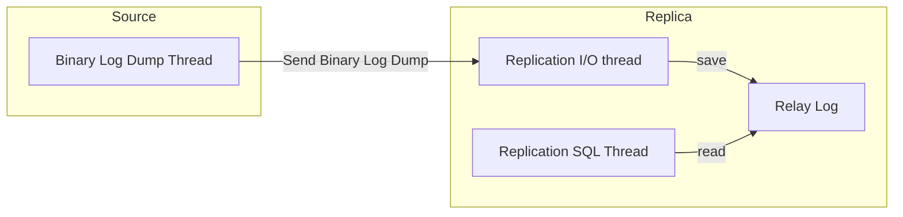

## 복제(Replication)

한 서버에서 다른 서버로 데이터를 동기화하는 것을 의미한다.  
원본 데이터를 가지는 서버를 Primary 또는 Source 라고 부르고, 복제된 데이터를 가지는 서버를 Secondary 또는 Replica 라고 부른다.  

### 복제를 하는 이유

**1. 스케일 아웃**

사용자의 트래픽이 증가하는 경우, 데이터베이스에 가해지는 부하도 자연스럽게 증가한다.  
이를 처리하기 위해 복제를 통한 스케일 아웃을 적용하여 애플리케이션에서 사용하는 쿼리들을 각각의 데이터베이스로 분산 시킬 수 있다.  

**2. 데이터 백업**

실제 운영되는 서비스가 사용하고 있는 DB에서 백업을 진행하는 경우, 서비스에 영향을 미칠 수 있다.  
따라서 실제 서비스에 영향이 가지 않도록 복제를 통해 Replica 서버를 구축하여, Replica 서버에서 복제를 진행하는 방법으로 영향을 최소화 할 수 있다.  

**3. 데이터 분석**

백업과 마찬가지로 복잡하고 무거운 분석용 쿼리의 서비스에 영향을 미칠 수 있다.  
마찬가지로 복제를 사용해 분석용 쿼리를 사용할 수 있는 환경을 만들 수 있다.  

**4. 데이터의 지리적 분산**

빠른 응답을 위해 애플리케이션 서버에 가깝게 서버를 구성하거나, 고가용성(High Availability)을 위해서도 사용된다.  

### 복제 원리

MySQL 서버에서 발생하는 변경사항에 대한 로그 파일을 바이너리 로그라고 한다.  
바이너리 로그를 통해 데이터 변경, 테이블 구조 변경, 계정이나 권한 변경에 대한 정보가 저장된다.  
MySQL의 복제는 바이너리 로그 기반으로 구현되어 있다. 이를 Replica 서버로 전달하고 바이너리 로그 기반으로 데이터를 변경 사항을 반영한다.  



:::note 스레드별 역할

Binary Log Dump Thread: 바이너리 로그의 내용을 Replica 서버로 전달  
Replication I/O Thread: Binary 로그 이벤트를 가져와 로컬 서버의 파일(Relay Log)로 저장  
Replication SQL Thread: 릴레이 로그 파일의 이벤트를 읽고 실행

:::

## Replication 구성하기

mysql 2대를 이용하여 replication을 구성하고, spring boot application으로 source, replica 데이터베이스에 접근해보는 예제이다.  
[https://github.com/bbiac/db-replication](https://github.com/bbiac/db-replication)  

### MySQL 환경 구성

MySQL 버전은 8.1을 사용했다.  
3306, 3307 포트를 사용해서 MySQL 서버 2대를 띄웠다.  
또한 사실 IP 대역으로 통신할 수 있도록 커스텀 네트워크를 추가했다.  

```yml
version: '3.8'

services:
  source:
    platform: linux/x86_64
    image: mysql:latest
    restart: always
    container_name: mysql-source
    environment:
      TZ: 'Asia/Seoul'
      MYSQL_DATABASE: 'db'
      MYSQL_USER: 'user'
      MYSQL_PASSWORD: 'password'
      MYSQL_ROOT_PASSWORD: 'password'
    ports:
      - "3306:3306"
    volumes:
      - db-source:/var/lib/mysql
      - db-source:/var/lib/mysql-files
      - ./docker/source.cnf:/etc/mysql/my.cnf
    networks:
      - mysql_network

  replica:
    platform: linux/x86_64
    image: mysql:latest
    restart: always
    container_name: mysql-replica
    environment:
      TZ: 'Asia/Seoul'
      MYSQL_DATABASE: 'db'
      MYSQL_USER: 'user'
      MYSQL_PASSWORD: 'password'
      MYSQL_ROOT_PASSWORD: 'password'
    ports:
      - "3307:3306"
    volumes:
      - db-replica:/var/lib/mysql
      - db-replica:/var/lib/mysql-files
      - ./docker/replica.cnf:/etc/mysql/my.cnf
    networks:
      - mysql_network

volumes:
  db-source:
  db-replica:

networks:
  mysql_network:
    driver: bridge
```

또한 source, replica 각각 다음과 같이 db 설정을 했다.  

| 설정 | 설명 |
| --- | --- |
| server_id | 각각의 mysql 마다 고유한 값을 가져야 한다. |
| log_bin | 바이너리 로그 파일 경로 설정으로 절대경로를 사용하지 않는다면 /var/lib/mysql 아래 해당 log_bin에 설정된 값으로 로그가 생성된다. |
| sync_binlog | N개의 트랜잭션 당 바이너리 로그를 디스크와 동기화 작업을 하도록 한다. 1은 기본값으로 안정적이지만, 가장 느리다. |
| relay_log | 릴레이 로그 파일 경로 설정 |
| relay_log_purge | 필요 없는 릴레이 로그 파일을 자동으로 삭제하는 옵션 |
| read_only | 읽기 전용 설정 |
| log_replica_updates | Replication SQL Thread로 인해 실행되는 정보를 바이너리 로그에 기록  추후에 소스 서버로 승격되는 경우를 고려하면 설정하는 것이 좋다. |

import Tabs from "@theme/Tabs";
import TabItem from "@theme/TabItem";

<Tabs>
<TabItem value="Source" label="Source">

```cnf title="/docker/source.cnf"
[mysqld]
server_id=1
log_bin=mysql-bin
sync_binlog=1
```

</TabItem>

<TabItem value="Replica" label="Replica">

```cnf title="/docker/replica.cnf"
[mysqld]
server_id=2
relay_log=mysql-relay-bin
relay_log_purge=ON
read_only
log_replica_updates
```

</TabItem>
</Tabs>

### 도커 실행

docker-compose up 명령어로 docker-compose 설정으로 docker를 띄운다.  
-d 옵션을 붙이면 백그라운드 모드로 실행된다.  

```
docker-compose up -d
```

### replication slave 권한 설정

REPLICATION SLAVE 권한이 설정되어 있어야 replica 서버에서 source 서버에 접근하여 로그를 읽어올 수 있다.  
source 서버에 접근하여 user 계정에 해당 권한을 설정해준다.  

SOURCE 접속

```bash
docker exec -it mysql-source mysql -u root -p
```

user 계정에 REPLICATION SLAVE 권한 추가

```mysql
GRANT REPLICATION SLAVE ON *.* TO 'user'@'%';
FLUSH PRIVILEGES;
```

### SOURCE DB 정보 확인

replica 설정에 필요한 source db의 바이너리 로그 파일명과 Position을 확인한다.  
Position 값은 실제 파일의 바이트 수를 의미한다.  
확인한 File(SOURCE_LOG_FILE)과 Position(SOURCE_LOG_POS) 값은 replica 설정에서 사용한다.

```mysql
SHOW MASTER STATUS;

+------------------+----------+--------------+------------------+-------------------+
| File             | Position | Binlog_Do_DB | Binlog_Ignore_DB | Executed_Gtid_Set |
+------------------+----------+--------------+------------------+-------------------+
| mysql-bin.000003 |     1082 |              |                  |                   |
+------------------+----------+--------------+------------------+-------------------+
```

### SOURCE ip 주소 확인

docker inspect -f 옵션을 사용하면 해당 컨테이너의 세부 정보를 확인할 수 있다.  
다음 명령어를 이용해 docker-compose 파일에 설정해둔 mysql_network에서 사용되는 사설 아이피 주소를 확인한다.  

```bash
docker inspect -f "{{ .NetworkSettings.Networks.db_mysql_network.IPAddress }}" mysql-source
```

확인한 IP주소(SOURCE_HOST) 값은 replica 설정에서 사용한다.

### replica mysql 접속

source db에 접속했던 방법과 동일하게 replica db에 접속한다.  

```bash
docker exec -it mysql-replica mysql -u root -p
```

### replica 설정

이전에 source db에서 얻었던 정보들을 사용하여 replica 설정을 진행한다.  
SOURCE_HOST, SOURCE_LOG_FILE, SOURCE_LOG_POS 를 적절히 변경한다.

```mysql
STOP REPLICA;

CHANGE REPLICATION SOURCE TO 
SOURCE_HOST='172.29.0.2', 
SOURCE_USER='user', 
SOURCE_PASSWORD='password', 
SOURCE_LOG_FILE='mysql-bin.000001', 
SOURCE_LOG_POS=0, 
GET_SOURCE_PUBLIC_KEY=1;

START REPLICA;
```

### 설정 확인

```mysql
SHOW REPLICA STATUS;

+----------------------------------+-------------+-------------+-------------+---------------+------------------+---------------------+------------------------+---------------+-----------------------+--------------------+---------------------+-----------------+---------------------+--------------------+------------------------+-------------------------+-----------------------------+------------+------------+--------------+---------------------+-----------------+-----------------+----------------+---------------+--------------------+--------------------+--------------------+-----------------+-------------------+----------------+-----------------------+-------------------------------+---------------+---------------+----------------+----------------+-----------------------------+------------------+--------------------------------------+-------------------------+-----------+---------------------+----------------------------------------------------------+--------------------+-------------+-------------------------+--------------------------+----------------+--------------------+--------------------+-------------------+---------------+----------------------+--------------+--------------------+------------------------+-----------------------+-------------------+
| Replica_IO_State                 | Source_Host | Source_User | Source_Port | Connect_Retry | Source_Log_File  | Read_Source_Log_Pos | Relay_Log_File         | Relay_Log_Pos | Relay_Source_Log_File | Replica_IO_Running | Replica_SQL_Running | Replicate_Do_DB | Replicate_Ignore_DB | Replicate_Do_Table | Replicate_Ignore_Table | Replicate_Wild_Do_Table | Replicate_Wild_Ignore_Table | Last_Errno | Last_Error | Skip_Counter | Exec_Source_Log_Pos | Relay_Log_Space | Until_Condition | Until_Log_File | Until_Log_Pos | Source_SSL_Allowed | Source_SSL_CA_File | Source_SSL_CA_Path | Source_SSL_Cert | Source_SSL_Cipher | Source_SSL_Key | Seconds_Behind_Source | Source_SSL_Verify_Server_Cert | Last_IO_Errno | Last_IO_Error | Last_SQL_Errno | Last_SQL_Error | Replicate_Ignore_Server_Ids | Source_Server_Id | Source_UUID                          | Source_Info_File        | SQL_Delay | SQL_Remaining_Delay | Replica_SQL_Running_State                                | Source_Retry_Count | Source_Bind | Last_IO_Error_Timestamp | Last_SQL_Error_Timestamp | Source_SSL_Crl | Source_SSL_Crlpath | Retrieved_Gtid_Set | Executed_Gtid_Set | Auto_Position | Replicate_Rewrite_DB | Channel_Name | Source_TLS_Version | Source_public_key_path | Get_Source_public_key | Network_Namespace |
+----------------------------------+-------------+-------------+-------------+---------------+------------------+---------------------+------------------------+---------------+-----------------------+--------------------+---------------------+-----------------+---------------------+--------------------+------------------------+-------------------------+-----------------------------+------------+------------+--------------+---------------------+-----------------+-----------------+----------------+---------------+--------------------+--------------------+--------------------+-----------------+-------------------+----------------+-----------------------+-------------------------------+---------------+---------------+----------------+----------------+-----------------------------+------------------+--------------------------------------+-------------------------+-----------+---------------------+----------------------------------------------------------+--------------------+-------------+-------------------------+--------------------------+----------------+--------------------+--------------------+-------------------+---------------+----------------------+--------------+--------------------+------------------------+-----------------------+-------------------+
| Waiting for source to send event | 172.25.0.3  | user        |        3306 |            60 | mysql-bin.000003 |                1082 | mysql-relay-bin.000002 |           868 | mysql-bin.000003      | Yes                | Yes                 |                 |                     |                    |                        |                         |                             |          0 |            |            0 |                1082 |            1078 | None            |                |             0 | No                 |                    |                    |                 |                   |                |                     0 | No                            |             0 |               |              0 |                |                             |                1 | 5a396b02-41c6-11ee-a56d-0242ac190003 | mysql.slave_master_info |         0 |                NULL | Replica has read all relay log; waiting for more updates |              86400 |             |                         |                          |                |                    |                    |                   |             0 |                      |              |                    |                        |                     1 |                   |
+----------------------------------+-------------+-------------+-------------+---------------+------------------+---------------------+------------------------+---------------+-----------------------+--------------------+---------------------+-----------------+---------------------+--------------------+------------------------+-------------------------+-----------------------------+------------+------------+--------------+---------------------+-----------------+-----------------+----------------+---------------+--------------------+--------------------+--------------------+-----------------+-------------------+----------------+-----------------------+-------------------------------+---------------+---------------+----------------+----------------+-----------------------------+------------------+--------------------------------------+-------------------------+-----------+---------------------+----------------------------------------------------------+--------------------+-------------+-------------------------+--------------------------+----------------+--------------------+--------------------+-------------------+---------------+----------------------+--------------+--------------------+------------------------+-----------------------+-------------------+
```

Replica_IO_Running, Replica_SQL_Running 값이 YES라면 정상적으로 replication 구성이 완료된 것이다.  

설정을 마친 후 source db에 다음과 같이 create table 명령어를 입력한다.  
replica db에 동일한 member table이 생성된 것을 확인할 수 있다.  

```sql
CREATE TABLE member
(
    id   BIGINT PRIMARY KEY AUTO_INCREMENT,
    name VARCHAR(255)
);
```

## 스프링 부트로 DB 접근하기

일반적인 트랜잭션의 경우 source, 읽기 전용 트랜잭션인 경우 replica로 요청이 가도록 구성해보자.  

### Environment 설정

다음과 같이 source, replica로 구분하여 설정한다. 

```yml title="application.yml"
spring:
  datasource:
    source:
      username: user
      password: password
      driver-class-name: com.mysql.cj.jdbc.Driver
      jdbc-url: jdbc:mysql://localhost:3306/db
    replica:
      username: user
      password: password
      driver-class-name: com.mysql.cj.jdbc.Driver
      jdbc-url: jdbc:mysql://localhost:3307/db
```

### DataSourceType 설정

단순 문자열로도 구분할 수 있지만, enum을 이용해서 트랜잭션을 구분하도록 생성한다.  
Key는 추후에 빈 설정에 사용한다.  

```java title="DataSourceType"
public enum DataSourceType {
    SOURCE(SOURCE_NAME),
    REPLICA(REPLICA_NAME),
    ;

    private final String key;

    DataSourceType(String key) {
        this.key = key;
    }

    public static class Key {
        public static final String ROUTING_NAME = "ROUTING";
        public static final String SOURCE_NAME = "SOURCE";
        public static final String REPLICA_NAME = "REPLICA";
    }
}
```

### AbstractRoutingDataSource 설정

스프링이 지원해주는 AbstractRoutingDataSource를 상속받아 트랜잭션의 읽기 여부에 따라 다른 DataSource를 향하도록 설정한다.  

정적 팩터리 메서드는 Map<DataSourceKey, DataSource>에 해당하는 값을 받아 데이터 소스를 설정한다.  
- setDefaultTargetDataSource: 기본 데이터 소스를 설정한다.  
- setTargetDataSources: 맵 형태로 받은 데이터 소스 값들을 설정한다.   

determineCurrentLookupKey를 오버라이딩하여 트랜잭션의 읽기 여부에 따라 다른 DataSourceType을 반환하도록 설정한다.  
- isCurrentTransactionReadOnly() 메서드를 통해 트랜잭션이 읽기 전용인지 확인할 수 있다.  
- DataSourceType을 반환하도록 설정하고, 반환한 값에 해당하는 데이터 소스가 사용된다.  

```java title="RoutingDataSource"
public class RoutingDataSource extends AbstractRoutingDataSource {

    private final Logger log = LoggerFactory.getLogger(getClass());

    public static RoutingDataSource from(Map<Object, Object> dataSources) {
        RoutingDataSource routingDataSource = new RoutingDataSource();
        routingDataSource.setDefaultTargetDataSource(dataSources.get(DataSourceType.SOURCE));
        routingDataSource.setTargetDataSources(dataSources);
        return routingDataSource;
    }

    @Override
    protected Object determineCurrentLookupKey() {
        boolean readOnly = TransactionSynchronizationManager.isCurrentTransactionReadOnly();

        if (readOnly) {
            log.info("readOnly = true, request to replica");
            return DataSourceType.REPLICA;
        }
        log.info("readOnly = false, request to source");
        return DataSourceType.SOURCE;
    }
}
```

### DataSource 설정

위에서부터 순서대로 Source, Replica, RoutingDataSource, LazyConnectionDataSourceProxy 설정이다.  
스프링은 트랜잭션 시작시에 커넥션의 사용여부와 상관없이 커넥션을 확보한다.  
따라서 readOnly 트랜잭션이 설정된 메서드를 사용하더라도 미리 확보된 커넥션을 사용하기 때문에 replica db로 요청을 하지 않고 setDefaultTargetDataSource로 설정한 source db로 요청을 한다.  
LazyConnectionDataSourceProxy를 설정하는 경우 실제 DataSource를 사용하는 시점에 커넥션을 획득해서 사용하기 때문에 설정한대로 replica db로 조회 요청을 한다.  

```java title="DataSourceConfiguration"
@Configuration
public class DataSourceConfiguration {

    @Bean
    @Qualifier(SOURCE_NAME)
    @ConfigurationProperties(prefix = "spring.datasource.source")
    public DataSource sourceDataSource() {
        return DataSourceBuilder.create().build();
    }

    @Bean
    @Qualifier(REPLICA_NAME)
    @ConfigurationProperties(prefix = "spring.datasource.replica")
    public DataSource replicaDataSource() {
        return DataSourceBuilder.create().build();
    }

    @Bean
    @Qualifier(ROUTING_NAME)
    public DataSource routingDataSource(
            @Qualifier(SOURCE_NAME) DataSource sourceDataSource,
            @Qualifier(REPLICA_NAME) DataSource replicaDataSource
    ) {
        return RoutingDataSource.from(Map.of(
                DataSourceType.SOURCE, sourceDataSource,
                DataSourceType.REPLICA, replicaDataSource
        ));
    }

    @Bean
    @Primary
    public DataSource dataSource(
            @Qualifier(ROUTING_NAME) DataSource routingDataSource
    ) {
        return new LazyConnectionDataSourceProxy(routingDataSource);
    }
}
```

### 동작 확인

간단하게 테스트를 작성해서 설정한대로 동작이 되는지 확인해보았다.  
save 메서드의 경우 `@Transactional`, findById 메서드의 경우 `@Transactional(readOnly = true)`가 설정되어있다.  
로그를 통해 save의 경우 source db로 findById의 경우 replica db로 요청을 하는 것을 알 수 있다.  

```java title="MemberServiceTest"
@SpringBootTest
class MemberServiceTest {

    @Autowired
    private MemberService memberService;

    @Test
    void 사용자를_저장한다() {
        // RoutingDataSource log: readOnly = false
        memberService.save("bbiac");
    }

    @Test
    void 사용자를_조회한다() {
        // RoutingDataSource log: readOnly = true
        assertThatThrownBy(() -> memberService.findById(MAX_VALUE))
                .isInstanceOf(NoSuchElementException.class);
    }
}
```

DB에서는 확인하려면 root 계정으로 접속한 후 general log를 활성화 시킨다.  

```sql
SET GLOBAL log_output = 'table';
SET GLOBAL general_log = 1;
```

general log를 활성화 한 후 읽기 전용 메서드를 실행한다.  
server_id, 실행한 쿼리문을 확인할 수 있다.  

```sql
SELECT user_host, thread_id, server_id, convert(argument using utf8) FROM mysql.general_log where argument like '%select%';

+----------------------------+-----------+-----------+-----------------------------------------------------------------------------+
| user_host                  | thread_id | server_id | convert(argument using utf8)                                                |
+----------------------------+-----------+-----------+-----------------------------------------------------------------------------+
| user[user] @  [172.25.0.1] |       277 |         2 | select m1_0.id,m1_0.name from member m1_0 where m1_0.id=9223372036854775807 |
+----------------------------+-----------+-----------+-----------------------------------------------------------------------------+
```

확인 후 general log를 비활성화 한 후 비활성화 되었는지 확인한다.  
```sql
SET GLOBAL general_log = 0;
SHOW VARIABLES LIKE '%general%';

+------------------+---------------------------------+
| Variable_name    | Value                           |
+------------------+---------------------------------+
| general_log      | OFF                             |
| general_log_file | /var/lib/mysql/4b6b9db98290.log |
+------------------+---------------------------------+
```


## 참고 자료

16장 복제, Real MySQL 8.0 - 백은빈, 이성욱  
[Replication, MySQL Docs](https://dev.mysql.com/doc/refman/8.1/en/replication.html)  
[MySql - Master Slave Replication 구조 만들어보기](https://huisam.tistory.com/entry/mysql-replication)  
[Spring 레플리케이션 트랜잭션 처리 방식](https://cheese10yun.github.io/spring-transaction/)  
[replication-datasource](https://github.com/kwon37xi/replication-datasource)  
[Simplified Guide to MySQL Replication with Docker Compose](https://www.linkedin.com/pulse/simplified-guide-mysql-replication-docker-compose-rakesh-shekhawat/)  
[Dockerfile에서 자주 쓰이는 명령어](https://www.daleseo.com/dockerfile/)  
[CHANGE REPLICATION SOURCE TO Statement](https://dev.mysql.com/doc/refman/8.1/en/change-replication-source-to.html)  
[LazyConnectionDataSourceProxy](https://kwonnam.pe.kr/wiki/springframework/lazyconnectiondatasourceproxy)  
[데이터베이스 레플리케이션을 통한 쿼리 성능 개선 (feat. Mysql, SpringBoot)](https://hudi.blog/database-replication-with-springboot-and-mysql/)  
[부하 분산을 위한 MySQL Replication 구성 및 쿼리 요청 분기](https://chagokx2.tistory.com/100)  
[Use Docker Compose, Docker](https://docs.docker.com/get-started/08_using_compose/)
