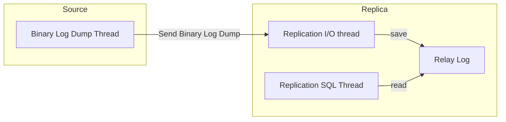

## 복제(Replication)

한 서버에서 다른 서버로 데이터를 동기화하는 것을 의미한다.  
원본 데이터를 가지는 서버를 Primary 또는 Source 라고 부르고, 복제된 데이터를 가지는 서버를 Secondary 또는 Replica 라고 부른다.  

### 복제를 하는 이유

**1. 스케일 아웃**

사용자의 트래픽이 증가하는 경우, 데이터베이스에 가해지는 부하도 자연스럽게 증가한다.  
이를 처리하기 위해 복제를 통한 스케일 아웃을 적용하여 애플리케이션에서 사용하는 쿼리들을 각각의 데이터베이스로 분산 시킬 수 있다.  

**2. 데이터 백업**

실제 운영되는 서비스가 사용하고 있는 DB에서 백업을 진행하는 경우, 서비스에 영향을 미칠 수 있다.  
따라서 실제 서비스에 영향이 가지 않도록 복제를 통해 Replica 서버를 구축하여, Replica 서버에서 복제를 진행하는 방법으로 영향을 최소화 할 수 있다.  

**3. 데이터 분석**

백업과 마찬가지로 복잡하고 무거운 분석용 쿼리의 서비스에 영향을 미칠 수 있다.  
마찬가지로 복제를 사용해 분석용 쿼리를 사용할 수 있는 환경을 만들 수 있다.  

**4. 데이터의 지리적 분산**

빠른 응답을 위해 애플리케이션 서버에 가깝게 서버를 구성하거나, 고가용성(High Availability)을 위해서도 사용된다.  

### Replication 원리

MySQL 서버에서 발생하는 변경사항에 대한 로그 파일을 바이너리 로그라고 한다.  
바이너리 로그를 통해 데이터 변경, 테이블 구조 변경, 계정이나 권한 변경에 대한 정보가 저장된다.  
MySQL의 복제는 바이너리 로그 기반으로 구현되어 있다. 이를 Replica 서버로 전달하고 바이너리 로그 기반으로 데이터를 변경 사항을 반영한다.  

:::note 스레드별 역할

Binary Log Dump Thread: 바이너리 로그의 내용을 Replica 서버로 전달  
Replication I/O Thread: Binary 로그 이벤트를 가져와 로컬 서버의 파일(Relay Log)로 저장  
Replication SQL Thread: 릴레이 로그 파일의 이벤트를 읽고 실행

:::

### 참고 자료

Real My SQL  
[Replication, MySQL Docs](https://dev.mysql.com/doc/refman/8.1/en/replication.html)