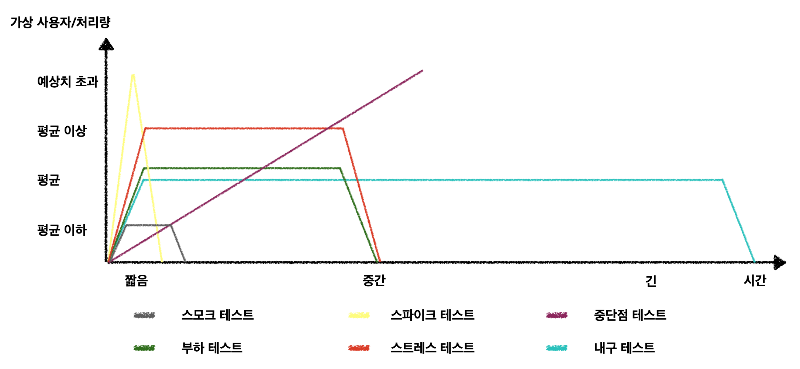

## 성능 테스트

API의 요청이 많은 상황에서 서버가 어떻게 동작하는지 확인하는 테스트

시스템에 부하가 걸리면 문제 상황이 발생할 수 있다.    
다양한 상황에 대비해서 성능 테스트를 해야한다.  

### 스모크 테스트(Smoke Test)

최소한의 부하를 주어 시스템이 정상적으로 동작하는지 확인하는 테스트  

VU를 최소한으로 두고, 짧은 시간을 가지고 테스트한다.  
다른 테스트를 시작하기 전에 스모크 테스트를 함으로써 테스트 스크립트에 오류가 없는지 확인할 수 있고, 성능 지표가 정상적으로 수집, 모니터링 되고 있는지 확인할 수 있다.  

:::note 가상 사용자(VU)
가상 사용자는 서버 애플리케이션에 대해 특정 테스트를 실행한다.  
이는 다른 가상 사용자와 독립적으로 실행되며, 여러 가상 사용자를 사용하여 동시 연결을 할 수 있다.  
스레드라고 생각하면 된다.  
:::

### 스파이크 테스트(Spike Test)

사용량이 급증하는 상황에서 시스템이 견디고 성능에 문제가 없는지 확인하는 테스트  

티켓 발급, 할인 쿠폰 발급과 같은 이벤트를 하는 경우 대규모 트래픽이 들어온다.  
스파이크 테스트를 통해 급증하는 부하 상황에서 시스템이 어떻게 동작하고, 부하를 잘 버티는지 확인할 수 있다.  

### 부하 테스트(Load Test)

목푯값에 해당되는 부하를 견딜 수 있을지 확인하는 테스트  

일반적인 부하 상황에서 시스템이 어떻게 동작하는지 확인하는 테스트다.  
램프업 또는 묙푯값에 해당하는 부하 기간동안 성능이 문제가 있는지 확인하고, 시스템 변경 후에도 부하 테스트를 돌려 동일하게 목푯값을 처리하는지 확인할 수 있다.  

:::note 램프 업(Ramp-up)
부하 테스트를 위해 설정한 가상 사용자 수에 도달하는 데 걸리는 시간
:::

### 스트레스 테스트(Stress Test)  

시스템의 최대치에 해당되는 부하를 받았을 때 시스템이 어떻게 동작하는지 확인하는 테스트  

그래프를 봤을 때 부하 테스트와 유사한 형태로 보이지만, 부하량이 다르다.  
일반적으로 평균적인 목푯값 대비 작게는 50% 이상, 필요의 경우 그 이상으로 부하를 준다.  
스트레스 테스트는 부하 테스트를 실행한 후에만 실행해야 한다. 부하 테스트가 이루어지지 않은 상황에서 스트레스 테스트를 실행하는 경우에는 병목 지점이나 문제 상황을 찾기 어려워진다.  
또한 부하 테스트에서 사용한 스크립트를 VU값(스레드 수)만 수정하여 재사용하는 것이 좋다.  

### 내구 테스트(Endurance Test)  

평균 사용률로 일정 부하를 지속적으로 주며 시스템이 문제되는 지점을 확인하는 테스트  

흡수 테스트(Soak Test)라고도 하며, 기본적인 부하 테스트의 변형이라고 볼 수 있다.  
다른 테스트와 달리 긴 시간동안 테스트를 하는 것이 특징이며, 메모리 누수 문제와 같이 장시간 애플리케이션을 실행할 때 시스템의 문제가 발생하는 부분을 확인하는 것이 목적이다.  

### 중단점 테스트(Breakpoint Test)

임계 지점을 찾기 위해 부하를 점진적으로 증가시키며 진행하는 테스트

문제되는 부분을 더 빨리 찾기 위해 다른 테스트를 통과한 다음에 중단점 테스트를 진행하고, 이 때 점진적으로 부하를 늘려나가는 것이 좋다.  
스트레스 테스트를 성능 튜닝과 반복해서 진행한다면, 시스템을 더욱 발전시킬 수 있다.  
다만 Auto Scaling이 적용된 클라우드 환경에서는 진행하지 않아야 한다.  

### 참고 자료

[Load test types, k6](https://k6.io/docs/test-types/load-test-types/)  
자바 최적화 - 벤저민 J. 에번스, 제임스 고프, 크리스 뉴랜드  
아마존 웹 서비스 부하 테스트 입문 - 나카가와 타루하치, 모리시타 켄  