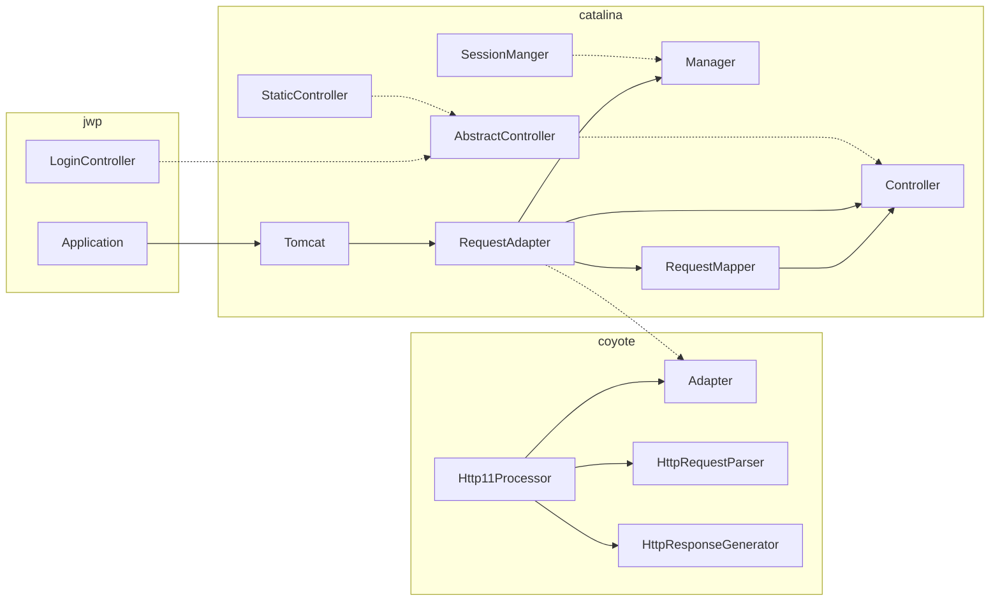
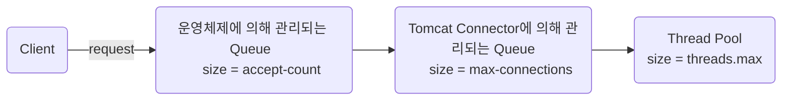

### 톰캣 구현

우아한테크코스를 지원할 때 객체지향과 관련된 미션도 기대를 많이 했지만 레벨 4에 진행하는 미션이 정말 하고 싶었다.  
그래서 미션을 할 수 있을까라는 걱정 반, 미션에 대한 기대 반으로 부푼 마음을 가지고 미션을 시작했던 것 같다.  

이번 미션에서는 적절하게 추상화하고, 미션의 본질을 이해하려고 노력했다.  
톰캣 구현 미션은 [RFC 2616](https://datatracker.ietf.org/doc/html/rfc2616/)에 명시된 스펙(완벽하지 않지만 미션에서 주어진 요구사항만 만족하도록)으로 요청을 받아 처리 후 반환하는데 집중했다.  

### 다이어그램

Catalina는 Tomcat의 서블릿 컨테이너, Coyote는 HTTP 1.1 웹 서버를 지원하는 구성 요소라고 생각하고 아래와 같이 구성했다.  
사실 내부 구조를 깊게 공부할 시간을 가지지 못해서 각 구성 요소가 왜 해당 위치에 있는지 완벽하게 설명하지는 못하지만 미션을 진행하면서 이건 여기에 있으면 좋을 것 같은데? 라는 생각이 들면 적절한 패키지에 위치시키는 방향으로 진행을 했다.  
또한 적절하게 인터페이스를 사용하여 의존성 방향을 단방향으로 하려고 노력했다.  



### 코드 리뷰 

크루 중 한 명이 나의 리뷰어가 되고, 내가 다른 크루의 리뷰어가 되는 형태로 진행이 되었다.  
나의 리뷰어는 디노, 리뷰이는 필립이었다.  

디노(매의 눈이 아닌 공룡의 눈?)가 매우 꼼꼼하게 코드 리뷰를 해주어서 조금 더 나은 코드를 작성할 수 있었고, 필립의 코드에서는 꼼꼼하게 예외처리 하는 부분을 배울 수 있었다.  
한 가지 아쉬운 점은 필립에게 작성한 나의 코멘트들이 미션을 진행하면서 경험 기반으로 작성한 내용이 많아 근거가 조금 부족했고, 정리되지 않은 부분이 많았던 것 같다.  
다음 미션부터 리뷰할 때 조금 더 시간을 투자해서 더 좋은 내용을 크루들과 공유할 수 있도록 노력해야겠다.  

### SessionConfig

미션을 진행 중 catalina 패키지의 Session 관련 부분을 보면서 중복 로직을 개선해 볼 수 있을 것 같아 [컨트리뷰트](https://github.com/apache/tomcat/pull/660)를 시도했다.  
세션 쿠키의 이름을 가져오는 Util 클래스의 코드를 수정했는데 기본 값은 JSESSIONID 지만 설정에 따라서 세션 쿠키명을 다르게 사용할 수 있기 때문에 해당 로직이 있는 것으로 생각했다.  
기존의 코드는 명시된 주석의 내용과 코드의 흐름이 일치하지 않아서 약간 이해하기 어려웠다.  

초기에 요청했던 PR은 기존의 코드보다 전체적으로 비교 연산을 한 번 줄일 수 있었고, context가 null인 경우 바로 기본 값을 반환함으로써 성능 개선의 효과가 있을 거라고 생각했다.  
메인테이너인 Mark Thomas 형이 해당 로직의 경우 컴파일러가 해당 부분을 최적화 할 수 있을 거라고 기대한다고 했고, 가독성을 개선시켜보라고 조언해주셨다.  
컴파일러 최적화는 고려해보지 못한 부분인데, 앞으로 학습해야 할 부분이 산더미라고 생각했다.  

남겨준 코멘트에 따라 최종적으로는 중복된 코드를 줄이는 방향으로 코드를 수정했다.  
결과적으로 기존 로직 대비 비교 연산을 한 번 줄일 수 있었고, 명시된 주석의 내용과 유사한 흐름의 코드를 작성하여 좋은 방향으로 리팩터링을 했다고 생각한다.  

import Tabs from "@theme/Tabs";
import TabItem from "@theme/TabItem";

<Tabs>
<TabItem value="기존" label="기존">

```java
public static String getSessionCookieName(Context context) {

    String result = getConfiguredSessionCookieName(context);

    if (result == null) {
        result = DEFAULT_SESSION_COOKIE_NAME;
    }

    return result;
}

public static String getSessionUriParamName(Context context) {

    String result = getConfiguredSessionCookieName(context);

    if (result == null) {
        result = DEFAULT_SESSION_PARAMETER_NAME;
    }

    return result;
}

private static String getConfiguredSessionCookieName(Context context) {

    // Priority is:
    // 1. Cookie name defined in context
    // 2. Cookie name configured for app
    // 3. Default defined by spec
    if (context != null) {
        String cookieName = context.getSessionCookieName();
        if (cookieName != null && cookieName.length() > 0) {
            return cookieName;
        }

        SessionCookieConfig scc =
            context.getServletContext().getSessionCookieConfig();
        cookieName = scc.getName();
        if (cookieName != null && cookieName.length() > 0) {
            return cookieName;
        }
    }

    return null;
}
```

</TabItem>

<TabItem value="PR 요청" label="PR 요청">

```java
public static String getSessionCookieName(Context context) {
    if (context == null) {
        return DEFAULT_SESSION_COOKIE_NAME;
    }
    return getConfiguredSessionCookieName(context, DEFAULT_SESSION_COOKIE_NAME);
}

public static String getSessionUriParamName(Context context) {
    if (context == null) {
        return DEFAULT_SESSION_PARAMETER_NAME;
    }
    return getConfiguredSessionCookieName(context, DEFAULT_SESSION_PARAMETER_NAME);
}

private static String getConfiguredSessionCookieName(Context context, String defaultName) {
    // Priority is:
    // 1. Cookie name defined in context
    // 2. Cookie name configured for app
    // 3. Default defined by spec
    String cookieName = context.getSessionCookieName();
    if (cookieName != null && cookieName.length() > 0) {
        return cookieName;
    }

    SessionCookieConfig scc = context.getServletContext().getSessionCookieConfig();
    cookieName = scc.getName();
    if (cookieName != null && cookieName.length() > 0) {
        return cookieName;
    }

    return defaultName;
}
```
</TabItem>

<TabItem value="최종" label="최종">

```java
public static String getSessionCookieName(Context context) {
    return getConfiguredSessionCookieName(context, DEFAULT_SESSION_COOKIE_NAME);
}

public static String getSessionUriParamName(Context context) {
    return getConfiguredSessionCookieName(context, DEFAULT_SESSION_PARAMETER_NAME);
}

private static String getConfiguredSessionCookieName(Context context, String defaultName) {
    // Priority is:
    // 1. Cookie name defined in context
    // 2. Cookie name configured for app
    // 3. Default defined by spec
    if (context != null) {
        String cookieName = context.getSessionCookieName();
        if (cookieName != null && cookieName.length() > 0) {
            return cookieName;
        }

        SessionCookieConfig scc = context.getServletContext().getSessionCookieConfig();
        cookieName = scc.getName();
        if (cookieName != null && cookieName.length() > 0) {
            return cookieName;
        }
    }
    return defaultName;
}
```

</TabItem>
</Tabs>

### HTTP 수업

미션 중간에 진행되었던 HTTP 수업에는 HTTP를 적절하게 활용하는 부분에 대해 학습했다.  
항상 성능 개선을 위해 애플리케이션 단에서 최적화해보려고 노력을 했지만, 더 적은 시간을 투자해서 효율적으로 성능을 개선할 수 있는 방법에 대해 알 수 있었던 수업이었다.  
HTTP 압축, HTTP 캐싱, 리소스 최적화 기법에 대해 학습했다.  

스프링 부트에서는 다음 옵션을 설정하여 http의 송수신의 압축을 진행할 수 있다.  

```yml
server:
  compression:
    enabled: true
```

수업 중 해당 압축 성능이 좋다면 왜 스프링 부트에서는 기본 값으로 설정을 하지 않았는지 궁금해졌다.  
궁금증을 해소하지 못했는데 말랑이 잡담 채널에 다음과 같은 [issue](https://github.com/spring-projects/spring-boot/issues/21369)를 찾아주었다.  
내용을 요약해 보자면 WAS 별로 압축을 하기 위해 설정해야 하는 것이 다르고, 무조건 압축을 하는 것이 최적의 경우가 아닐 수 있기 때문에 기본값으로 설정하지 않는 것 같다.  

> If you're developing a public-facing application then it's probably likely gzip compression would be worthwhile. If, however, you're a microservice application and you're in a dataceter, you may well prefer to reduce CPU load because you know you'll only be talking to other microservices and you have a reliable gigabit network.

Phil Webb 형님의 말에 따르면 일반적인 애플리케이션을 개발하는 경우 gzip 압축을 사용하는 것이 좋지만, MSA 환경 + 데이터 센터에서 사용하는 경우 오직 다른 MSA 애플리케이션과 통신하고, 고성능 네트워크가 있기 때문에 CPU 부하를 줄이는 것이 우선시 될 수도 있다는 것이었다.  

이외에도 의도하지 않은 캐싱을 막기 위해 휴리스틱 캐싱을 제거하거나, 개인 정보 유출을 막기 위해 응답 헤더에 private을 설정, ETag도 학습했다.  

:::note ETag
ETag HTTP 응답 헤더는 특정 버전의 리소스를 식별하는 식별자다.  
웹 서버가 내용을 확인하고 변하지 않았으면, 웹 서버로 full 요청을 보내지 않기 때문에, 캐시가 더 효율적이게 된다.  
MDN
:::

### Thread 수업

스레드에 대한 수업을 들었지만, 복잡한 내용도 워낙 많았기 때문에 설명하라고 하면 잘 못할 것 같은 느낌이 든다.  
현재 프로젝트, 미션, 테코톡 준비를 병행해야 해서 세부적인 내용은 시간 날 때 복습하려고 한다.  

스레드를 이해하고, WAS에 스레드 설정 관련한 실습이 있었는데 테오와 같이 1시간 정도 페어로 Thread 실습을 진행해 보았다.  
학습한 내용은 다음과 같다.  

`threads.max`: Tomcat의 최대 스레드 개수  
`max-connections`: Tomcat이 유지할 수 있는 최대 커넥션 개수  
`accept-count`: 최대 연결 수에 도달했을 때 연결 요청에 대해 운영 체제에서 제공하는 대기열의 최대 길이. 해당 Queue에 요청이 쌓이는 것은 Tomcat이 더 이상 요청을 받을 수 없다는 뜻이다. accpet-count queue에도 요청이 가득차면 그 이후에 오는 요청은 거부된다.  



### 마치며

시간은 너무 빠르게 가고 할 일은 많은 것 같다.  
우선순위를 잘 정하고 학습을 진행해야겠다.  
현재 데이터 다루는 부분(DB)에 대한 학습이 많이 부족한 것 같다. 해당 부분은 테코톡이 끝나는대로 채워야겠다.  

### 참고 자료

[RFC 2616](https://datatracker.ietf.org/doc/html/rfc2616/)  
[ETag, mdn](https://developer.mozilla.org/ko/docs/Web/HTTP/Headers/ETag)  
[Apache Tomcat 8 Configuration Reference](https://tomcat.apache.org/tomcat-8.5-doc/config/http.html)  
[Apache Tomcat Tuning, Terry Cho](https://bcho.tistory.com/788)  
[maxThreads, maxConnections, acceptCount로 Tomcat 튜닝하기](https://dev-ws.tistory.com/96)  