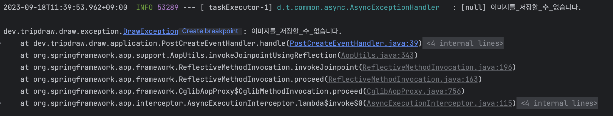
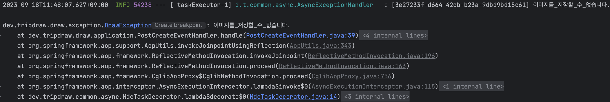

### 문제 상황

현재 트립드로우의 경로 이미지 생성 기능은 비동기로 처리되고 있다. 로그를 확인하는 도중 `@Async`가 적용된 메서드에서 예외가 발생하는 경우 로그가 정상적으로 출력되지 않는 문제가 발생했다.  
확인해 보니 Spring의 `@ControllerAdvice` + `@ExceptionHandler`의 경우 동기 예외만 처리하고, 비동기 예외를 처리하지 않았기 때문에 발생한 문제였다. 

### 비동기 예외 발생시 로깅 설정

Spring에서 지원해 주는 AsyncUncaughtExceptionHandler 인터페이스를 구현해서 예외를 처리하는 클래스를 생성했다.  

```java title=AsyncExceptionHandler
@Slf4j
public class AsyncExceptionHandler implements AsyncUncaughtExceptionHandler {

    private static final String LOG_FORMAT = "[%s] %s";

    @Override
    public void handleUncaughtException(Throwable throwable, Method method, Object... obj) {
        log.info(String.format(LOG_FORMAT, MDC.get(REQUEST_ID.key()), throwable.getMessage()), throwable);
    }
}
```

AsyncExceptionHandler의 경우 AsyncConfigurer를 구현한 Configuration 클래스를 사용하여 등록할 수 있다.  
getAsyncUncaughtExceptionHandler() 메서드를 오버라이딩하여 AsyncExceptionHandler를 반환하도록 설정하면 된다.  

```java title=AsyncConfig
@EnableAsync
@Configuration
public class AsyncConfig implements AsyncConfigurer {

    @Override
    public AsyncUncaughtExceptionHandler getAsyncUncaughtExceptionHandler() {
        return new AsyncExceptionHandler();
    }
}
```

이제 예외가 발생하는 경우 AsyncUncaughtExceptionHandler의 구현체인 AsyncExceptionHandler가 예외를 잡아서 처리를 해준다.  

### MDC 정보 연동 문제

트립드로우의 애플리케이션은 예외가 발생할 때 실행 흐름을 추적하기 위해 MDC(Mapped Diagnostic Context)를 사용하고 있다. 비동기 처리의 경우 별도의 스레드에서 동작하기 때문에 ThreadLocal 기반으로 동작하는 MDC의 정보를 얻어올 수 없었다.  



Spring 4.3 이상부터 제공되는 [TaskDecorator](https://docs.spring.io/spring-framework/docs/current/javadoc-api/org/springframework/core/task/TaskDecorator.html)를 이용하면 TaskExecutor를 커스터마이징 할 수 있다. TaskDecorator를 구현한 클래스를 하나 생성하고, Task가 실행되기 전 MDC의 정보를 복사하도록 설정한다.  

```java title=MdcTaskDecorator
public class MdcTaskDecorator implements TaskDecorator {

    @Override
    public Runnable decorate(final Runnable runnable) {
        Map<String, String> threadContext = MDC.getCopyOfContextMap();
        return () -> {
            MDC.setContextMap(threadContext);
            runnable.run();
        };
    }
}
```

해당 Decorator 클래스를 설정 파일에 등록해 준다.

```java title=AsyncConfig
@RequiredArgsConstructor
@EnableAsync
@Configuration
public class AsyncConfig implements AsyncConfigurer {

    private final AsyncConfigurationProperties properties;

    @Bean
    public ThreadPoolTaskExecutor taskExecutor() {
        ThreadPoolTaskExecutor executor = new ThreadPoolTaskExecutor();
        executor.setCorePoolSize(properties.coreSize());
        executor.setMaxPoolSize(properties.maxSize());
        executor.setQueueCapacity(properties.queueCapacity());
        
        // highlight-next-line
        executor.setTaskDecorator(new MdcTaskDecorator());
        executor.setWaitForTasksToCompleteOnShutdown(true);
        executor.initialize();
        return executor;
    }

    @Override
    public AsyncUncaughtExceptionHandler getAsyncUncaughtExceptionHandler() {
        return new AsyncExceptionHandler();
    }
}
```

설정 후에는 정상적으로 MDC에 들어가 있는 UUID가 출력되는 것을 볼 수 있다.




### 참고 자료

[spring async, baeldung](https://www.baeldung.com/spring-async)  
[@Async will not call by @ControllerAdvice for global exception](https://stackoverflow.com/questions/61885358/async-will-not-call-by-controlleradvice-for-global-exception)  
[Spring 의 동기, 비동기, 배치 처리시 항상 context 를 유지하고 로깅하기, 강남언니](https://blog.gangnamunni.com/post/mdc-context-task-decorator/)  
[TaskDecorator, Spring docs](https://docs.spring.io/spring-framework/docs/current/javadoc-api/org/springframework/core/task/TaskDecorator.html)  