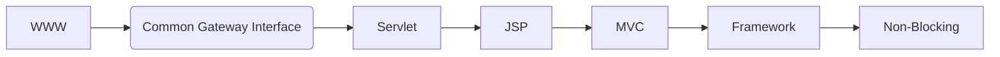
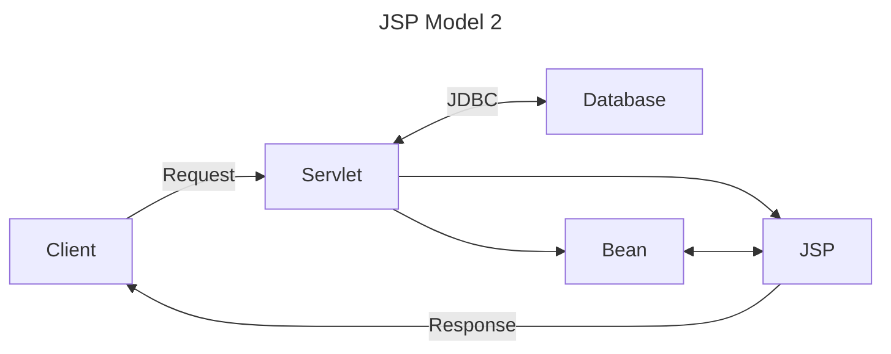

### 웹 애플리케이션 발전 과정

웹 애플리케이션의 발전 과정 대한 구구의 강의가 있었다.  
간단하게 정리하자면 다음과 같은 흐름으로 웹 애플리케이션이 발전했다.  
원래 회고에 작성하려고 했지만, 정리하다 보니 조금 길어져서 따로 분리했다.  

### WWW(1989)

정적 페이지를 제공하는 웹 서버를 시작으로 동적 페이지가 필요했기 때문에 CGI가 등장했다.  

### CGI(1993)  

CGI는 동적 콘텐츠를 제공하기 위한 규약으로, 해당 인터페이스를 구현한 스크립트를 이용해서 매 요청마다 프로세스를 실행시켜 정보를 반환하도록 한다. 하지만 매 요청마다 프로세스를 실행시키기 때문에 서버에 많은 부하가 발생할 수 있다. 따라서 이러한 단점을 극복하기 위해 나온 것이 Servlet이다.  

### Servlet(1996)

Servlet은 웹 서버에서 실행되는 자바 프로그램으로 HTTP를 이용하여 웹 클라이언트의 요청을 수신하고 응답한다. CGI와 다르게 매 요청마다 프로세스가 아닌 스레드를 생성하여 응답한다.  
하지만 View 영역의 코드를 작성하기 위해 Servlet의 소스 코드를 알아야 하는 등 복잡도가 너무 높았다. 따라서 해당 문제를 해결하기 위해 JSP가 등장했다.  

### JSP(1999)

JSP는 HTML에 자바 코드를 작성하여 동적 웹 페이지를 생성하는 기술로, 유사한 기술로는 ASP, PHP가 있다.  
JSP만 사용하여 프로그래밍한다면 Model 1, 아래 구성도와 같이 JSP가 View 영역만 담당한다면 Model 2라고 한다.  

### MVC(2000)

위 JSP의 구성도를 보면 현재 MVC와 매우 유사한데, Govind Seshadri라는 사람이 JSP Model 2를 MVC 패턴으로 공식화를 제안했다.  

> I provide an in-depth look at how you can gain optimal separation of presentation from content by using the JSP Model 2 architecture. This model can also be seen as a server-side implementation of the popular Model-View-Controller (MVC) design pattern.  
> Govind Seshadri

이때 MVC 패턴이 처음 탄생한 것은 아니고, 서버 측 구현이라고 하는 것을 보니 MVC가 처음 등장한 건 아닌 것 같다.  
[해당 문서](https://folk.universitetetioslo.no/trygver/themes/mvc/mvc-index.html)를 보면 MVC라는 용어의 등장은 1978년에 등장한 것으로 보인다.  

### Spring Framework(2003)

Spring은 복잡했던 J2EE을 대체하기 위해 2003년에 등장했다.  
J2EE는 웹 기반의 엔터프라이즈 애플리케이션을 구축하기 위한 플랫폼으로 위에서 설명한 Servlet, JSP, EJB 등의 기술을 포함하고 있다.  
하지만 이중 EJB라는 기술이 J2EE의 핵심 기술이었는데, 해당 기술이 매우 복잡했기 때문에 사용에 문제가 많았다고 한다.  
2002년에 Rod Johnson이 EJB를 사용하지 않고 J2EE 애플리케이션을 구축하는 방법에 대해 저술한 `Expert One-to-One J2EE Development`라는 책을 발행했고, 출간 후 Juergen Hoeller, Yann Caroff가 Rod Johnson에게 오픈소스 제안을 하여 스프링이 탄생했다고 한다.  

스프링은 엔터프라이즈 서비스 기능을 POJO에 제공하며, 이 덕분에 스프링을 사용하여 비즈니스 로직에 집중할 수 있다.  

### WebFlux 이전 Servlet 3.0(2009), 3.1(2013)

Tomcat의 NIO 동작 방식을 보면 Poller가 소켓 커넥션을 들고 있다가 처리가 가능할 때 스레드를 할당하는 식으로 처리를 한다. 하지만 할당 후 Servlet과 통신하는 부분은 블로킹 방식으로 요청이 끝날 때까지 스레드를 점유하고 있었고, 스레드 점유로 인해 요청이 max thread에 도달하면 요청을 처리할 수 없었다.  
그래서 비동기 방식의 Servlet이 Servlet 3.0에 등장했다. 하지만 전통적인 I/O 방식을 사용하는 부분은 블로킹 방식으로 동작했다. Servlet 3.1에서 논블로킹 I/O가 추가되었지만, 많이 사용되지 않았다고 한다.  

### Spring WebFlux(2017)

적은 수의 스레드로 동시성을 처리하고, 적은 리소스로 확장이 가능한 논블로킹 방식의 웹 기술이 필요했고, 기존의 Servlet의 경우 비동기를 지원한다 해도 동기식 API들이 많이 남아있었기 때문에 이러한 Servlet에 영향을 받지 않는 기술이 필요했다. 또한 기존에 Netty와 같이 비동기, 논블로킹 방식 서버로 자리를 잘 잡은 서버를 위해 Spring WebFlux가 등장했다.  
추가로 데이터 접근을 위해 사용하는 JDBC의 경우 Blocking API라, Spring Webflux에서는 R2DBC를 사용한다고 한다.  

### 마치며

해당 정리 내용의 경우 Async, Non Blocking 관련된 내용을 깊게 공부한 적이 없어서 정확하지 않을 수 있다.  
그래도 기술의 등장 배경이나 과정을 알고 있다면 조금 더 깊이 있는 학습에 도움이 된다고 생각한다.  

### 참고 자료

웹 애플리케이션의 발전 과정, 구구 강의  
[Dynamic Content with CGI, Apache Tutorial](https://httpd.apache.org/docs/trunk/en/howto/cgi.html)  
[History of Spring and the Spring Framework, Spring](https://docs.spring.io/spring-framework/reference/overview.html#overview-history)  
[Understanding JavaServer Pages Model 2 architecture, Govind Seshadri](https://www.infoworld.com/article/2076557/understanding-javaserver-pages-model-2-architecture.html)  
[MVC, XEROX PARC](https://folk.universitetetioslo.no/trygver/themes/mvc/mvc-index.html)  
[Expert One-to-One J2EE Development, Rod Johnson](https://www.amazon.com/Expert-One-One-Development-without/dp/0764558315)  
[배달의민족 최전방 시스템! ‘가게노출 시스템’을 소개합니다, 배달의민족](https://techblog.woowahan.com/2667/)  
[Asynchronous processing support in Servlet 3.0, Dr. Xinyu Liu](https://www.infoworld.com/article/2077995/java-concurrency-asynchronous-processing-support-in-servlet-3-0.html)
[WebFlux Overview, Spring](https://docs.spring.io/spring-framework/reference/web/webflux/new-framework.html)
[Spring WebFlux와 Armeria를 이용하여 Microservice에 필요한 Reactive + RPC 동시에 잡기, Naver D2](https://d2.naver.com/helloworld/6080222)  
[Spring WebFlux란 무엇일까](https://tweety1121.tistory.com/entry/Spring-WebFlux-%EB%9E%80-%EB%AC%B4%EC%97%87%EC%9D%BC%EA%B9%8C)  