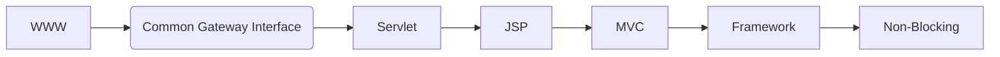

:::note PR 링크
1단계: https://github.com/woowacourse/jwp-dashboard-mvc/pull/404  
2단계: https://github.com/woowacourse/jwp-dashboard-mvc/pull/465  
3단계: https://github.com/woowacourse/jwp-dashboard-mvc/pull/580  
:::

### MVC 구현

Reflection을 이용하여 Spring MVC와 유사한 기능을 구현하는 미션이었다.  
미션의 목표는 다음과 같았다.

- MVC 프레임워크를 구현하면서 내부 동작 원리를 학습한다.
- 점진적인 리팩토링을 경험한다.

### 웹 애플리케이션 발전 과정 강의

웹 애플리케이션의 발전 과정 대한 구구의 강의가 있었다.  
간단하게 정리하자면 다음과 같은 흐름으로 웹 애플리케이션이 발전했다.

내용이 길어져서 [다음 문서](./web-application-evolution)에 정리했다.

### IoC와 DI 강의

직관적이지 않은 추상적인 개념을 학습할 때는 해당 개념의 구현을 참고하면 학습에 도움이 된다고 한다.  

| 개념       | 제품                                             |
| ---------- | ------------------------------------------------ |
| OOP        | Java                                             |
| WAS Tomcat | Jetty                                            |
| IoC        | Spring BeanFactory, Servlet Container, Framework |
| DI         | Spring BeanFactory                               |

DI 관련해서는 [다음 문서](./docs/spring/essence)에서 간단히 정리했다.  