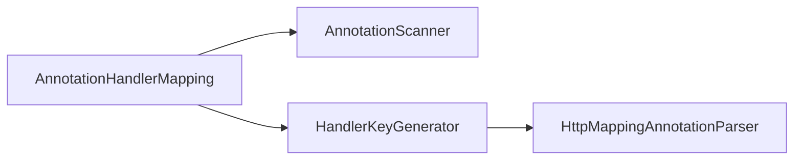
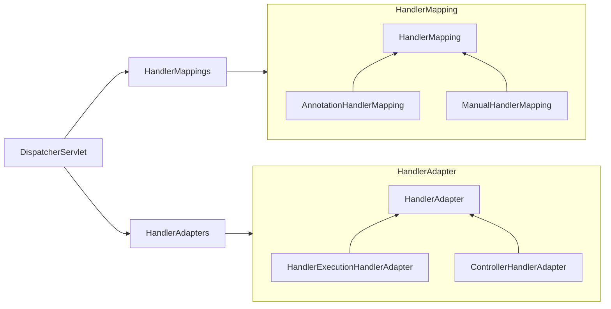
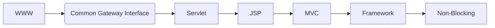

:::note PR 링크
1단계: https://github.com/woowacourse/jwp-dashboard-mvc/pull/404  
2단계: https://github.com/woowacourse/jwp-dashboard-mvc/pull/465  
3단계: https://github.com/woowacourse/jwp-dashboard-mvc/pull/580  
:::

### MVC 구현

Reflection을 이용하여 Spring MVC와 유사한 기능을 구현하는 미션이었다.  
미션의 목표는 다음과 같았다.

- MVC 프레임워크를 구현하면서 내부 동작 원리를 학습한다.
- 점진적인 리팩토링을 경험한다.

미션의 목표와 더불어 각 클래스들이 역할과 책임을 적절히 가지도록 하고, 패키지의 의존 방향을 고민하면서 미션을 진행하는 것에 중점을 두었다.  

### 애너테이션 기반 프레임워크 만들기

기존 코드에 ManualHandlerMapping이라는 서블릿을 직접 등록해서 사용하는 HandlerMapping 클래스가 있었고, 1단계에서는 애너테이션 기반의 AnnotationHandlerMapping을 구현해야 했기 때문에 @Controller, @RequestMapping을 Reflection을 이용하여 스캔하고, 핸들러 매핑을 등록하는 부분까지 진행해야 했다.  
테오가 @GetMapping이나 @PostMapping 부분도 진행하면 재밌을 것 같다고 해서 같이 진행해 보았다.  
추가로 미션 요구사항은 아니었지만 클래스 레벨에 적용된 @RequestMapping도 동작하도록 구현해보았다.  



다음과 같은 Flow로 Handler(실제 요청을 처리하는 메서드) 등록을 진행한다.  

1. @Controller가 적용된 클래스의 정보를 스캔하여 반환한다.  
2. @Controller가 적용된 클래스의 @RequestMapping이 적용된 메서드들의 정보를 반환한다.  
3. 각 메서드들을 순회하며 HandlerKey(uri + httpMethod 정보)와 HandlerExecution(인스턴스 + 실행하려는 메서드)을 생성하여 Map<HandlerKey, HandlerExecution>에 추가한다.  

AnnotationHandlerMapping의 initialize 메서드에서 Handler를 등록한다. 코드는 다음과 같다.  

```java title=AnnotationHandlerMapping
public void initialize() {
    if (!initialized.compareAndSet(false, true)) {
        return;
    }

    final Map<Class<?>, ControllerInstance> controllers = annotationScanner.scanControllers();
    final Set<Method> methods = annotationScanner.scanHttpMappingMethods(controllers.keySet());
    for (final Method method : methods) {
        final ControllerInstance controller = controllers.get(method.getDeclaringClass());
        final HandlerExecution handlerExecution = new HandlerExecution(controller.getInstance(), method);
        final List<HandlerKey> handlerKeys = handlerKeyGenerator.generate(controller.getUriPrefix(), method);
        handlerKeys.forEach(handlerKey -> handlerExecutions.put(handlerKey, handlerExecution));
    }

    log.info("Initialized AnnotationHandlerMapping!");
    handlerExecutions.keySet().forEach(key -> log.info("key: {}, Handler: {}", key, handlerExecutions.get(key)));
}
```

### Legacy MVC와 @MVC 통합

2단계는 Legacy MVC와 AnnotationHandlerMapping을 통합하는 부분이었다.  
기존의 MVC와 애너테이션이 적용된 MVC 두 개를 같이 사용할 수 있어야 헀다.  
대략적인 흐름은 다음과 같다.  

1. DispatcherServlet.service(request, response) 호출
2. HandlerMappings를 통해 입력받은 request에 해당하는 Handler 조회
3. HandlerAdapters를 통해 Handler를 실행시킬 수 있는 HandlerAdapter 조회
4. HandlerAdapter의.handle 메서드 실행
5. View의 render 호출



### 웹 애플리케이션 발전 과정

웹 애플리케이션의 발전 과정 대한 구구의 강의가 있었다.  
간단하게 정리하자면 다음과 같은 흐름으로 웹 애플리케이션이 발전했다.



내용이 길어져서 [다음 문서](./web-application-evolution)에 정리했다.

### 추상적인 개념 학습 방법

직관적이지 않은 추상적인 개념을 학습할 때는 개념의 구현을 참고하면 학습에 도움이 된다고 한다.

| 개념 | 제품                                             |
| ---- | ------------------------------------------------ |
| OOP  | Java                                             |
| WAS  | Tomcat, Jetty                                    |
| IoC  | Spring BeanFactory, Servlet Container, Framework |
| DI   | Spring BeanFactory                               |

### 정리

지금까지 스프링의 DispatcherServlet의 동작을 이론적으로만 알고 있었는데, 실제로 구현해 보니 조금 더 이해가 잘 가는 것 같다.  
이번 미션에서 나의 리뷰어는 루카, 리뷰이는 헤나였다.  
매 단계마다 꼼꼼하게 리뷰해 준 루카에게 너무 감사하고, 헤나에게 이상한 리뷰를 많이 남긴 것 같은데 꼼꼼히 반영해줘서 감사하다.  
오랫동안 기다려왔던 레벨 4 미션이 하나씩 마무리 될 때 마다 아쉬움이 남는다.  