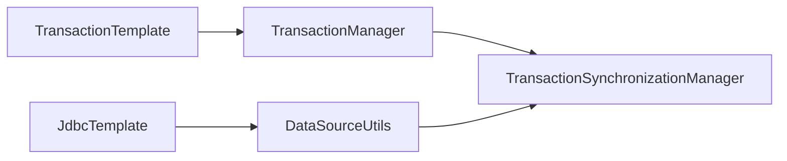

:::note PR 링크
1단계: https://github.com/woowacourse/jwp-dashboard-jdbc/pull/267  
2단계: https://github.com/woowacourse/jwp-dashboard-jdbc/pull/358  
3단계: https://github.com/woowacourse/jwp-dashboard-jdbc/pull/448  
4단계: https://github.com/woowacourse/jwp-dashboard-jdbc/pull/515  
:::

### Jdbc 구현

이번 미션은 Jdbc 라이브러리를 구현하고, Transaction 경계 설정과 동기화하는 부분을 구현해 보는 미션이었다.  
미션 목표는 다음과 같다.  

- JDBC 라이브러리를 구현하면서 중복을 제거하는 연습을 한다.
- 데이터베이스에 대한 이해도를 높인다.

최대한 Java가 제공하는 기능을 사용하여 리팩터링 하는 방향으로 코드를 작성했다.  

### JdbcTemplate

JdbcTemplate은 Connection을 이용하여 PreparedStatement를 생성하는 부분, 그리고 PreparedStatement가 어떻게 동작하는지에 대한 부분을 분리했다.  
템플릿 콜백 패턴을 적절하게 적용하여 중복을 비교적 간단하게 제거할 수 있었다.  
예전에도 미션을 진행하면서 [JdbcTemplate을 구현](./custom-jdbc-template)한 적이 있었는데, 이번에는 자원 할당과 해제 부분에 대한 중복도 제거했다.  

```java
public class JdbcTemplate {

    private static final Logger log = LoggerFactory.getLogger(JdbcTemplate.class);

    private final DataSource dataSource;
    private final StatementCreator statementCreator;
    private final StatementExecutor statementExecutor;

    public JdbcTemplate(final DataSource dataSource) {
        this(dataSource, new StatementCreator(), new StatementExecutor());
    }

    JdbcTemplate(
            final DataSource dataSource,
            final StatementCreator statementCreator,
            final StatementExecutor statementExecutor
    ) {
        this.dataSource = dataSource;
        this.statementCreator = statementCreator;
        this.statementExecutor = statementExecutor;
    }

    private <T> T query(
            final String sql,
            final PreparedStatementCallback<T> preparedStatementCallback,
            final Object... parameters
    ) {
        final Connection connection = DataSourceUtils.getConnection(dataSource);
        try (final PreparedStatement preparedStatement = statementCreator.create(connection, sql, parameters)) {
            return preparedStatementCallback.execute(preparedStatement);
        } catch (final SQLException e) {
            log.error(e.getMessage(), e);
            throw new DataAccessException(e);
        } finally {
            DataSourceUtils.releaseConnection(connection, dataSource);
        }
    }

    public void update(final String sql, final Object... parameters) {
        query(sql, PreparedStatement::executeUpdate, parameters);
    }

    public <T> Optional<T> queryForObject(final String sql, final RowMapper<T> rowMapper, final Object... parameters) {
        final List<T> results = query(sql, statement -> statementExecutor.execute(statement, rowMapper), parameters);
        if (results.size() > 1) {
            throw new DataAccessException("2개 이상의 결과를 반환할 수 없습니다.");
        }
        return results.stream().findAny();
    }

    public <T> List<T> queryForList(final String sql, final RowMapper<T> rowMapper, final Object... parameters) {
        return query(sql, statement -> statementExecutor.execute(statement, rowMapper), parameters);
    }
}
```

### 트랜잭션 적용

3, 4단계는 기존의 코드에 트랜잭션을 시작하고 끝나는 부분인 트랜잭션 경계를 설정하고 ThreadLocal을 이용하여 트랜잭션 동기화(Transaction synchronization)를 적용하는 미션이었다.  
트랜잭션 동기화란 트랜잭션을 시작하기 위한 Connection 객체를 ThreadLocal과 같은 공간에 따로 저장 후, 필요할 때 저장된 Connection을 가져다 사용하는 방식이다.  
아래와 같은 구조로 미션을 진행했는데, ThreadLocal에 Connection 객체가 아닌, Connection 객체와 Transaction이 진행 중인지 확인할 수 있는 flag를 가지고 있는 클래스를 저장해서 사용하도록 했다.  



### 마무리

Jdbc 미션을 진행하면서 AOP나 Transactional에 대한 학습 테스트도 진행하고, 약간 알찬 미션이었던 것 같다.  
꼼꼼히 코드를 봐준 리뷰어 호이 그리고 연휴 동안 계속 티키타카 하면서 재밌게 리뷰한 민트에게 감사하다.  
회고 이만 끝내고 리팩터링 미션 하러가야겠다. 😊 