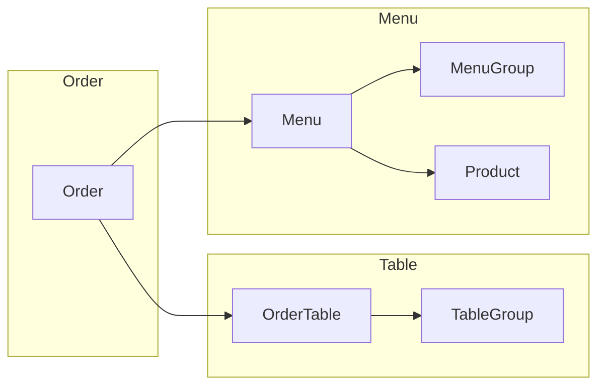

:::note PR 링크
1단계: https://github.com/woowacourse/jwp-refactoring/pull/465  
2단계: https://github.com/woowacourse/jwp-refactoring/pull/547  
3단계: https://github.com/woowacourse/jwp-refactoring/pull/610  
4단계: https://github.com/woowacourse/jwp-refactoring/pull/721  
:::

### 리팩터링 미션

요구사항 작성 → 테스트를 통한 코드 보호 → 리팩터링 → 의존성 리팩터링 → 멀티모듈 순서로 미션을 진행했다.  
미션에 온전히 집중하고 싶었지만, 프로젝트와 병행하면서 진행했기에 어느정도 타협보고 진행한 부분이 많아서 아쉬웠다.  

### 1, 2단계

1단계는 요구사항을 작성하고, 테스트 코드를 작성하여 추후에 리팩터링 할 때 안정감 있게 진행할 수 있도록 준비하는 과정이었다. 
요구사항을 작성할 때 제공된 용어 사전을 최대한 활용하면서 기존의 코드를 보면서 요구사항을 정리했다. 
테스트는 시간 관계상 API, 서비스 둘 중 하나만 통합 테스트를 진행해야겠다는 생각이 들었다. 

최종적으로 서비스 기준으로 통합 테스트를 작성했는데 약간 후회되는 결정이었던 것 같다.  
리팩터링 과정에서 API 명세가 바뀌지 않아야 한다는 것을 기준을 잡고 이번 미션을 한다고 가정했을 때 API 기준으로 테스트를 작성하고, 리팩터링을 진행하는 것이 더 안정감 있다고 생각한다.  

2단계는 작성된 테스트 기반으로 리팩터링 하는 미션이었다.  
서비스에서 도메인을 직접 반환하는 구조였는데, 도메인에 JPA를 적용하면 기존 명세와 달라질 것을 우려해서 DTO로 수정하는 작업을 먼저 진행했다. 
DTO 이후에 서비스에 있는 로직을 도메인으로 이동시키고, 최종적으로 JPA를 적용하는 순서로 리팩터링을 진행했다. 
이 과정에서 의존성 방향이 양방향인 부분도 생겨났다.  

### 소프트웨어의 복잡성을 다루는 지혜

중간에 소프트웨어 복잡성을 다루는 지혜에 관한 제이슨의 강의가 있었다.  
소프트웨어의 복잡성을 다루는 지혜는 에릭 에반스의 저서 `도메인 주도 설계`의 부제이다.  

도메인 주도 설계는 유비쿼터스 언어, 전략적 설계, 전술적 설계가 중요하다고 한다.  
유비쿼터스 언어, 전략적 설계가 전체의 90%에 해당할 정도로 중요하다고 한다. 또한 전술적 설계만 하는 경우를 DDD Lite 라고 한다.  

간단히 도메인 주도 설계에서 나오는 단어를 정리한다면 다음과 같다.  

| 단어 | 설명 |
| --- | --- |
| 도메인 | 소프트웨어로 해결하고자 하는 문제 영역 |
| 바운디드 컨텍스트 | 해결 영역, 관심사를 분리하고 격리하여 문제 해결에 집중할 범위 |
| 유비쿼터스 언어 | 프로젝트에 이해관계자들의 공통된 언어로, 서로의 의사소통 비용을 줄이기 위해 사용하는 언어 |
| 전략적 설계 | 도메인 전문가와 개발자가 함께 유비쿼터스 언어를 이용하여 도메인과 관련된 지식을 이해하고 이를 바탕으로 경계를 나눠 바운디드 컨텍스트를 정의하고, 컨텍스트 맵을 생성하는 것을 포함하는 과정 |
| 전술적 설계 | 전략적 설계에서 정의한 바운디드 컨텍스트와 도메인을 이용하여 애그리거트, Entity와 VO, Repository 등을 구현하는 과정 |

이 외에도 다양한 내용들이 나왔지만, 지식을 제대로 흡수하지는 못했다.  

### 3, 4단계

제이슨의 강의를 듣고, 조영호님의 우아한객체지향 유튜브 영상을 본 다음 3, 4단계를 진행했다.  

3단계는 의존성 리팩터링에 관한 내용이었다. 클래스 간 방향, 패키지 간 방향을 단방향이 되도록 리팩터링을 진행해야 했었다. 
함께 생성되고 삭제되는 객체들을 묶고, 결합도를 낮추기 위해 생명주기가 다르다면 id를 이용하여 참조하도록 변경했다.  

의존성을 분리하기 위해 이벤트도 사용해보았다. 이벤트는 현재 기준으로 과거에 벌어진 것을 표현하기 때문에 이벤트명은 과거 시제가 되어야하는 것을 알았다. 
처음에는 애플리케이션 이벤트를 사용했지만, 서비스 로직을 최대한 간단하게 하기 위해 도메인 이벤트도 사용해보았다.  

4단계는 멀티모듈로 분리하는 미션이었는데 3단계에서 분리해둔 패키지 그대로 분리하지는 않았다.  
3단계에서는 함께 생성되고 삭제되는 객체 기준으로 분리했다. 4단계에서는 내가 인식하기 편한 기준으로 분리를 했다. 
아직 분리한 기준에 대한 근거가 모호했고, 이에 대한 공부를 조금 더 해야겠다고 생각했다.  

추가로 테스트 격리를 위한 직접 작성한 `@ServiceTest` 커스텀 애너테이션이 있었는데, 상위 모듈의 테스트에서 만든 클래스를 하위 모듈에서는 사용할 수 없었다. 
따라서 TestFixtures를 사용하여 해결했다.  

### 마무리

우아한테크코스의 마지막 미션이니 만큼, 가장 흥미로운 미션이었고 배울점도 많았던 것 같다.  
바쁜 기간이라 많은 리뷰를 남기지 못했던 리뷰이 호이에게 미안하고, 코멘트 꼼꼼하게 달아주고 미션에 대한 이야기도 오프라인으로 많이 나눈 리뷰어 테오에게 너무 감사하다. 

### 참고 자료

[도메인 원정대, 우아콘 2021](https://www.youtube.com/watch?v=kmUneexSxk0)  
[우아한객체지향, 우아한테크세미나](https://www.youtube.com/watch?v=dJ5C4qRqAgA)  
[TestFixtures, 권남님](https://kwonnam.pe.kr/wiki/gradle/testfixtures)
