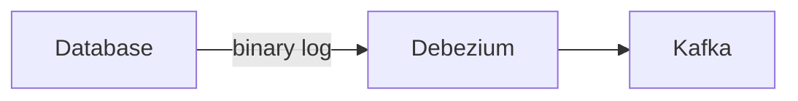

우아콘 2023을 다녀왔다.  
이해가 잘 안되는 내용이 대다수였지만, 그래도 유익한 내용들이 많았다.  

### 대규모 트랜잭션을 처리하는 배민 주문시스템 규모에 따른 진화

배달의민족 주문시스템의 경우 특정 시간대(점심, 저녁) 피크가 발생하는 특징을 가지고 있다.  
이전에는 일 평균 10만 건 정도의 주문이 발생했고, 최근에는 일 평균 300만 건의 주문이 발생한다고 한다. 
이렇게 성장하는 주문 시스템에서 발생하는 문제와 그 해결 방법에 대한 내용들이 소개되었던 세션이었다.

대규모 트랜잭션 내용이 인상 깊었는데 늘어나는 주문 처리량에 따라 쓰기 처리량에 한계에 도달했고, 이를 해결하기 위해 샤딩을 통해 쓰기 부하를 분산했다고 한다.  
Aurora DB를 사용하고 있기 때문에 DB 레벨에서 샤딩이 불가능했고, AbstractRoutingDataSource를 이용하여 애플리케이션 레벨에서 샤딩을 도입하기로 했고 
여러 샤딩 방식 중 주문 데이터가 변경되는 일은 최대 30일까지 밖에 없기 때문에 Key Based 샤딩 방식을 선택했다고 한다.  

### 모놀리식에서 점진적 서비스 분리: 사업과제와 병행하여 시스템 개선하기

거대한 모놀리식 시스템에서 점진적으로 사업과제와 병행하면서 서비스를 분리하는 방법에 대한 세션이었다.  
모듈, 컴포넌트 분리부터 서비스 분리에 대한 다양한 내용을 담고 있었고 배민상회의 경우 장기적인 관점에서 서비스 기준으로 개발 조직의 분리를 위해 서비스 분리 진행했다고 한다.  
서비스 분리를 할 때 고려해야하는 사이드 이펙트에 관한 내용도 있었고, 장애 발생 시 빠르게 롤백할 수 있도록 FeatureFlag를 도입했다고 한다.  

### 배민스토어에 최신 기술 한방에 때려넣기: Kotlin, Spring WebFlux, EDA

배민스토어에 최신 기술을 도입하고, 기술 도입을 위한 논의 과정에 대한 부분을 자세하게 설명해주는 세션이었다.  
또한 기술 도입 후 서비스에 대한 이해도가 높아짐에 따라 기술에 대한 이해도도 높아지는 부분이(커머스 특성상 Batch 로직에서 배압의 특성이 오히려 발휘되었다고 설명하는 부분) 인상깊었다.  

:::note 기술 도입 하기좋은 환경이란?

- 팀 차원에서 챙겨야 하는 부분
- 기본적인 개발 문화 → 스터디, 페어프로그래밍, 코드 리뷰, 노하우 공유
- 팀에서 충분한 논의를 거쳐 내린 결정은 존중해주고, 믿고 지켜봐줘야한다.
- 개발자는 도메인에 대한 전문성을 바탕으로 기술 도입에 대한 결정을 내리고 증명한다.
- 주변에서는 개발자를 전문가로써 신뢰한다. 성과를 블로그나 발표로 나눠가진다.

:::

### 대용량 트래픽을 받는 모놀리식 서비스에 Woowa하게 RPC 적용하기

RPC를 사용하려면 IDL 파일이 필요한데 이에 대한 유지보수가 어렵기 때문에, Spring 코드 기반으로 RPC에 대한 엔드포인트를 관리할 수 있도록 하는 Woowaboot에 대한 세션이었다. 
하지만 RPC를 잘 몰라서 이해하지는 못했다.  
기억나는 부분은 기존의 RestController + RPC를 동시에 작성할 수 있도록 했고, 코드 레벨에서 Enum 값에 따라서 RPC의 구현체인 gRPC, Thrift 둘 중 하나를 선택해서 사용할 수 있도록 한게 기억난다.  

### 낯선 서드파티와의 동행: 믿을 만한 배민커넥트 서버 구축하기

문제에 대한 인식 없이 배민 커넥스 앱을 사용할 수 있도록 어떠한 고민을 하는지 알 수 있었던 세션이다.  
서드파티를 통한 운전면허 검증에 대한 내용을 설명했는데 다음의 플로우로 진행된다고 했다.  

또한 검증 방식을 다음과 같이 점진적으로 발전시켜나갔다고 한다.  
수기 검증 → 서드파티에 제공하는 문서를 이용하여 최대 1000건 일괄 검증 → Spring Batch 이용하여 주기적 검증

또한 서드파티에 문제가 발생한 경우 서킷브레이커를 적용하여 장애 전파를 차단했다고 한다.  
발표를 제대로 이해를 못해서 그런가 운행 시도할 때 현재 면허 상태를 응답하지만, 만약 서드파티를 통해 검증 수행한 결과가 운행 시도에 부적합할 때의 경우가 궁금했다.  

### Kafka를 활용한 이벤트 기반 아키텍처 구축

요구사항이 많아짐에 따라 배달 시스템의 복잡도가 증가했다. 하지만 대부분의 기능은 배달과 강한 일관성(관련 기능들이 동시에 반영되어야 하는것)을 필요로하지 않았기 때문에 이벤트 기반으로 구축했다고 한다.    

:::note SNS + SQS가 아닌 Kafka를 선택한 이유

- 순서 보장 → 토픽의 파티션을 통해 key별로 순서를 보장
- 고성능 고가용성 → 실시간 이벤트를 처리할 고성능 고가용성 제공 + 브로커를 클러스터 형태로 관리
- 통합 도구 → Kafka Streams, Kafka Connect등 다양한 통합 도구 제공
- 전담팀 지원 → 카프카 클러스터 관리, 모니터링 및 지원도구 제공

:::

도메인의 상태와 이벤트 발행 결과가 같다는 것을 보장할 수 없기 때문에 트랜잭션 아웃박스 패턴을 사용한다고 하는데 이후에는 복잡한 내용이 나와서 제대로 이해하지 못했다.  
트랜잭션 아웃박스 패턴을 적용할 때 저비용, 안정성, 처리량을 고려하여 debezium을 사용했다고 한다.  
이때 debezium은 Binary Log를 통한 순서를 보장하는데 처리량을 증대시키기 위해 Outbox 테이블을 파티셔닝했다고 한다.  

아래와 같은 느낌인 것 같은데 아직 잘 모르겠다.  

### 이벤트 스토밍 인 액션: 이벤트 스토밍 소개와 적용 방법

근로를 하는 크루들은 이벤트 스토밍을 경험해보았다고 하는데, 궁금해서 제이슨의 세션을 들으러 갔다.  
이벤트 스토밍이 어떻게 진행되어야 하는지, 퍼실리테이터(진행자)는 어떻게 이벤트 스토밍이 잘 진행될 수 있도록 도와야하는지, 안티 패턴등을 소개해줘서 재밌었다.  

:::note 이벤트 스토밍
알베르토 브란돌리니가 제안한 복잡한 비즈니스 도메인을 빠르게 탐색하고 학습할 수 있는 워크숍  
프로젝트 참여하는 모든 이해관계자가 한자리에 모여 도메인 지식을 교환하고 용어를 통일하고 현재 프로젝트 내 회색 지대를 파악하여 향후 의사소통 비용을 절약하는 워크숍이다.  
:::

### 참고 자료

[DB분산처리를 위한 sharding, 우아한기술블로그](https://techblog.woowahan.com/2687/)  
[Feature Toggles, martinfowler](https://martinfowler.com/articles/feature-toggles.html)