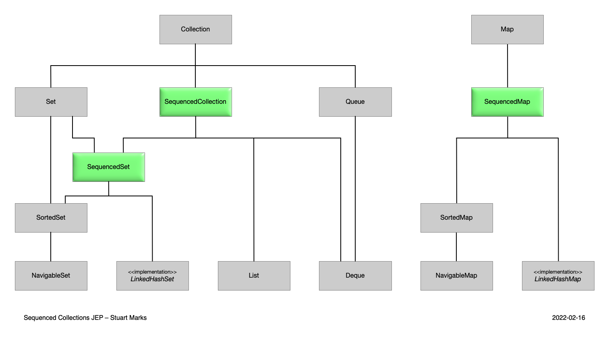

### JEP 431: Sequenced Collections

첫 번째, 마지막 원소를 접근할 때 번거로운 부분이 해결되었다.    
기존의 자바의 리스트를 사용하는 경우 `list.get(0)`이나 `list.get(list.size() - 1)`를 사용했어야 했다.  
자바 21에서 추가된 Sequenced Collections을 이용하면 간편하게 해당 기능을 사용할 수 있다.  



### SequencedCollection

기존의 Deque를 사용하는 것 처럼 편 하게 사용할 수 있다.  
reversed의 경우 순서만 반대로 제공하는 컬렉션의 뷰를 반환한다.  

```java title=SequencedCollection
interface SequencedCollection<E> extends Collection<E> {
    SequencedCollection<E> reversed();
    void addFirst(E);
    void addLast(E);
    E getFirst();
    E getLast();
    E removeFirst();
    E removeLast();
}
```

### SequencedSet

```java title=SequencedSet
interface SequencedSet<E> extends Set<E>, SequencedCollection<E> {
    SequencedSet<E> reversed(); // covariant override
}
```

### SequencedMaps

firstEntry, lastEntry의 경우 키 값을 기준으로 결정된다.  

```java title=SequencedMap
interface SequencedMap<K,V> extends Map<K,V> {
    SequencedMap<K,V> reversed();
    SequencedSet<K> sequencedKeySet();
    SequencedCollection<V> sequencedValues();
    SequencedSet<Entry<K,V>> sequencedEntrySet();
    V putFirst(K, V);
    V putLast(K, V);
    Entry<K, V> firstEntry();
    Entry<K, V> lastEntry();
    Entry<K, V> pollFirstEntry();
    Entry<K, V> pollLastEntry();
}
```

### 참고 자료 및 이미지 출처

[SequencedCollection, openjdk](https://openjdk.org/jeps/431)