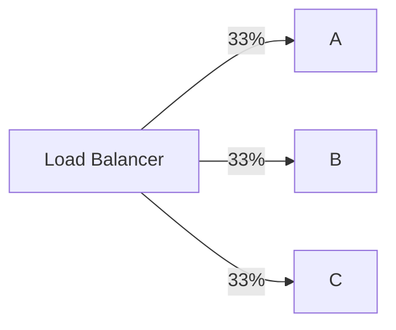
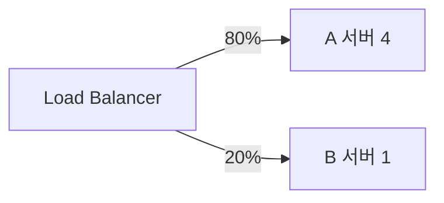
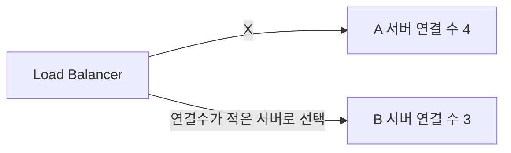
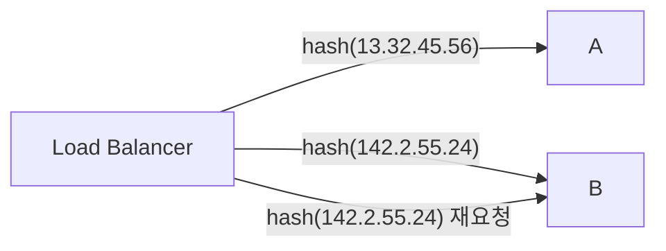
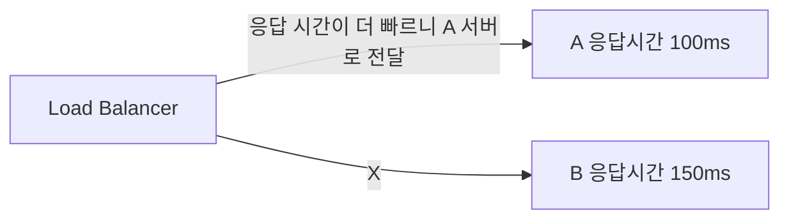

### 라운드로빈 방식(Round Robin Method)

클라이언트로부터 받은 요청을 로드 밸런싱 대상 서버에 순서대로 할당받는 방식

### 가중 기반 라운드 로빈 방식(Weighted Round Robin Method)

실제 서버에 서로 다른 처리 용량을 지정하는 방식

### 최소 연결 기반 방식(Least Connection Method)

로드 밸런서는 활성 연결이 가장 적은 서버를 확인하고 해당 서버로 트래픽을 전송

### IP 해시 방식(IP Hash Method)

각 클라이언트에 대해 Hashing key를 가지고 경로를 지정  
Hashing key는 클라이언트의 IP + port 혹은 IP 주소만으로 결정  
사용자가 항상 동일한 서버로 연결되는 것을 보장

### 최소 응답 시간 방식(Least Response Time Method)

서버의 현재 연결 상태, 응답 시간 고려하여 트래픽을 전송  
가장 적은 연결 상태와 가장 짧은 응답 시간을 보이는 서버에 우선적으로 로드를 배분하는 방식  

### 참고 자료

[load balancing, AWS](https://aws.amazon.com/ko/what-is/load-balancing/)  
[로드 밸런싱에 대해 알아보자, 테코블](https://tecoble.techcourse.co.kr/post/2021-11-07-load-balancing/)