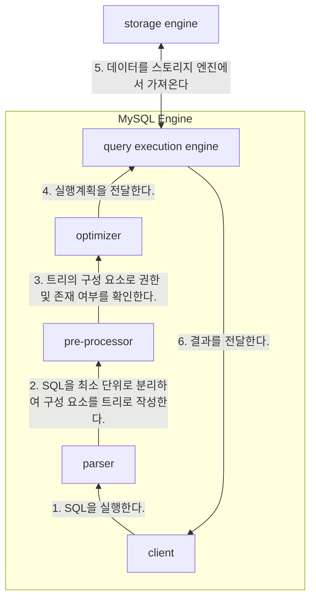

### 실행 구조

### 파서(Parser)

실행된 SQL문을 최소 단위로 분리해서 트리를 만든다.  
트리를 만들며 기본적인 문법 검사를 수행한다.  

### 전처리기(Preprocessor)

파서에서 생성한 파서 트리를 바탕으로 SQL문에 구조적인 문제점이 없는지 파악한다.  
SQL 구문에 작성된 테이블, 열과 같은 오브젝트가 실제로 존재하는지, 접근 권한이 있는지 확인한다.  

### 옵티마이저(Optimizer)

파서 트리를 바탕으로 필요하지 않은 조건은 제거하거나 연산 과정을 단순화 시킨다.  
테이블의 접근 순서, 인덱스 사용 여부와 같은 실행 계획을 수립한다.  

### 쿼리 실행 엔진(Query Execution Engine)

옵티마이저에서 수립한 실행 계획을 참고하여, 스토리지 엔진에서 데이터를 가져온다.  
MySQL 엔진의 부하를 줄이려면 스토리지 엔진에서 가져오는 데이터양을 줄이는 게 매우 중요하다.  

### 참고 자료

2장 SQL 튜닝 용어를 직관적으로 이해하기, 업무에 바로 쓰는 SQL 튜닝 - 양바른  
16장 복제, Real MySQL 8.0 - 백은빈, 이성욱  
https://dev.mysql.com/doc/refman/8.0/en/pluggable-storage-overview.html  