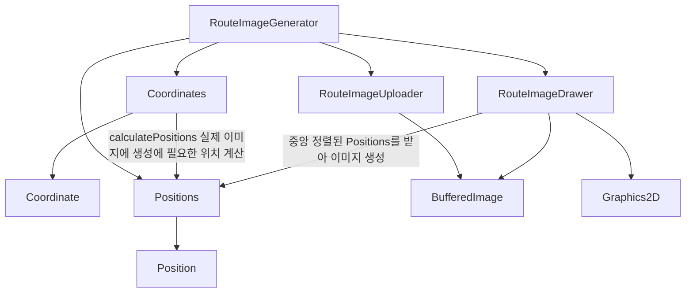
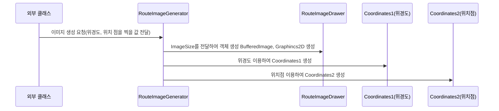
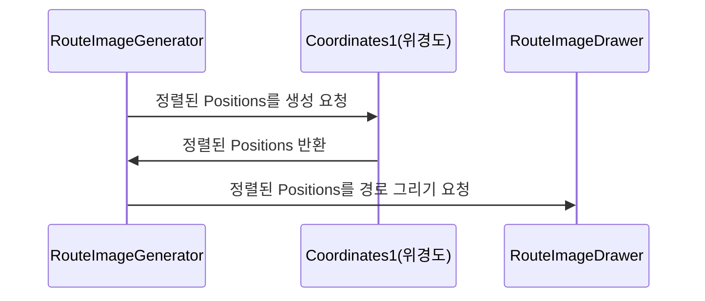
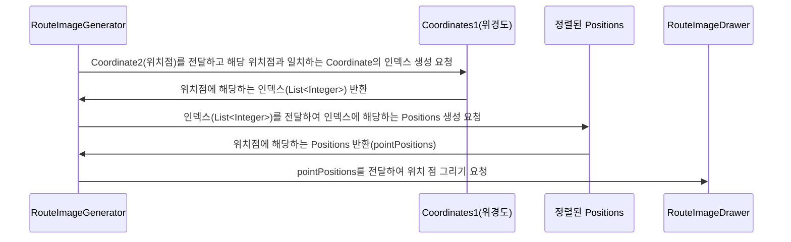
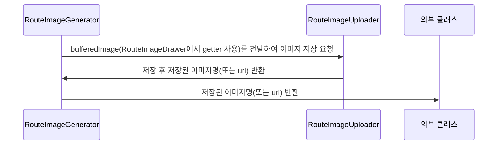
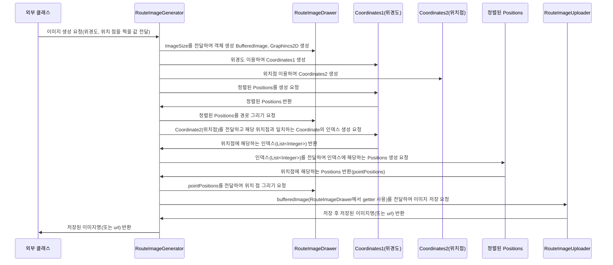

## 개요

### 요구사항

경로 이미지 생성에 대한 요구사항은 다음과 같습니다.

- 이미지 생성
- 선과 점 표현
- 투명한 배경색

### 예시

지도 이미지


경로 생성 이미지


예시 데이터는 다음과 같습니다.

**서울역(점)** → 신사역 → 노량진역 → 홍대입구역 → 종로3가역 → 옥수역 → **구로역(점)** → 신림역 → 발산역

```java
List<Double> x = List.of(
        126.97094933811682, 127.02154822802501, 126.94218991864345, 126.92402556641424,
        126.99265358592287, 127.01779856076462, 126.88474839801178, 126.92900751277035, 126.83930056313639
);
List<Double> y = List.of(
        37.55302829553499, 37.51619698970427, 37.51294119442773, 37.5565933969331,
        37.57034879708931, 37.54027238225762, 37.50129417536773, 37.48258811529137, 37.557607696911184
);
List<Double> xPoints = List.of(126.97094933811682, 126.88474839801178);
List<Double> yPoints = List.of(37.55302829553499, 37.50129417536773);
```

### IMAGE_SIZE & ROUTE_SIZE

```java
private static final int IMAGE_SIZE = 800;
private static final int ROUTE_SIZE = 600;
```

코드를 보면 이미지 크기와 경로 크기가 있습니다.

이미지 크기는 말 그대로 이미지의 width와 height를 의미합니다.

경로 크기의 경우 상하좌우 100px 만큼의 간격을 위해 존재합니다.

따라서 실제 경로 그려지는 크기는 600 * 600 사이즈로 생성됩니다.


**사이즈 변경의 이유**

255 * 255 정도의 작은 사이즈로 이미지를 생성해보려고 했는데 화질이 너무 안좋아서 800으로 변경했습니다.

## 클래스 설명

싱글톤이 아닌 객체로 생성되야 하는 부분은 도메인 레이어에, 싱글톤으로 생성되는 클래스는 어플리케이션 레이어에 위치시켰습니다.

### 요약

[D]: Domain Layer에 위치함을 의미합니다.

[A]: Application Layer에 위치함을 의미합니다.

| 클래스명 | 설명 | 특이사항 |
| --- | --- | --- |
| [D] Coordinate | 위도, 경도로 이루어진 VO | 좌표를 뜻하지만 Point와 구분하기 위해 longitude, latitude를 사용하지 않고 x, y 사용 |
| [D] Coordinates | Coordinate의 일급 컬렉션 | - |
| [D] Position | 실제 이미지 생성에 사용할 위치 값 | Integer 타입의 x, y 사용 |
| [D] Positions | Positions의 일급 컬렉션 | - |
| [D] RouteImageDrawer | 실제 이미지에 경로를 그려주는 클래스 BufferedImage, Graphics2D를 가지고 있음 | 이미지 생성에 필요한 상수가 정의되어 있음 |
| [A] RouteImageUploader | BufferedImage를 받아 서버에 업로드 하는 클래스 | 현재 업로드 위치가 정해지지 않아 일단 기본(프로젝트 루트) 위치에 생성 |
| [A] RouteImageGenerator | 이미지를 생성하고 업로드하는 서비스 | 여행 종료, 감상 저장시 해당 클래스를 통해 이미지 생성 요청  |
| BufferedImage(AWT) | 이미지 데이터를 처리하고 조작하는 데 사용 | 왼쪽 상단의 좌표가 (0, 0) |
| Graphics2D(AWT) | 선 그리기, 색상 관리 등을 지원하는 클래스 실제 해당 클래스의 draw 메서드를 경로를 그림 | JDK1.2 이후에 추가됨, 2D(평면) 그래픽 환경을 지원, bufferedImage.createGraphics 메서드를 통해 생성 |

### 의존관계



### Coordinates(위도, 경도에 대한 클래스)

List<Double> 2개(위도, 경도)인 형태로 관리하는 방법이 있었지만, 위치 점을 여러개 찍는 부분에서 로직이 복잡해 질 것 같아서 Coordinate(x, y)와 일급 컬렉션인 Coordinates로 관리하기로 했습니다.

다음 두 개의 인터페이스가 존재합니다.

- 경로 이미지의 크기를 받아 실제 이미지 생성시 사용될 Positions를 반환하는 `calculatePositions()`
- 다른 Coordinates를 받아 동일한 위치점에 해당하는 인덱스를 반환하는 `indexOf()`

Positions 계산 로직은 다음과 같습니다.

위도, 경도 각각에 대한 부분을 이미지 생성시 필요한 값으로 변환합니다.

```java
// 호출
// List<Integer> xPositions = toPositions(xValues, maxDifference, routeImageSize);
// List<Integer> yPositions = toPositions(yValues, maxDifference, routeImageSize);

private List<Integer> toPositions(List<Double> values, Double maxDifference, Integer routeImageSize) {
    Double minValue = Collections.min(values);
    return values.stream()
            .map(value -> normalizeCoordinate(value, maxDifference, minValue))
            .map(value -> mapToPosition(value, routeImageSize))
            .toList();
}

private double normalizeCoordinate(Double coordinate, Double maxDifference, Double minValue) {
    return (coordinate - minValue) / maxDifference;
}

private int mapToPosition(Double coordinate, Integer routeImageSize) {
    return (int) (coordinate * routeImageSize);
}
```

위도로 예시를 들겠습니다.

1. Collections.min(values) → 위도를 받아 위도 리스트의 최소값을 구합니다.
2. normalizeCoordinate → 각 값에서 최소값을 빼고 0 ~ 1 사이 값으로 변환 후 `위경도의 최대 차이`로 나눕니다.
3. mapToPosition → 그래프 크기를 받아 0 ~ 1 사이 값을 실제 이미지를 위한 위치값으로 변환합니다.

### Positions(실제 이미지 생성에 사용할 위치 값)

다음 다섯 개의 인터페이스가 존재합니다.

- align → 이미지 사이즈와 경로 이미지 사이즈를 받아 Position 값들을 중앙 정렬합니다.
- getPositionsByIndexes → 인덱스 리스트를 받아 입력받은 인덱스에 해당하는 값들을 반환합니다.
- size → 크기를 반환합니다.
- xPositions → x 값들을 반환합니다.
- yPositions → y 값들을 반환합니다.

중앙 정렬 로직은 다음과 같습니다.

상하좌우 여백을 동일하게 주기 위해서 offset 값을 구해서 x, y 값에 각각 더하는 형태로 중앙 정렬을 수행했습니다.

```java
public Positions align(int imageSize, int routeSize) {
    int xOffset = calculateOffset(Position::x, imageSize);
    int yOffset = calculateOffset(Position::y, imageSize);

    return items.stream()
            .map(item -> new Position(item.x() + xOffset, imageSize - (item.y() + yOffset)))
            .collect(collectingAndThen(toList(), Positions::new));
}

private int calculateOffset(ToIntFunction<Position> positionToInteger, int imageSize) {
    List<Integer> positions = items.stream()
            .mapToInt(positionToInteger)
            .boxed()
            .toList();

    int midValue = (Collections.min(positions) + Collections.max(positions)) / 2;
    return imageSize / 2 - midValue;
}
```

BufferedImage를 사용할 때 왼쪽 상단의 좌표 (0, 0) 기준으로 아래로 내려갈수록 y 값이 커지고, 오른쪽으로 갈 수록 x 값이 커집니다.


따라서 최종적으로 이미지를 생성하기 위한 값을 다음과 같이 구했습니다.

- x 값 → 계산한 offset 그대로 더합니다.
- y 값 → imageSize(800)에서 y + offset 값을 뺍니다.

### RouteImageDrawer(실제 이미지에 경로를 그려주는 클래스)

BufferedImage, Graphics2D를 필드로 가지고 있는 클래스입니다.

그림을 그리기 위해 설정한 상수들이 존재합니다.

```java
// RGB에 각각 8비트씩 할당한 값을 24비트 트루컬러라 부릅니다.
// 해당 설정은 24비트 + 8비트(alpha, 투명도)를 추가한 32비트 이미지 타입입니다.
// 이를 RGBA라고 부릅니다.
private static final int IMAGE_TYPE = BufferedImage.TYPE_INT_ARGB;
// 배경 투명색
private static final Color TRANSPARENT = new Color(0, 0, 0, 0);
// 경로를 위한 STROKE
private static final int LINE_STROKE_WIDTH = 7;
private static final Stroke LINE_STROKE = new BasicStroke(LINE_STROKE_WIDTH, CAP_ROUND, JOIN_ROUND);
// 위치 점을 위한 STROKE
private static final int POINT_STROKE_WIDTH = 20;
private static final Stroke POINT_STROKE = new BasicStroke(POINT_STROKE_WIDTH, CAP_ROUND, JOIN_ROUND);
// 안티앨리어싱 등 화질이 안좋은 이미지를 개선하기 위한 설정
private static final Map<Object, Object> renderingHints = Map.of(
        RenderingHints.KEY_ANTIALIASING, RenderingHints.VALUE_ANTIALIAS_ON,
        RenderingHints.KEY_RENDERING, RenderingHints.VALUE_RENDER_QUALITY,
        RenderingHints.KEY_INTERPOLATION, RenderingHints.VALUE_INTERPOLATION_BICUBIC
);
```

## 이미지 생성 Flow

### 이미지 생성 Flow 1 - 이미지 생성 준비



### 이미지 생성 Flow 2 - 선 그리기 요청



### 이미지 생성 Flow 3 - 위치 점 그리기 요청



### 이미지 생성 Flow 4 - 업로드 요청



### 전체 이미지 생성 Flow



## 테스트

이미지 생성이 정상적으로 완료 되었는지에 대한 테스트가 어려워서 최대한 테스트 할 수 있는 부분을 분리하고, 이미지 생성에 대한 검증의 경우 mock의 verify를 사용했습니다.

이미지 저장, 그리기 기능 자체가 외부로 나가는 상호작용이고 이를 모방하고 호출 횟수를 검사하는데는 mock을 사용하는게 적절하다고 생각했습니다.

### Mock 테스트 예시 - Graphics2D

```java
@Test
void positions를_입력받아_이미지에_경로를_그린다() {
    // given
    Graphics2D graphics2D = Mockito.mock(Graphics2D.class);
    RouteImageDrawer routeImageDrawer = new RouteImageDrawer(null, graphics2D);
    Positions positions = new Positions(List.of(
            new Position(254, 100), new Position(302, 150), new Position(389, 138), new Position(482, 164),
            new Position(521, 276), new Position(546, 336), new Position(402, 426), new Position(317, 700)
    ));

    // when
    routeImageDrawer.drawLine(positions);

    // then
    Mockito.verify(graphics2D, times(positions.size() - 1)).draw(any(Line2D.Double.class));
}
```

`routeImageDrawer.drawLine(positions);` 가 호출되면 선을 그려야 하기에 Positions의 크기 - 1개의 `Graphics2D.draw()` 메서드가 호출됩니다. 

따라서 해당 부분을 verify를 통해 `positions.size() - 1` 번의 호출이 일어나는지 검증했습니다.

### Mock 테스트 예시 - ImageIO

```java
@Test
void 파일을_업로드하고_파일명을_반환한다() {
    // given
    BufferedImage bufferedImage = new BufferedImage(800, 800, BufferedImage.TYPE_INT_ARGB);
    RouteImageUploader routeImageUploader = new RouteImageUploader();

    // expect
    try (MockedStatic<ImageIO> imageIO = Mockito.mockStatic(ImageIO.class)) {
        String imageUrl = routeImageUploader.upload(bufferedImage);

        assertThat(imageUrl).isNotBlank();
        imageIO.verify(
                () -> ImageIO.write(any(BufferedImage.class), any(String.class), any(File.class)),
                times(1)
        );
    }
}
```

실제로 파일을 업로드할 때 ImageIO의 write라는 static 메서드를 사용합니다.

static 클래스의 메서드 호출을 검증하기 위해 Mockito의 mockStatic을 사용하였습니다.

MockedStatic은 사용 후 자원할당 해제를 해줘야하기에 try-with-resources를 사용했습니다.