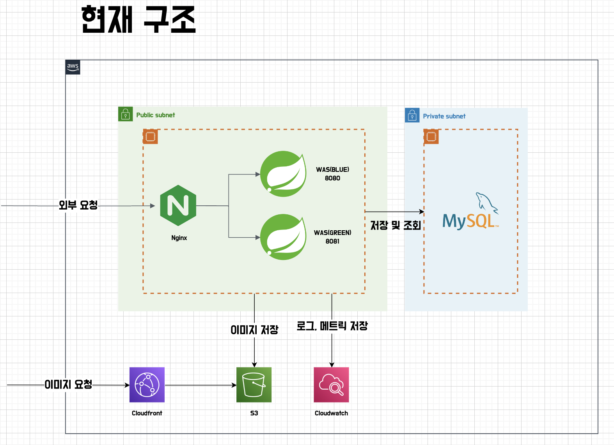
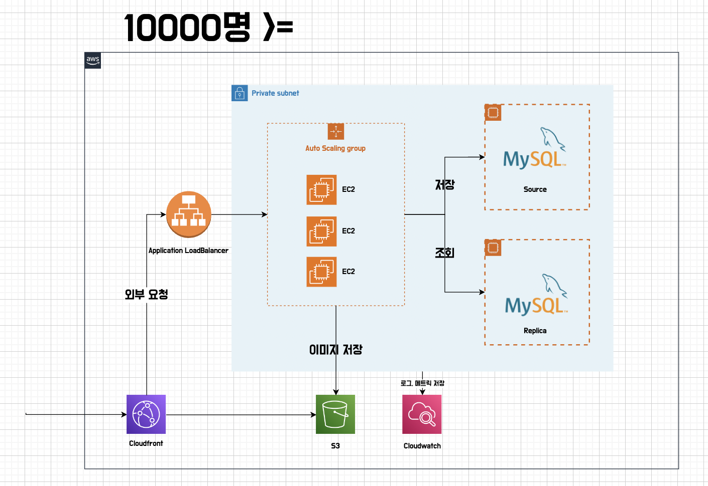
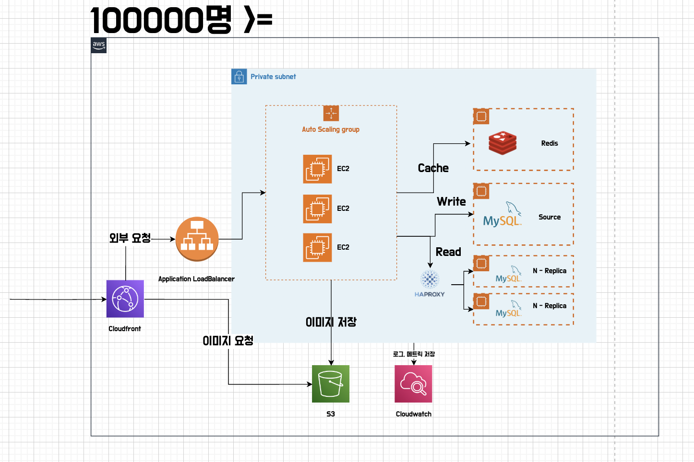
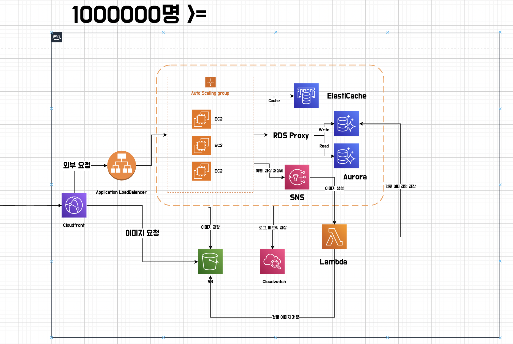

### 개요 

> 현재 팀의 아키텍처에서 사용자가 늘어났을 때 문제가 될 수 있는 부분을 설명하고, 이를 개선할 수 있는 방법에 대해 작성한다.  
> 만명, 10만명, 1,000만명이 사용해도 서비스할 수 있도록 팀의 인프라 아키텍처 개선 방향

사용자가 1000만명이 되었으면 좋겠지만, 그럴 수 없으니 사용자에 대한 가정을 세우고 해당 부분에 대해 고민했다.  

### 사용자에 대한 가정

1인당 국내 여행 횟수는 평균 약 7회라고 한다.  
우리 서비스의 사용자는 1년에 당일치기 여행을 7번씩 가고, 여행마다 트립드로우를 적극적으로 사용한다고 가정하에 진행했다.  
하루에 12시간의 여행을 다니고, 5분 단위로 위치정보 저장을 하기 때문에 시간 당 12번의 위치정보 저장 요청이 이루어지게 된다.  

> 7(일) x 12(시간) x 12(위치 정보) = 1008  

연간 1인당 약 1008회의 위치 정보 저장 요청을 하게 된다.  
조회의 경우 명령 쿼리의 3배 정도로 가정하고, 여행을 자주 다니는 성수기(3배) x 안전계수(3배) 정도로 가정을 하고 진행했다.  

### 현재 트립드로우의 서비스 구성도

현재 트립드로우 서비스의 경우 위에서 내린 가정을 통해 1000명의 사용자 정도를 무난하게 받을 수 있을 것으로 보인다.  

### 1만명

위에서 설정한 수치로 계산한다면 1만명의 사용자가 서비스를 사용한다고 하더라도 감당할 수 없는 양의 요청이 들어오지는 않는다.  
하지만 갑자기 트래픽이 늘어날 때를 대비 AutoScaling, 또한 서비스 정보들의 백업을 위해 DB 이중화를 진행할 수 있을 것 같다.  
SPOF를 줄이고 서비스의 가용성을 증가시킬 수 있다.  

### 10만명

고성능 인스턴스를 사용하지 않는 경우 1만명의 인프라 구조에서 10만명의 사용자가 들어온다면, 조회 요청을 처리할 수 없는 문제가 발생할 것 같다.  
10만명이 사용하는 서비스가 된다면, 초당 230 TPS 정도의 부하를 견뎌내야 한다.  
감상과 여행 조회의 경우 가장 최근의 정보부터 조회되기 때문에, 요청을 캐싱할 수 있는 Redis를 두고 캐시 히트에 실패하는 경우 Replica DB로 조회 요청이 가도록 한다.  
복잡한 서비스의 경우 10만의 사용자가 있으면 클라우드가 제공하는 관리형 서비스를 `예) RDS, ElasticCache` 상황에 따라 고려할 수 있겠지만, 현재 서비스의 규모로는 관리형 서비스를 사용하지 않아도 충분히 요청을 처리할 수 있을 것 으로 생각된다.  
추후 확장 & 성장 가능성을 고려하여 관리 비용과 서비스의 비용을 잘 고려하여 마이그레이션을 진행해야할 것 같다.  

### 100만명

100만명의 사용자가 들어온다면 10만명의 인프라 구조에서 이미지 생성시 문제가 발생할 것 같다.  
일정 이상의 TPS가 나오기 때문에 이미지 생성의 경우 Labmda와 같은 서버리스 플랫폼을 사용할 수 있을 것 같다.  
현재 서비스 기준으로 감상 저장, 여행 저장시 경로 이미지를 생성하고 있다.  
경로 이미지를 보여주는 기능을 클라이언트 쪽으로 옮기거나(안드로이드에서 위치 정보만으로 그리게 하도록) Lambda를 이용하여 python 스크립트로 경로 이미지를 만드는 방법이 있을 것 같다.  
추가로 이미지 생성 실패시 재시도가 필요하다면 SQS를 사용하여 실패한 이미지 생성 요청을 재시도 큐에 넣어 서비스에 안정성을 더할 수 있을 것 같다.  

### 1000만명

사실 1000만명이 서비스를 사용한다고 하면 상상이 가지 않는다.      
다량의 요청이 발생하기 때문에, 무수한 로그와 DB에 데이터가 축적되면서 모든 부분에서 문제가 발생할 것 같다.  
많은 사용자가 서비스를 사용하는 만큼 서비스의 고가용성이 가장 중요할 것 같다.  
100만명 인프라 구조에서 SPOF를 최대한 제거하고, Multi AZ를 고려할 것 같다.  
다만 서비스에 기능이 추가되지 않는다면 복잡도가 매우 낮기 때문에, 서비스를 분리하는 것은 필요없어 보인다.  

### 참고 자료

https://www.youtube.com/watch?v=fhNpjPr-f54&t=1494s  
https://www.youtube.com/watch?v=z68l2X5KoC4  
https://www.youtube.com/watch?v=eLOURl9hP5c  
https://docs.aws.amazon.com/ko_kr/AmazonRDS/latest/AuroraUserGuide/rds-proxy.html  